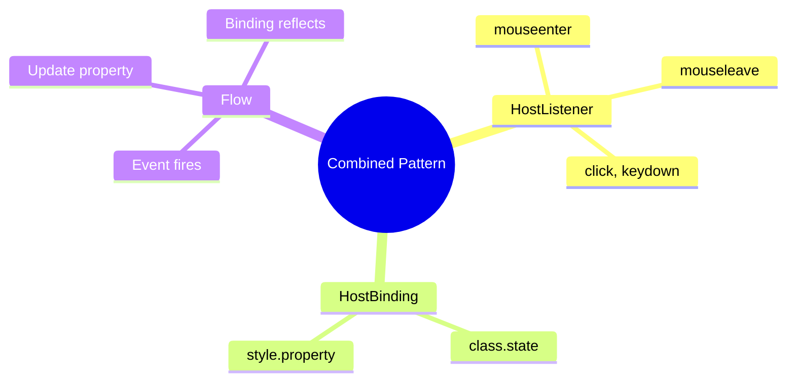

# 🔗 Use Case 5: Combined HostListener + HostBinding

> **Goal**: Create interactive components by combining event listeners with dynamic bindings.

---

## 🔍 How It Works

The pattern: **Listen** to events → **React** by changing bound properties.

```typescript
// Listen to event
@HostListener('mouseenter')
onEnter() { this.isHovered = true; }

// React with binding
@HostBinding('class.hovered')
isHovered = false;
```

---

## 🚀 Implementation

```typescript
@Component({...})
export class InteractiveCard {
    // BINDINGS
    @HostBinding('class.active') isActive = false;
    @HostBinding('style.borderColor')
    get borderColor() {
        return this.isActive ? '#4ade80' : '#667eea';
    }

    // LISTENERS
    @HostListener('click')
    onClick() {
        this.isActive = !this.isActive;
    }

    @HostListener('mouseenter')
    onEnter() { /* change styles */ }
}
```

---

## 🌍 Real World Uses

1. **Expandable cards** - Click to expand, hover to preview
2. **Custom buttons** - Hover/active states without CSS only
3. **Drag-and-drop** - Track dragging state

---

## 🧠 Mind Map


