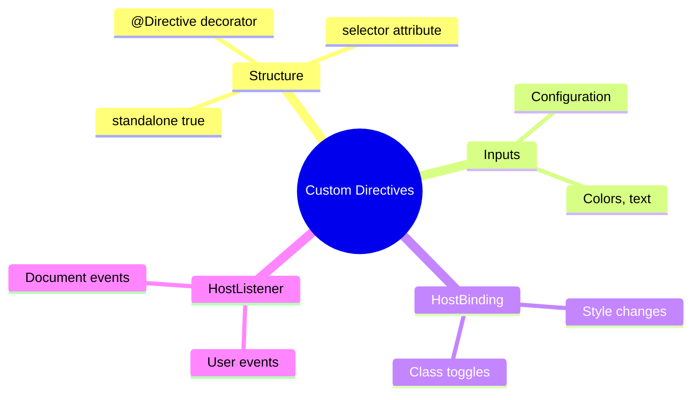

# 🧩 Use Case 6: Custom Attribute Directive

> **Goal**: Create reusable attribute directives using HostListener and HostBinding.

---

## 🔍 How It Works

Attribute directives modify behavior of existing elements. Perfect use of Host decorators!

---

## 🚀 Implementation

### Highlight Directive

```typescript
@Directive({
    selector: '[appHighlight]',
    standalone: true
})
export class HighlightDirective {
    @Input() highlightColor = '#fff176';

    @HostBinding('style.backgroundColor')
    bgColor = 'transparent';

    @HostListener('mouseenter')
    onEnter() { this.bgColor = this.highlightColor; }

    @HostListener('mouseleave')
    onLeave() { this.bgColor = 'transparent'; }
}
```

### Usage

```html
<div appHighlight>Yellow on hover</div>
<div appHighlight [highlightColor]="'pink'">Pink</div>
```

---

## 🌍 Real World Uses

1. **Highlight directive** - Text highlights
2. **Tooltip directive** - Custom tooltips
3. **Click outside** - Close dropdowns
4. **Lazy load** - Images on scroll

---

### 📦 Data Flow Summary (Visual Box Diagram)

```
┌─────────────────────────────────────────────────────────────┐
│  CUSTOM ATTRIBUTE DIRECTIVE: REUSABLE BEHAVIOR              │
│                                                             │
│   DIRECTIVE STRUCTURE:                                      │
│   ┌───────────────────────────────────────────────────────┐ │
│   │ @Directive({                                          │ │
│   │   selector: '[appHighlight]',                         │ │
│   │   standalone: true                                    │ │
│   │ })                                                    │ │
│   │ export class HighlightDirective {                     │ │
│   │   @Input() highlightColor = 'yellow';                 │ │
│   │                                                       │ │
│   │   @HostBinding('style.backgroundColor')               │ │
│   │   bgColor = 'transparent';                            │ │
│   │                                                       │ │
│   │   @HostListener('mouseenter')                         │ │
│   │   onEnter() { this.bgColor = this.highlightColor; }   │ │
│   │                                                       │ │
│   │   @HostListener('mouseleave')                         │ │
│   │   onLeave() { this.bgColor = 'transparent'; }         │ │
│   │ }                                                     │ │
│   └───────────────────────────────────────────────────────┘ │
│                                                             │
│   USAGE:                                                    │
│   ┌───────────────────────────────────────────────────────┐ │
│   │ <p appHighlight>Yellow on hover</p>                   │ │
│   │ <p appHighlight highlightColor="pink">Pink</p>        │ │
│   │                                                       │ │
│   │ Mouse enters → Background changes!                    │ │
│   │ Mouse leaves → Back to transparent!                   │ │
│   └───────────────────────────────────────────────────────┘ │
└─────────────────────────────────────────────────────────────┘
```

> **Key Takeaway**: Attribute directives add behavior to existing elements. Perfect combo of @Input + @HostListener + @HostBinding!

---

## 🧠 Mind Map


