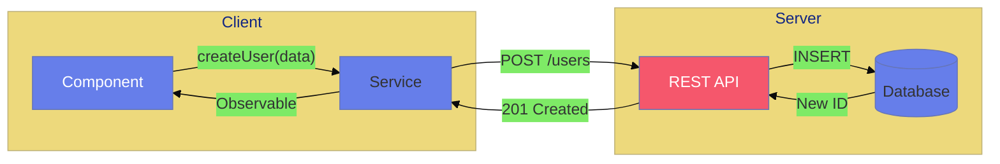
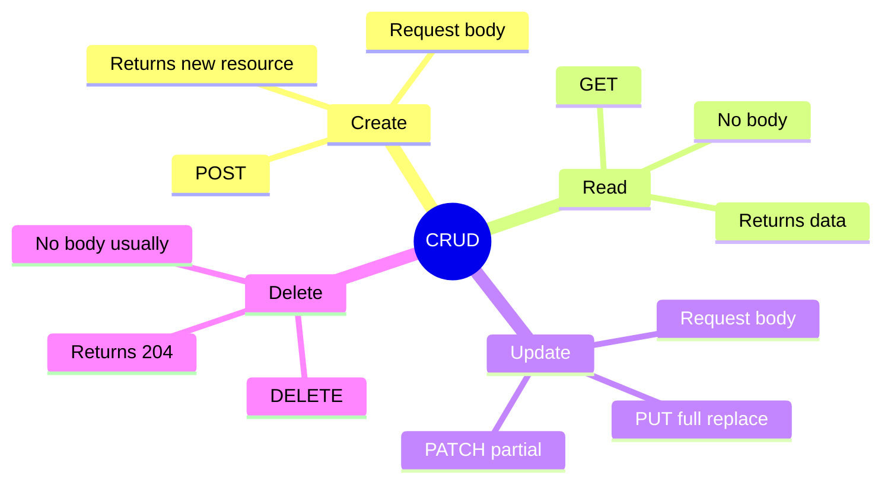

# ✏️ CRUD Operations

> **Goal**: Master Create, Read, Update, Delete operations with HttpClient.


## 📋 Table of Contents
- [1. 🔍 How It Works](#1--how-it-works)
  - [HTTP Methods Mapping](#http-methods-mapping)
  - [📊 CRUD Flow](#crud-flow)
- [🍽️ Restaurant Menu Analogy (Easy to Remember!)](#restaurant-menu-analogy-easy-to-remember)
  - [📖 Story to Remember:](#story-to-remember)
- [2. 🚀 Step-by-Step Implementation](#2--step-by-step-implementation)
  - [CREATE (POST)](#create-post)
  - [READ (GET)](#read-get)
  - [UPDATE (PUT)](#update-put)
  - [DELETE](#delete)
- [3. 🐛 Common Pitfalls](#3--common-pitfalls)
  - [❌ Mutating Original Data](#mutating-original-data)
- [4. 🌍 Real World Uses](#4--real-world-uses)
- [5. ❓ Interview Questions](#5--interview-questions)
  - [Basic Questions](#basic-questions)
    - [Q1: What's the difference between PUT and PATCH?](#q1-whats-the-difference-between-put-and-patch)
    - [Q2: What HTTP status codes indicate success for each CRUD operation?](#q2-what-http-status-codes-indicate-success-for-each-crud-operation)
    - [Q3: Why should you clone objects before editing?](#q3-why-should-you-clone-objects-before-editing)
  - [Scenario-Based Questions](#scenario-based-questions)
    - [Scenario 1: Optimistic Updates](#scenario-1-optimistic-updates)
    - [Scenario 2: Bulk Delete](#scenario-2-bulk-delete)
    - [Scenario 3: Refresh After Create](#scenario-3-refresh-after-create)
    - [Scenario 4: Inline Edit vs Modal Edit](#scenario-4-inline-edit-vs-modal-edit)
  - [Advanced Questions](#advanced-questions)
    - [Q4: What is idempotency and why does it matter?](#q4-what-is-idempotency-and-why-does-it-matter)
    - [Q5: How do you handle concurrent edits (two users editing same record)?](#q5-how-do-you-handle-concurrent-edits-two-users-editing-same-record)
- [🧠 Mind Map](#mind-map)

---
---

## 1. 🔍 How It Works

### HTTP Methods Mapping

| Operation | HTTP Method | Request Body | Response |
|-----------|-------------|--------------|----------|
| **Create** | POST | ✅ Yes | Created resource |
| **Read** | GET | ❌ No | Resource(s) |
| **Update** | PUT/PATCH | ✅ Yes | Updated resource |
| **Delete** | DELETE | ❌ Usually no | Empty (204) |

### 📊 CRUD Flow



---

## 🍽️ Restaurant Menu Analogy (Easy to Remember!)

Think of CRUD operations like **ordering at a restaurant**:

| Operation | Restaurant Analogy | Memory Trick |
|-----------|-------------------|--------------|
| **CREATE (POST)** | 📝 **"I'd like to order the pasta"** - You're adding a NEW item to your order | **"Post a new order"** |
| **READ (GET)** | 👀 **"What's on the menu?"** - Just looking, not changing anything | **"Get the menu"** |
| **UPDATE (PUT)** | 🔄 **"Actually, make that pasta spicy"** - Changing your existing order | **"Put changes on my order"** |
| **DELETE** | ❌ **"Cancel the appetizer"** - Removing something from your order | **"Delete from my order"** |

### 📖 Story to Remember:

> 🍝 **The Restaurant Order Flow**
>
> 1. **GET (Read)**: You look at the MENU to see what's available
> 2. **POST (Create)**: You PLACE a new order - "I'll have the pizza"
> 3. **PUT (Update)**: You MODIFY your order - "Change pizza to large"
> 4. **DELETE**: You CANCEL an item - "Remove the drink"
>
> Just like a restaurant, the **server** (kitchen) handles your requests and sends back a **response** (your food)!

---

## 2. 🚀 Step-by-Step Implementation

### CREATE (POST)

```typescript
createUser(userData: Partial<User>): Observable<User> {
    return this.http.post<User>(`${this.API_URL}/users`, userData);
    // Body is automatically serialized to JSON
}

// Usage
this.apiService.createUser({ name: 'John', email: 'john@test.com' })
    .subscribe(newUser => console.log('Created:', newUser));
```

### READ (GET)

```typescript
// Get all
getUsers(): Observable<User[]> {
    return this.http.get<User[]>(`${this.API_URL}/users`);
}

// Get one
getUser(id: number): Observable<User> {
    return this.http.get<User>(`${this.API_URL}/users/${id}`);
}
```

### UPDATE (PUT)

```typescript
updateUser(id: number, data: Partial<User>): Observable<User> {
    return this.http.put<User>(`${this.API_URL}/users/${id}`, data);
}
```

### DELETE

```typescript
deleteUser(id: number): Observable<void> {
    return this.http.delete<void>(`${this.API_URL}/users/${id}`);
}
```

---

## 3. 🐛 Common Pitfalls

### ❌ Mutating Original Data

```typescript
// ❌ BAD: Mutates the original object in the list
selectUser(user: User) {
    this.editingUser = user;
}
```

**Fix:**
```typescript
// ✅ GOOD: Create a copy
selectUser(user: User) {
    this.editingUser = { ...user };
}
```

---

## 4. 🌍 Real World Uses

1. **Admin Panel** - Manage users, products, content
2. **Form Submissions** - Create/update records
3. **Shopping Cart** - Add/remove items

---

## 5. ❓ Interview Questions

### Basic Questions

#### Q1: What's the difference between PUT and PATCH?
**Answer:**
| Method | Purpose | What it sends |
|--------|---------|---------------|
| PUT | Replace entire resource | Full object |
| PATCH | Update specific fields | Only changed fields |

```typescript
// PUT: Send entire user object
http.put('/users/1', { id: 1, name: 'John', email: 'j@test.com', age: 30 })

// PATCH: Send only what changed
http.patch('/users/1', { name: 'John Updated' })
```

#### Q2: What HTTP status codes indicate success for each CRUD operation?
**Answer:**
| Operation | Success Status |
|-----------|---------------|
| Create (POST) | 201 Created |
| Read (GET) | 200 OK |
| Update (PUT/PATCH) | 200 OK or 204 No Content |
| Delete (DELETE) | 200 OK or 204 No Content |

#### Q3: Why should you clone objects before editing?
**Answer:**
To avoid mutating the original data in the list. If you edit the original and the save fails, the UI shows incorrect data.
```typescript
// ❌ Bad: Editing original reference
this.editingUser = user;

// ✅ Good: Create a copy
this.editingUser = { ...user };
```

---

### Scenario-Based Questions

#### Scenario 1: Optimistic Updates
**Question:** The user edits a record. You want to update the UI immediately for better UX, but rollback if the server save fails. How do you implement this?

**Answer:**
```typescript
saveEdit(): void {
    // 1. Store original for rollback
    const original = { ...this.users[index] };
    
    // 2. Update UI immediately (optimistic)
    this.users[index] = this.editingUser;
    
    // 3. Sync with server
    this.apiService.updateUser(this.editingUser).subscribe({
        next: () => {
            this.showSuccess('Saved!');
        },
        error: () => {
            // 4. ROLLBACK on failure
            this.users[index] = original;
            this.showError('Save failed');
        }
    });
}
```

---

#### Scenario 2: Bulk Delete
**Question:** User selects 5 items and clicks "Delete Selected". How do you handle this efficiently?

**Answer:**
**Option A: Single batch endpoint (preferred)**
```typescript
deleteSelected(ids: number[]): Observable<void> {
    return this.http.post('/api/users/bulk-delete', { ids });
}
```

**Option B: Parallel individual deletes**
```typescript
deleteSelected(ids: number[]): void {
    forkJoin(
        ids.map(id => this.apiService.deleteUser(id))
    ).subscribe({
        next: () => this.loadUsers(),
        error: (err) => this.showError('Some deletes failed')
    });
}
```

---

#### Scenario 3: Refresh After Create
**Question:** After creating a new user, you need to refresh the list. What's the best approach?

**Answer:**
**Option A: Add returned user to list (no extra request)**
```typescript
this.apiService.createUser(newUser).subscribe(createdUser => {
    // Server returns user with ID
    this.users.push(createdUser);
});
```

**Option B: Refetch entire list (simpler, but more network)**
```typescript
this.apiService.createUser(newUser).pipe(
    switchMap(() => this.apiService.getUsers())
).subscribe(users => {
    this.users = users;
});
```

---

#### Scenario 4: Inline Edit vs Modal Edit
**Question:** When would you choose inline editing vs modal editing?

**Answer:**
| Inline Edit | Modal Edit |
|-------------|------------|
| Quick, simple fields | Complex forms |
| Single field changes | Multiple related fields |
| High-frequency edits | Validation needed |
| List/table context | Need more space |

---

### Advanced Questions

#### Q4: What is idempotency and why does it matter?
**Answer:**
An idempotent operation produces the same result regardless of how many times it's executed.

| Method | Idempotent? | Why |
|--------|-------------|-----|
| GET | ✅ Yes | Reading doesn't change state |
| PUT | ✅ Yes | Same data = same result |
| DELETE | ✅ Yes | Deleting deleted resource = no change |
| POST | ❌ No | Each call may create new resource |

#### Q5: How do you handle concurrent edits (two users editing same record)?
**Answer:**
1. **Optimistic Locking**: Check version/timestamp before saving
2. **ETags**: Server returns ETag, client sends If-Match header
3. **Last Write Wins**: Simple but may lose data
4. **Lock Record**: Prevent other edits while one user is editing

---

## 🧠 Mind Map



