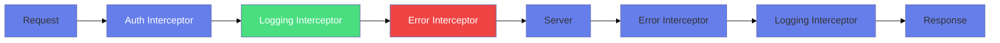
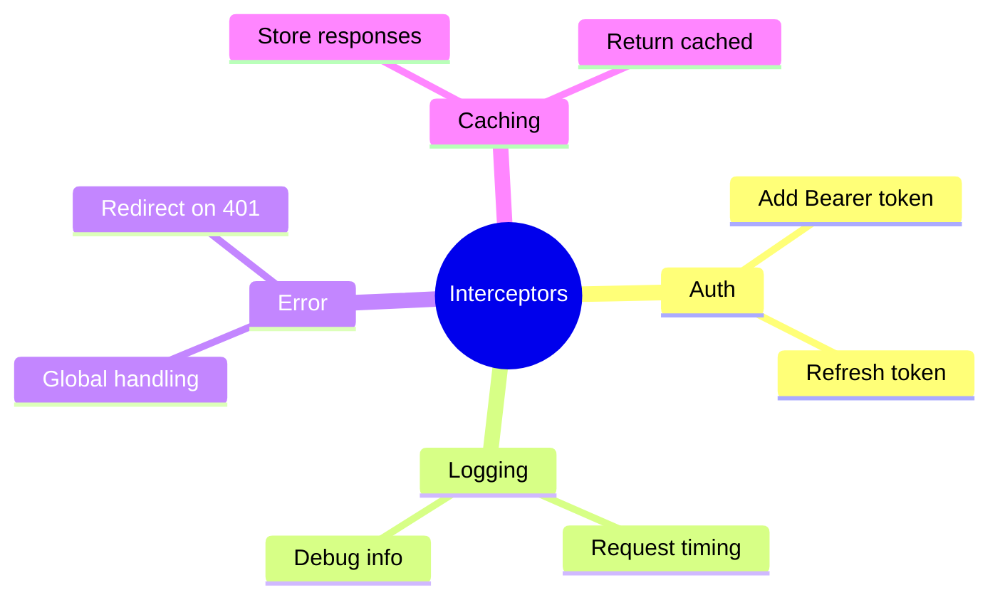

# 🔒 HTTP Interceptors

> **Goal**: Implement cross-cutting concerns like auth, logging, and error handling.


## 📋 Table of Contents
- [1. 🔍 How It Works](#1--how-it-works)
  - [📊 Interceptor Chain](#interceptor-chain)
- [🛃 Airport Security Analogy (Easy to Remember!)](#airport-security-analogy-easy-to-remember)
  - [📖 Story to Remember:](#story-to-remember)
  - [🎯 Quick Rule:](#quick-rule)
- [2. 🚀 Implementation](#2--implementation)
  - [Functional Interceptor (Angular 15+)](#functional-interceptor-angular-15)
  - [Register in app.config.ts](#register-in-appconfigts)
- [3. 🌍 Real World Uses](#3--real-world-uses)
- [🧠 Mind Map](#mind-map)
- [🎤 Interview Questions](#interview-questions)
  - [Basic Questions](#basic-questions)
    - [Q1: What is an HTTP Interceptor?](#q1-what-is-an-http-interceptor)
    - [Q2: Why must you clone the request in an interceptor?](#q2-why-must-you-clone-the-request-in-an-interceptor)
    - [Q3: What's the difference between class-based and functional interceptors?](#q3-whats-the-difference-between-class-based-and-functional-interceptors)
    - [Q4: In what order do interceptors run?](#q4-in-what-order-do-interceptors-run)
  - [Scenario-Based Questions](#scenario-based-questions)
    - [Scenario 1: Token Refresh](#scenario-1-token-refresh)
    - [Scenario 2: Skip Interceptor for Specific Requests](#scenario-2-skip-interceptor-for-specific-requests)
    - [Scenario 3: Global Loading Indicator](#scenario-3-global-loading-indicator)
    - [Scenario 4: Add Correlation ID to All Requests](#scenario-4-add-correlation-id-to-all-requests)
    - [Scenario 5: Request Caching](#scenario-5-request-caching)
  - [Advanced Questions](#advanced-questions)
    - [Q5: How would you implement retry logic in an interceptor?](#q5-how-would-you-implement-retry-logic-in-an-interceptor)
    - [Q6: Can you have multiple interceptors? What's the execution order?](#q6-can-you-have-multiple-interceptors-whats-the-execution-order)
    - [Q7: How do you test an interceptor?](#q7-how-do-you-test-an-interceptor)
- [💡 Pro Tips](#pro-tips)
- [❓ Additional Interview Questions (13+)](#additional-interview-questions-13)
  - [Basic Questions](#basic-questions)
  - [Error Handling Questions](#error-handling-questions)
  - [Advanced Questions](#advanced-questions)
  - [Testing Questions](#testing-questions)
  - [Performance Questions](#performance-questions)

---
---

## 1. 🔍 How It Works

Interceptors are **middleware** that intercept every HTTP request/response.

### 📊 Interceptor Chain



---

## 🛃 Airport Security Analogy (Easy to Remember!)

Think of HTTP Interceptors like **airport security checkpoints**:

| Interceptor | Airport Analogy | Memory Trick |
|-------------|----------------|--------------|
| **Auth Interceptor** | 🎫 **Ticket Check**: "Show your boarding pass (token) before proceeding" | **"No ticket, no entry"** |
| **Logging Interceptor** | 📸 **Security Camera**: Records everything that passes through | **"Log every traveler"** |
| **Error Interceptor** | 🚨 **Emergency Response**: Handle problems - lost luggage, missed flights | **"Intercept problems"** |
| **Cache Interceptor** | 🏪 **Duty-Free Shop**: "We saved your preferences from last time!" | **"Cache frequent flyers"** |

### 📖 Story to Remember:

> 🏢 **The Airport Security Checkpoint**
>
> Your HTTP request is a **passenger** going through airport security:
>
> 1. **Auth Interceptor** (Ticket Counter) → Check passport/token, stamp boarding pass
> 2. **Logging Interceptor** (Security Camera) → Record passenger passing through
> 3. **Error Interceptor** (Emergency Desk) → Handle issues, redirect if needed
>
> **On the way back** (response), the passenger goes through checkpoints in **REVERSE** order!
>
> ```
> REQUEST:  Passenger → 🎫 Ticket → 📸 Camera → 🚨 Emergency → ✈️ Flight
> RESPONSE: ✈️ Flight → 🚨 Emergency → 📸 Camera → 🎫 Ticket → Passenger
> ```

### 🎯 Quick Rule:
> **"Clone before modify"** = Like making a photocopy of your passport before stamping it. The original stays safe!

---

## 2. 🚀 Implementation

### Functional Interceptor (Angular 15+)

```typescript
export const authInterceptor: HttpInterceptorFn = (req, next) => {
    const token = localStorage.getItem('token');
    
    // Clone request (immutable!)
    const authReq = req.clone({
        headers: req.headers.set('Authorization', `Bearer ${token}`)
    });
    
    return next(authReq);
};
```

### Register in app.config.ts

```typescript
export const appConfig = {
    providers: [
        provideHttpClient(
            withInterceptors([authInterceptor, loggingInterceptor])
        )
    ]
};
```

---

## 3. 🌍 Real World Uses

1. **Auth tokens** - Add JWT to every request
2. **Request logging** - Track all API calls
3. **Global errors** - Show toasts on 500 errors
4. **Caching** - Return cached responses

---

## 🧠 Mind Map



---

## 🎤 Interview Questions

### Basic Questions

#### Q1: What is an HTTP Interceptor?
**Answer:**
An HTTP Interceptor is middleware that intercepts every HTTP request and response. It allows you to:
- Modify requests before they're sent (add headers, transform data)
- Modify responses before they reach your component
- Handle errors globally
- Log all HTTP traffic

#### Q2: Why must you clone the request in an interceptor?
**Answer:**
HTTP requests in Angular are **immutable**. You cannot modify them directly.
```typescript
// ❌ WRONG - This doesn't work!
req.headers.set('Authorization', 'token');

// ✅ CORRECT - Clone first, then modify
const clonedReq = req.clone({
    headers: req.headers.set('Authorization', 'token')
});
```

#### Q3: What's the difference between class-based and functional interceptors?
**Answer:**
| Feature | Class-based (Legacy) | Functional (Angular 15+) |
|---------|---------------------|--------------------------|
| Syntax | `@Injectable() class` | `const fn: HttpInterceptorFn` |
| Registration | `HTTP_INTERCEPTORS` token | `withInterceptors([])` |
| DI | Constructor injection | `inject()` function |
| Boilerplate | More | Less |

#### Q4: In what order do interceptors run?
**Answer:**
- **Request phase**: First registered → Last registered
- **Response phase**: Last registered → First registered (reverse order)

```
Request:  Component → Auth → Logging → Error → Server
Response: Server → Error → Logging → Auth → Component
```

---

### Scenario-Based Questions

#### Scenario 1: Token Refresh
**Question:** Your JWT token expires after 1 hour. When a 401 is received, you need to refresh the token and retry the original request. How would you implement this?

**Answer:**
```typescript
export const tokenRefreshInterceptor: HttpInterceptorFn = (req, next) => {
    const authService = inject(AuthService);
    
    return next(req).pipe(
        catchError((error: HttpErrorResponse) => {
            if (error.status === 401 && !req.url.includes('/refresh')) {
                // Token expired - refresh it
                return authService.refreshToken().pipe(
                    switchMap(newToken => {
                        // Retry original request with new token
                        const retryReq = req.clone({
                            headers: req.headers.set('Authorization', `Bearer ${newToken}`)
                        });
                        return next(retryReq);
                    }),
                    catchError(refreshError => {
                        // Refresh failed - logout
                        authService.logout();
                        return throwError(() => refreshError);
                    })
                );
            }
            return throwError(() => error);
        })
    );
};
```

---

#### Scenario 2: Skip Interceptor for Specific Requests
**Question:** You have an auth interceptor, but you don't want to add the token to public endpoints like `/login` and `/register`. How?

**Answer:**
```typescript
export const authInterceptor: HttpInterceptorFn = (req, next) => {
    // Skip auth for public endpoints
    const publicUrls = ['/api/login', '/api/register', '/api/public'];
    
    if (publicUrls.some(url => req.url.includes(url))) {
        return next(req);  // Pass through without modification
    }
    
    // Add token for protected endpoints
    const token = inject(AuthService).getToken();
    const authReq = req.clone({
        headers: req.headers.set('Authorization', `Bearer ${token}`)
    });
    
    return next(authReq);
};
```

---

#### Scenario 3: Global Loading Indicator
**Question:** Show a loading spinner whenever ANY HTTP request is in progress. Hide it when all requests complete. How?

**Answer:**
```typescript
export const loadingInterceptor: HttpInterceptorFn = (req, next) => {
    const loadingService = inject(LoadingService);
    
    loadingService.show();
    
    return next(req).pipe(
        finalize(() => {
            loadingService.hide();
        })
    );
};

// LoadingService tracks active requests
@Injectable({ providedIn: 'root' })
export class LoadingService {
    private activeRequests = 0;
    isLoading$ = new BehaviorSubject<boolean>(false);
    
    show() {
        this.activeRequests++;
        this.isLoading$.next(true);
    }
    
    hide() {
        this.activeRequests--;
        if (this.activeRequests <= 0) {
            this.activeRequests = 0;
            this.isLoading$.next(false);
        }
    }
}
```

---

#### Scenario 4: Add Correlation ID to All Requests
**Question:** For debugging in production, you need to add a unique correlation ID to every request. How?

**Answer:**
```typescript
export const correlationInterceptor: HttpInterceptorFn = (req, next) => {
    // Generate unique ID for this request
    const correlationId = crypto.randomUUID();
    
    const correlatedReq = req.clone({
        headers: req.headers.set('X-Correlation-ID', correlationId)
    });
    
    console.log(`[${correlationId}] ${req.method} ${req.url}`);
    
    return next(correlatedReq).pipe(
        tap({
            next: (event) => {
                if (event instanceof HttpResponse) {
                    console.log(`[${correlationId}] Response: ${event.status}`);
                }
            },
            error: (error) => {
                console.error(`[${correlationId}] Error: ${error.status}`);
            }
        })
    );
};
```

---

#### Scenario 5: Request Caching
**Question:** Cache GET requests for 5 minutes. Return cached response if available. How?

**Answer:**
```typescript
const cache = new Map<string, { response: any; expiry: number }>();

export const cachingInterceptor: HttpInterceptorFn = (req, next) => {
    // Only cache GET requests
    if (req.method !== 'GET') {
        return next(req);
    }
    
    const cacheKey = req.urlWithParams;
    const cached = cache.get(cacheKey);
    
    // Return cached if valid
    if (cached && cached.expiry > Date.now()) {
        return of(new HttpResponse({ body: cached.response }));
    }
    
    // Make request and cache response
    return next(req).pipe(
        tap(event => {
            if (event instanceof HttpResponse) {
                cache.set(cacheKey, {
                    response: event.body,
                    expiry: Date.now() + 5 * 60 * 1000  // 5 minutes
                });
            }
        })
    );
};
```

---

### Advanced Questions

#### Q5: How would you implement retry logic in an interceptor?
**Answer:**
```typescript
export const retryInterceptor: HttpInterceptorFn = (req, next) => {
    const maxRetries = 3;
    const retryDelay = 1000;
    
    return next(req).pipe(
        retry({
            count: maxRetries,
            delay: (error, retryCount) => {
                // Only retry on 5xx errors
                if (error.status < 500) {
                    throw error;
                }
                console.log(`Retry ${retryCount}/${maxRetries}`);
                return timer(retryDelay * retryCount);  // Exponential backoff
            }
        })
    );
};
```

#### Q6: Can you have multiple interceptors? What's the execution order?
**Answer:**
Yes, interceptors execute in the order they're registered:
```typescript
provideHttpClient(
    withInterceptors([
        first,   // Runs 1st on request, last on response
        second,  // Runs 2nd on request, 2nd on response
        third    // Runs 3rd on request, 1st on response
    ])
)
```

#### Q7: How do you test an interceptor?
**Answer:**
```typescript
describe('AuthInterceptor', () => {
    let httpMock: HttpTestingController;
    
    beforeEach(() => {
        TestBed.configureTestingModule({
            providers: [
                provideHttpClient(withInterceptors([authInterceptor])),
                provideHttpClientTesting()
            ]
        });
        httpMock = TestBed.inject(HttpTestingController);
    });
    
    it('should add Authorization header', () => {
        localStorage.setItem('token', 'test-token');
        
        inject([HttpClient], (http: HttpClient) => {
            http.get('/api/data').subscribe();
            
            const req = httpMock.expectOne('/api/data');
            expect(req.request.headers.get('Authorization'))
                .toBe('Bearer test-token');
        });
    });
});
```

---

## 💡 Pro Tips

1. **Order matters** - Put auth interceptor first, error interceptor last
2. **Always clone** - Requests are immutable
3. **Use `finalize()`** - For cleanup that must run (loading indicators)
4. **Skip when needed** - Check URL to skip certain endpoints
5. **Handle refresh loops** - Prevent infinite retry on token refresh

---

## ❓ Additional Interview Questions (13+)

### Basic Questions

**Q8: What does next() do in an interceptor?**
> A: Passes the request to the next interceptor or HTTP handler. Must be called.

**Q9: Can you have async logic in interceptors?**
> A: Yes - return an Observable that resolves when async work completes.

**Q10: How do you modify response in interceptor?**
> A: Use `tap()` or `map()` on the Observable returned by next().

---

### Error Handling Questions

**Q11: How do you handle errors globally with interceptors?**
> A: Use `catchError()` on next() Observable:
> ```typescript
> return next(req).pipe(catchError(err => { /* handle */ }))
> ```

**Q12: How to show toast on 500 errors?**
> A: Inject ToastService, check error.status in catchError.

---

### Advanced Questions

**Q13: Can you conditionally bypass interceptor logic?**
> A: Yes - check request properties (URL, headers) and return next(req) early.

**Q14: How to add timeout to all requests?**
> A: Use `timeout()` operator:
> ```typescript
> return next(req).pipe(timeout(30000))
> ```

**Q15: How to modify request body?**
> A: Clone with body option:
> ```typescript
> req.clone({ body: { ...req.body, timestamp: Date.now() } })
> ```

---

### Testing Questions

**Q16: How do you test interceptors?**
> A: Use HttpTestingController to verify requests have expected headers/body.

**Q17: How to mock interceptor behavior in tests?**
> A: Override providers in TestBed with custom test interceptor.

---

### Performance Questions

**Q18: Do interceptors affect performance?**
> A: Yes if heavy logic - keep interceptors lightweight, avoid blocking operations.

**Q19: Can you disable interceptors for specific tests?**
> A: Yes - provide empty array: `withInterceptors([])`.

**Q20: How to debug interceptor execution order?**
> A: Add console.log in each interceptor, check request/response logs.

