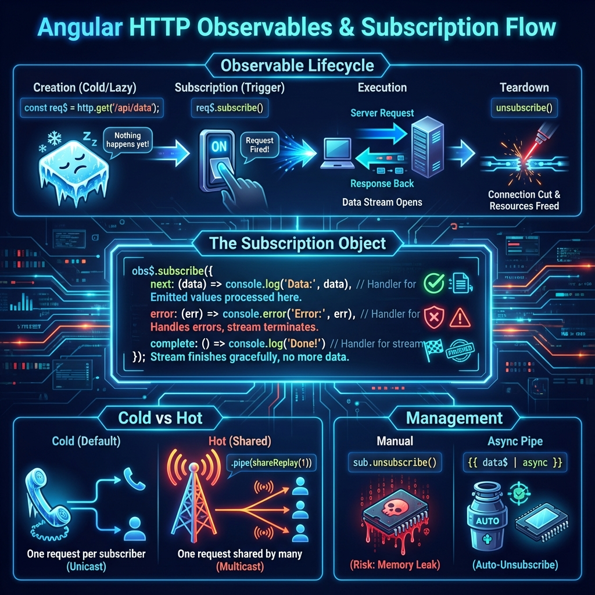
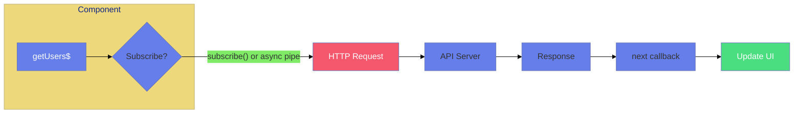
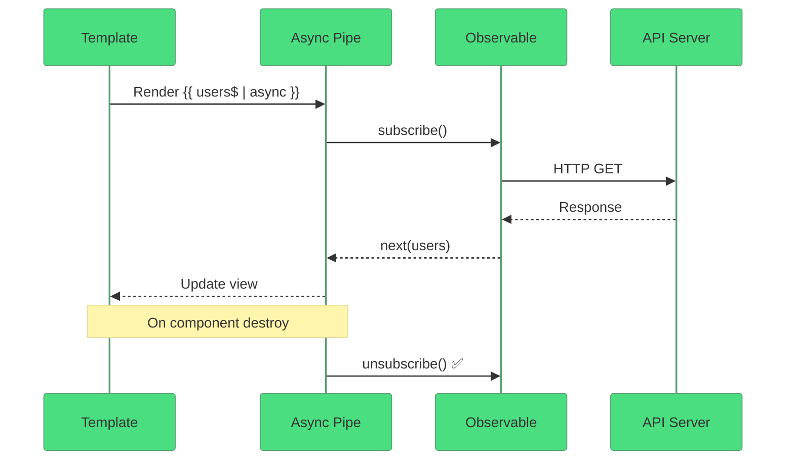
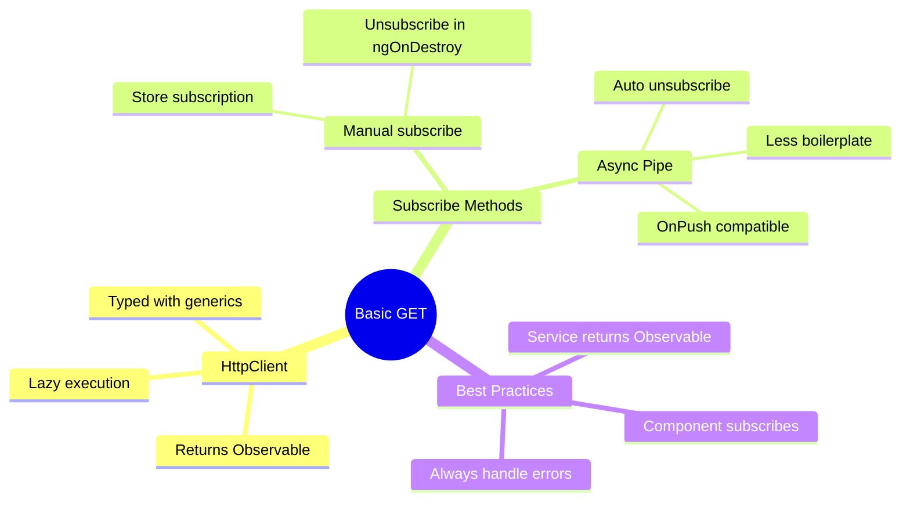

# 📥 Use Case 1: Basic GET with Observable

> **Goal**: Understand how HttpClient returns Observables and the best ways to consume them.

---

## 1. 🔍 How It Works (The Concept)

### The Core Mechanism

`HttpClient.get<T>()` returns an **Observable<T>**, not the data directly. The HTTP request is **lazy** - it doesn't execute until something subscribes.

### Observable vs Immediate

| Aspect | Observable (Angular) | Immediate (fetch/axios) |
|--------|---------------------|------------------------|
| Execution | Lazy (on subscribe) | Eager (immediately) |
| Cancellation | ✅ Unsubscribe | ❌ Requires AbortController |
| Multiple Values | ✅ Supported | ❌ Single value |
| Operators | ✅ map, filter, retry | ❌ Manual chaining |

### 📊 Data Flow Diagram





---

## 2. 🚀 Step-by-Step Implementation Guide

### Step 1: Inject HttpClient (via Service)

```typescript
// api.service.ts
@Injectable({ providedIn: 'root' })
export class ApiService {
    private http = inject(HttpClient);
    
    // 🛡️ CRITICAL: Return the Observable, don't subscribe here!
    getUsers(): Observable<User[]> {
        return this.http.get<User[]>('http://localhost:3000/api/users');
    }
}
```

### Step 2a: Manual Subscribe (Component)

```typescript
export class MyComponent implements OnDestroy {
    users: User[] = [];
    private subscription: Subscription | null = null;
    
    fetchUsers(): void {
        // 🛡️ CRITICAL: Store subscription for cleanup
        this.subscription = this.apiService.getUsers().subscribe({
            next: (users) => this.users = users,
            error: (err) => console.error(err)
        });
    }
    
    ngOnDestroy(): void {
        this.subscription?.unsubscribe(); // 🧹 Cleanup!
    }
}
```

### Step 2b: Async Pipe (Recommended!)

```typescript
// Component
users$ = this.apiService.getUsers();
```

```html
<!-- Template - async pipe auto-subscribes AND unsubscribes! -->
@if (users$ | async; as users) {
    @for (user of users; track user.id) {
        <div>{{ user.name }}</div>
    }
}
```

### 📊 Async Pipe Flow



---

## 3. 🐛 Common Pitfalls & Debugging

### ❌ Pitfall 1: Forgetting to Subscribe

```typescript
// ❌ BAD: Request never executes!
ngOnInit() {
    this.apiService.getUsers(); // Observable just sits there...
}
```

**Fix:** Either subscribe or use async pipe.

---

### ❌ Pitfall 2: Memory Leaks (No Unsubscribe)

```typescript
// ❌ BAD: Subscription lives forever
ngOnInit() {
    this.apiService.getUsers().subscribe(data => {
        // Component destroyed, but subscription keeps running!
    });
}
```

**Fix:** Use async pipe OR manual cleanup:

```typescript
private destroy$ = new Subject<void>();

ngOnInit() {
    this.apiService.getUsers().pipe(
        takeUntil(this.destroy$) // 🛡️ Auto-unsubscribe
    ).subscribe(data => {...});
}

ngOnDestroy() {
    this.destroy$.next();
    this.destroy$.complete();
}
```

---

## 4. ⚡ Performance & Architecture

### When to Use What

| Scenario | Recommendation |
|----------|---------------|
| Display-only data | Async Pipe |
| Need to process data | Manual subscribe with takeUntil |
| Complex logic | Manual subscribe |
| Simple display | Async Pipe (always) |

### Best Practice: Service Returns Observable

```typescript
// ✅ Service returns Observable
getUsers(): Observable<User[]> {
    return this.http.get<User[]>(url);
}

// ❌ Don't subscribe in service!
getUsersBad() {
    this.http.get(url).subscribe(...); // Anti-pattern!
}
```

---

## 5. 🌍 Real World Use Cases

1. **User List Page** - Fetch and display users
2. **Dashboard Data** - Load statistics on init
3. **Dropdown Options** - Fetch select options from API

---

## 6. 📝 The Analogy: "Magazine Subscription" 📰

Think of Observables like a **magazine subscription**:

- **Creating Observable** = Signing up for a magazine
- **Subscribing** = Actually paying and receiving issues
- **Data emissions** = Each magazine issue that arrives
- **Unsubscribing** = Cancelling your subscription (no more issues)
- **Async Pipe** = A service that auto-cancels when you move away

---

## 7. ❓ Interview & Concept Questions

### Basic Questions

#### Q1: Why does HttpClient return an Observable instead of a Promise?
**A:** Observables are lazy (don't execute until subscribed), cancellable, support multiple values, and have powerful operators like retry, debounce, and switchMap.

#### Q2: What happens if you don't unsubscribe from an HTTP Observable?
**A:** Technically HTTP Observables complete after one response, BUT keeping the subscription reference can prevent garbage collection and lead to memory leaks, especially with side effects.

#### Q3: Which is better: subscribe() or async pipe?
**A:** Async pipe is preferred because it auto-unsubscribes on component destroy, works well with OnPush change detection, and requires less boilerplate.

#### Q4: How do you type an HTTP response?
**A:** Use generics: `this.http.get<User[]>(url)` returns `Observable<User[]>`.

---

### Scenario-Based Questions

#### Scenario 1: Loading State Management
**Question:** You need to show a spinner while loading users, display data when loaded, and show an error message if the request fails. How do you implement all three states?

**Answer:**
```typescript
interface LoadState {
    loading: boolean;
    error: string | null;
    data: User[] | null;
}

state: LoadState = { loading: false, error: null, data: null };

fetchUsers(): void {
    this.state = { loading: true, error: null, data: null };
    
    this.apiService.getUsers().pipe(
        finalize(() => this.state.loading = false)
    ).subscribe({
        next: (users) => this.state.data = users,
        error: (err) => this.state.error = err.message
    });
}
```

---

#### Scenario 2: Multiple Subscriptions
**Question:** You have a users$ Observable in your component. Two parts of your template use `users$ | async`. How many HTTP requests are made?

**Answer:**
**Two requests!** Each async pipe creates a new subscription.

**Fix:** Use `shareReplay(1)` to share the response:
```typescript
users$ = this.apiService.getUsers().pipe(
    shareReplay(1)  // Cache and share
);
```

---

#### Scenario 3: Component Destroyed Mid-Request
**Question:** User navigates away while an HTTP request is in progress. What happens? How do you prevent issues?

**Answer:**
Without cleanup, the subscription may try to update destroyed component = memory leak or errors.

**Fix 1: Async Pipe** (automatic cleanup)
```html
@if (users$ | async; as users) {
    ...
}
```

**Fix 2: takeUntil Pattern**
```typescript
private destroy$ = new Subject<void>();

ngOnInit() {
    this.apiService.getUsers().pipe(
        takeUntil(this.destroy$)
    ).subscribe(users => this.users = users);
}

ngOnDestroy() {
    this.destroy$.next();
    this.destroy$.complete();
}
```

---

#### Scenario 4: Conditional Fetching
**Question:** Only fetch users if the user is logged in. How do you implement this?

**Answer:**
```typescript
users$ = this.authService.isLoggedIn$.pipe(
    switchMap(isLoggedIn => 
        isLoggedIn 
            ? this.apiService.getUsers() 
            : of([])  // Return empty if not logged in
    )
);
```

---

### Advanced Questions

#### Q5: What's the difference between `tap()` and `map()`?
**Answer:**
| Operator | Purpose | Returns |
|----------|---------|---------|
| `tap()` | Side effects (logging) | Same value (unchanged) |
| `map()` | Transform data | New value |

```typescript
// tap: for side effects (doesn't change data)
.pipe(tap(users => console.log('Fetched', users.length)))

// map: to transform data
.pipe(map(users => users.filter(u => u.active)))
```

#### Q6: When would you use `finalize()` vs putting code in the subscribe callback?
**Answer:**
`finalize()` runs whether the Observable completes OR errors. Subscribe's complete callback only runs on success.

```typescript
// finalize: ALWAYS runs (success or error)
.pipe(finalize(() => this.loading = false))

// subscribe complete: ONLY on success
.subscribe({ complete: () => this.loading = false })
```

---

## 🧠 Mind Map



---

## 🎯 What Problem Does This Solve?

### The Problem: Traditional HTTP Is Eager and Hard to Cancel

**Without Observables (BAD):**
```typescript
// Using fetch - no cancellation, eager execution
async fetchUsers() {
    try {
        const response = await fetch('/api/users');
        const users = await response.json();
        this.users = users;
    } catch (e) {
        console.error(e);
    }
    // What if component is destroyed during fetch?
    // What if we need to cancel?
    // What if we need retry logic?
}
```

**Problems:**
1. **Eager execution**: Request starts immediately
2. **No cancellation**: AbortController is tedious
3. **Single value**: Can't handle streams
4. **No built-in retry**: Must implement manually
5. **Memory leaks**: Component destroyed mid-request

### How HttpClient/Observables Solve This

**With HttpClient Observables (GOOD):**
```typescript
// Using HttpClient - lazy, cancellable, powerful
users$ = this.http.get<User[]>('/api/users').pipe(
    retry(3),                    // Built-in retry
    catchError(e => of([]))      // Built-in error handling
);

// In template - auto-cancels on destroy!
{{ users$ | async }}
```

| Problem | Observable Solution |
|---------|-------------------|
| Eager execution | **Lazy**: Only executes on subscribe |
| No cancellation | **Automatic**: Unsubscribe cancels request |
| Single value | **Streams**: Can handle multiple emissions |
| No retry | **Built-in**: `retry`, `retryWhen` operators |
| Memory leaks | **Async pipe**: Auto-cleanup on destroy |

---

## 📚 Key Classes & Types Explained

### 1. `HttpClient` Service

```typescript
import { HttpClient } from '@angular/common/http';

private http = inject(HttpClient);

// Methods return Observable<T>
this.http.get<User[]>('/api/users');
this.http.post<User>('/api/users', newUser);
this.http.put<User>('/api/users/1', updatedUser);
this.http.delete('/api/users/1');
this.http.patch<User>('/api/users/1', partialUpdate);
```

**Key Characteristics:**
- Returns `Observable<T>` (not Promise)
- Automatically parses JSON responses
- Supports typed responses via generics
- Requires `provideHttpClient()` in app config

---

### 2. `Observable<T>` Type

```typescript
Observable<User[]>  // Will emit User[] then complete

// Observable lifecycle:
// 1. CREATED (not yet subscribed)
// 2. SUBSCRIBED (request sent)
// 3. EMITTING (data received)
// 4. COMPLETED/ERRORED (done)
```

**For HTTP**: Emits one value then completes (cold observable).

---

### 3. `Subscription` Type

```typescript
import { Subscription } from 'rxjs';

const sub: Subscription = observable$.subscribe();

// Cleanup
sub.unsubscribe();  // Cancels if still pending
```

---

### 4. AsyncPipe

```typescript
// In template - handles subscribe/unsubscribe automatically
{{ users$ | async }}

// With @if
@if (users$ | async; as users) {
    @for (user of users; track user.id) {
        <span>{{ user.name }}</span>
    }
}
```

**Benefits:**
- Auto-subscribes when component renders
- Auto-unsubscribes on component destroy
- Works with OnPush change detection
- No manual cleanup code

---

## ❓ Additional Interview Questions (10+)

### RxJS Operator Questions

**Q7: What does `shareReplay(1)` do and when do you need it?**
> A: It caches the last emitted value and shares it with all subscribers. Use when multiple template bindings use the same Observable to prevent duplicate HTTP requests.

**Q8: How do you handle errors in an Observable chain?**
> A: Use `catchError()` operator:
> ```typescript
> .pipe(catchError(err => {
>     console.error(err);
>     return of([]);  // Return fallback value
> }))
> ```

**Q9: What's the difference between `switchMap` and `mergeMap`?**
> A:
> - `switchMap`: Cancels previous request when new one starts
> - `mergeMap`: Runs all requests in parallel
> Use `switchMap` for search, `mergeMap` for batch operations.

---

### Architecture Questions

**Q10: Should services subscribe to their own HTTP requests?**
> A: No! Services should return Observables. Let components/consumers decide when to subscribe.

**Q11: How do you configure HttpClient in a standalone app?**
> A: In `app.config.ts`:
> ```typescript
> export const appConfig: ApplicationConfig = {
>     providers: [provideHttpClient()]
> };
> ```

**Q12: How do you add a base URL to all requests?**
> A: Use an interceptor or create a base service with configured URL.

---

### Testing Questions

**Q13: How do you mock HTTP requests in tests?**
> A: Use `HttpTestingController`:
> ```typescript
> const req = httpMock.expectOne('/api/users');
> req.flush([{ id: 1, name: 'Test' }]);
> ```

**Q14: How do you test error handling?**
> A: Flush with error status:
> ```typescript
> req.flush('Error', { status: 500, statusText: 'Server Error' });
> ```

---

### Performance Questions

**Q15: How do you implement caching for HTTP requests?**
> A: Use `shareReplay()` or implement a caching interceptor:
> ```typescript
> users$ = this.http.get<User[]>('/api/users').pipe(
>     shareReplay({ bufferSize: 1, refCount: true })
> );
> ```

**Q16: How do you debounce search requests?**
> A:
> ```typescript
> searchTerm$.pipe(
>     debounceTime(300),
>     distinctUntilChanged(),
>     switchMap(term => this.http.get(`/api/search?q=${term}`))
> )
> ```

---

### Edge Case Questions

**Q17: What happens if the API returns non-JSON?**
> A: By default, HttpClient expects JSON. For text:
> ```typescript
> this.http.get('/api/text', { responseType: 'text' })
> ```

**Q18: How do you get the full response including headers?**
> A: Use observe option:
> ```typescript
> this.http.get('/api/users', { observe: 'response' })
> // Returns Observable<HttpResponse<User[]>>
> ```

**Q19: How do you track upload/download progress?**
> A:
> ```typescript
> this.http.post('/api/upload', formData, { 
>     reportProgress: true, 
>     observe: 'events' 
> }).pipe(
>     filter(event => event.type === HttpEventType.UploadProgress)
> )
> ```

**Q20: How do you handle concurrent requests?**
> A: Use `forkJoin` for parallel:
> ```typescript
> forkJoin({
>     users: this.http.get<User[]>('/api/users'),
>     roles: this.http.get<Role[]>('/api/roles')
> }).subscribe(({ users, roles }) => {...})
> ```

