# 📥 Use Case 1: Basic GET with Observable

> **Goal**: Understand how HttpClient returns Observables and the best ways to consume them.

---

## 1. 🔍 How It Works (The Concept)

### The Core Mechanism

`HttpClient.get<T>()` returns an **Observable<T>**, not the data directly. The HTTP request is **lazy** - it doesn't execute until something subscribes.

### Observable vs Immediate

| Aspect | Observable (Angular) | Immediate (fetch/axios) |
|--------|---------------------|------------------------|
| Execution | Lazy (on subscribe) | Eager (immediately) |
| Cancellation | ✅ Unsubscribe | ❌ Requires AbortController |
| Multiple Values | ✅ Supported | ❌ Single value |
| Operators | ✅ map, filter, retry | ❌ Manual chaining |

### 📊 Data Flow Diagram


---

## 2. 🚀 Step-by-Step Implementation Guide

### Step 1: Inject HttpClient (via Service)

```typescript
// api.service.ts
@Injectable({ providedIn: 'root' })
export class ApiService {
    private http = inject(HttpClient);
    
    // 🛡️ CRITICAL: Return the Observable, don't subscribe here!
    getUsers(): Observable<User[]> {
        return this.http.get<User[]>('http://localhost:3000/api/users');
    }
}
```

### Step 2a: Manual Subscribe (Component)

```typescript
export class MyComponent implements OnDestroy {
    users: User[] = [];
    private subscription: Subscription | null = null;
    
    fetchUsers(): void {
        // 🛡️ CRITICAL: Store subscription for cleanup
        this.subscription = this.apiService.getUsers().subscribe({
            next: (users) => this.users = users,
            error: (err) => console.error(err)
        });
    }
    
    ngOnDestroy(): void {
        this.subscription?.unsubscribe(); // 🧹 Cleanup!
    }
}
```

### Step 2b: Async Pipe (Recommended!)

```typescript
// Component
users$ = this.apiService.getUsers();
```

```html
<!-- Template - async pipe auto-subscribes AND unsubscribes! -->
@if (users$ | async; as users) {
    @for (user of users; track user.id) {
        <div>{{ user.name }}</div>
    }
}
```

### 📊 Async Pipe Flow

```mermaid
%%{init: {'theme':'base', 'themeVariables': { 'primaryColor':'#4ade80'}}}%%
sequenceDiagram
    participant T as Template
    participant AP as Async Pipe
    participant O as Observable
    participant API as API Server
    
    T->>AP: Render {{ users$ | async }}
    AP->>O: subscribe()
    O->>API: HTTP GET
    API-->>O: Response
    O-->>AP: next(users)
    AP-->>T: Update view
    Note over T,AP: On component destroy
    AP->>O: unsubscribe() ✅
```



---

## 3. 🐛 Common Pitfalls & Debugging

### ❌ Pitfall 1: Forgetting to Subscribe

```typescript
// ❌ BAD: Request never executes!
ngOnInit() {
    this.apiService.getUsers(); // Observable just sits there...
}
```

**Fix:** Either subscribe or use async pipe.

---

### ❌ Pitfall 2: Memory Leaks (No Unsubscribe)

```typescript
// ❌ BAD: Subscription lives forever
ngOnInit() {
    this.apiService.getUsers().subscribe(data => {
        // Component destroyed, but subscription keeps running!
    });
}
```

**Fix:** Use async pipe OR manual cleanup:

```typescript
private destroy$ = new Subject<void>();

ngOnInit() {
    this.apiService.getUsers().pipe(
        takeUntil(this.destroy$) // 🛡️ Auto-unsubscribe
    ).subscribe(data => {...});
}

ngOnDestroy() {
    this.destroy$.next();
    this.destroy$.complete();
}
```

---

## 4. ⚡ Performance & Architecture

### When to Use What

| Scenario | Recommendation |
|----------|---------------|
| Display-only data | Async Pipe |
| Need to process data | Manual subscribe with takeUntil |
| Complex logic | Manual subscribe |
| Simple display | Async Pipe (always) |

### Best Practice: Service Returns Observable

```typescript
// ✅ Service returns Observable
getUsers(): Observable<User[]> {
    return this.http.get<User[]>(url);
}

// ❌ Don't subscribe in service!
getUsersBad() {
    this.http.get(url).subscribe(...); // Anti-pattern!
}
```

---

## 5. 🌍 Real World Use Cases

1. **User List Page** - Fetch and display users
2. **Dashboard Data** - Load statistics on init
3. **Dropdown Options** - Fetch select options from API

---

## 6. 📝 The Analogy: "Magazine Subscription" 📰

Think of Observables like a **magazine subscription**:

- **Creating Observable** = Signing up for a magazine
- **Subscribing** = Actually paying and receiving issues
- **Data emissions** = Each magazine issue that arrives
- **Unsubscribing** = Cancelling your subscription (no more issues)
- **Async Pipe** = A service that auto-cancels when you move away

---

## 7. ❓ Interview & Concept Questions

### Q1: Why does HttpClient return an Observable instead of a Promise?
**A:** Observables are lazy (don't execute until subscribed), cancellable, support multiple values, and have powerful operators like retry, debounce, and switchMap.

### Q2: What happens if you don't unsubscribe from an HTTP Observable?
**A:** Technically HTTP Observables complete after one response, BUT keeping the subscription reference can prevent garbage collection and lead to memory leaks, especially with side effects.

### Q3: Which is better: subscribe() or async pipe?
**A:** Async pipe is preferred because it auto-unsubscribes on component destroy, works well with OnPush change detection, and requires less boilerplate.

### Q4: How do you type an HTTP response?
**A:** Use generics: `this.http.get<User[]>(url)` returns `Observable<User[]>`.

---

## 🧠 Mind Map


