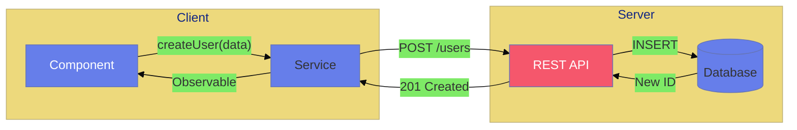
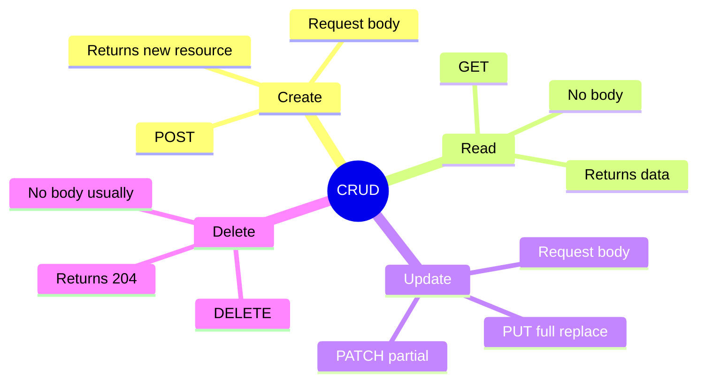

# ✏️ Use Case 2: CRUD Operations

> **Goal**: Master Create, Read, Update, Delete operations with HttpClient.

---

## 1. 🔍 How It Works

### HTTP Methods Mapping

| Operation | HTTP Method | Request Body | Response |
|-----------|-------------|--------------|----------|
| **Create** | POST | ✅ Yes | Created resource |
| **Read** | GET | ❌ No | Resource(s) |
| **Update** | PUT/PATCH | ✅ Yes | Updated resource |
| **Delete** | DELETE | ❌ Usually no | Empty (204) |

### 📊 CRUD Flow



---

## 2. 🚀 Step-by-Step Implementation

### CREATE (POST)

```typescript
createUser(userData: Partial<User>): Observable<User> {
    return this.http.post<User>(`${this.API_URL}/users`, userData);
    // Body is automatically serialized to JSON
}

// Usage
this.apiService.createUser({ name: 'John', email: 'john@test.com' })
    .subscribe(newUser => console.log('Created:', newUser));
```

### READ (GET)

```typescript
// Get all
getUsers(): Observable<User[]> {
    return this.http.get<User[]>(`${this.API_URL}/users`);
}

// Get one
getUser(id: number): Observable<User> {
    return this.http.get<User>(`${this.API_URL}/users/${id}`);
}
```

### UPDATE (PUT)

```typescript
updateUser(id: number, data: Partial<User>): Observable<User> {
    return this.http.put<User>(`${this.API_URL}/users/${id}`, data);
}
```

### DELETE

```typescript
deleteUser(id: number): Observable<void> {
    return this.http.delete<void>(`${this.API_URL}/users/${id}`);
}
```

---

## 3. 🐛 Common Pitfalls

### ❌ Mutating Original Data

```typescript
// ❌ BAD: Mutates the original object in the list
selectUser(user: User) {
    this.editingUser = user;
}
```

**Fix:**
```typescript
// ✅ GOOD: Create a copy
selectUser(user: User) {
    this.editingUser = { ...user };
}
```

---

## 4. 🌍 Real World Uses

1. **Admin Panel** - Manage users, products, content
2. **Form Submissions** - Create/update records
3. **Shopping Cart** - Add/remove items

---

## 🧠 Mind Map


