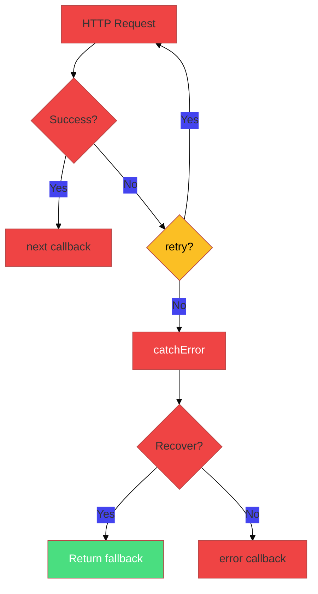
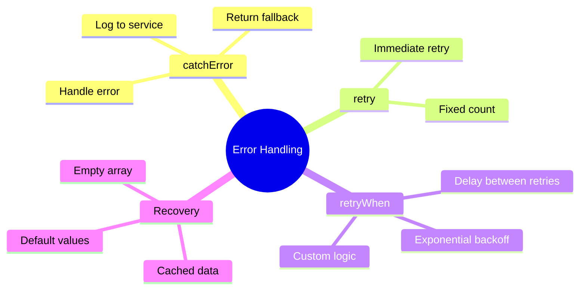

# 🐛 Use Case 3: Error Handling & Retry

> **Goal**: Handle HTTP errors gracefully and implement retry strategies.

---

## 1. 🔍 How It Works

### Error Handling Operators

| Operator | Purpose |
|----------|---------|
| `catchError` | Catch error, optionally recover |
| `retry(n)` | Retry n times immediately |
| `retryWhen` | Custom retry logic |
| `throwError` | Re-throw or create new error |

### 📊 Error Flow



---

## 2. 🚀 Implementation

### Basic catchError

```typescript
this.http.get(url).pipe(
    catchError(error => {
        console.error('API Error:', error);
        // Return fallback or empty
        return of({ error: true, data: [] });
    })
).subscribe(data => ...);
```

### Retry with Exponential Backoff

```typescript
this.http.get(url).pipe(
    retryWhen(errors => errors.pipe(
        delayWhen((_, attempt) => 
            timer(Math.pow(2, attempt) * 1000) // 1s, 2s, 4s...
        ),
        take(3) // Max 3 retries
    )),
    catchError(err => of(null))
).subscribe();
```

---

## 3. 🌍 Real World Uses

1. **Flaky APIs** - Retry transient network errors
2. **Offline mode** - Return cached data on error
3. **User feedback** - Show friendly error messages

---

## 🧠 Mind Map


