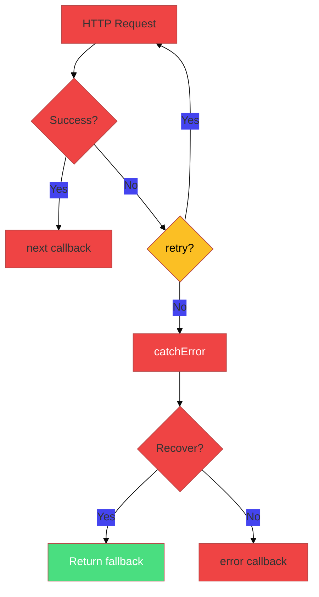
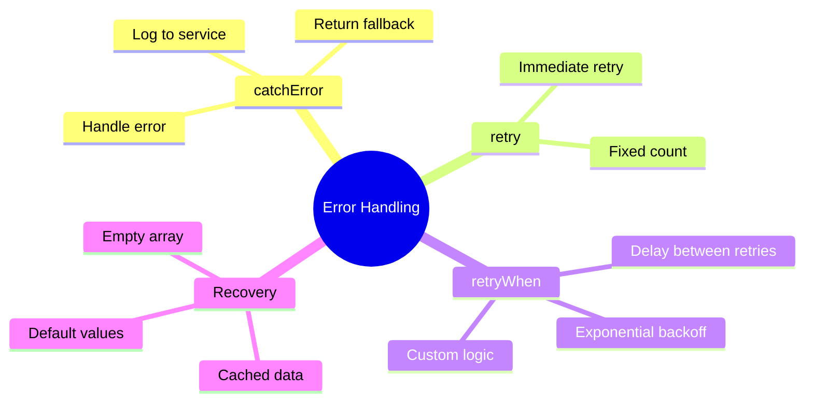

# 🐛 Use Case 3: Error Handling & Retry

> **Goal**: Handle HTTP errors gracefully and implement retry strategies.

---

## 1. 🔍 How It Works

### Error Handling Operators

| Operator | Purpose |
|----------|---------|
| `catchError` | Catch error, optionally recover |
| `retry(n)` | Retry n times immediately |
| `retryWhen` | Custom retry logic |
| `throwError` | Re-throw or create new error |

### 📊 Error Flow



---

## ✈️ Airplane Safety Analogy (Easy to Remember!)

Think of HTTP error handling like **airplane safety systems**:

| Operator | Airplane Analogy | Memory Trick |
|----------|-----------------|--------------|
| **`catchError`** | 🪂 **Parachute**: When engines fail, have a backup plan! Deploy parachute (fallback data) | **"Catch the fall safely"** |
| **`retry(n)`** | 🔄 **"Try again, Captain"**: Engine sputters? Try restarting 3 times before giving up | **"Retry the engine start"** |
| **`retryWhen`** | ⏰ **Smart Retry**: Wait longer between each restart attempt (1s, 2s, 4s...) | **"Retry with patience"** |
| **Exponential Backoff** | 📈 **Cooldown Period**: Like letting an overheated engine cool down longer each time | **"Back off and cool down"** |

### 📖 Story to Remember:

> 🛫 **The Pilot's Error Protocol**
>
> Imagine you're a pilot and your engine stalls:
>
> 1. **retry(3)** = Try to restart the engine 3 times immediately
> 2. **retryWhen + delay** = Wait between attempts (give it time to cool)
> 3. **catchError** = If all retries fail, glide to the nearest airport (fallback)
> 4. **throwError** = Radio for help - "Mayday!" (escalate the error)
>
> **Don't crash immediately!** Have a backup plan. ✈️➡️🪂

### 🎯 Error Codes as Flight Statuses:

```
4xx = Pilot error (bad request)    → Fix YOUR request, don't retry!
5xx = Weather/ATC problem (server) → Retry, might clear up!
0   = Lost contact (network)       → Try again, could be temporary!
```

---

## 2. 🚀 Implementation

### Basic catchError

```typescript
this.http.get(url).pipe(
    catchError(error => {
        console.error('API Error:', error);
        // Return fallback or empty
        return of({ error: true, data: [] });
    })
).subscribe(data => ...);
```

### Retry with Exponential Backoff

```typescript
this.http.get(url).pipe(
    retryWhen(errors => errors.pipe(
        delayWhen((_, attempt) => 
            timer(Math.pow(2, attempt) * 1000) // 1s, 2s, 4s...
        ),
        take(3) // Max 3 retries
    )),
    catchError(err => of(null))
).subscribe();
```

---

## 3. 🌍 Real World Uses

1. **Flaky APIs** - Retry transient network errors
2. **Offline mode** - Return cached data on error
3. **User feedback** - Show friendly error messages

---

## 4. ❓ Interview Questions

### Basic Questions

#### Q1: What's the difference between catchError and retry?
**Answer:**
| Operator | Purpose |
|----------|---------|
| `catchError` | Handle error, return fallback or rethrow |
| `retry(n)` | Retry the request n times before erroring |

```typescript
// catchError: Handle and recover
.pipe(catchError(err => of(fallbackData)))

// retry: Try again before giving up
.pipe(retry(3), catchError(err => of(null)))
```

#### Q2: Which HTTP error codes should you retry?
**Answer:**
| Status | Meaning | Retry? |
|--------|---------|--------|
| 0 | Network error | ✅ Yes |
| 400-499 | Client error | ❌ No (fix your request) |
| 429 | Rate limited | ✅ Yes (with delay) |
| 500-599 | Server error | ✅ Yes |

#### Q3: What is exponential backoff?
**Answer:**
A retry strategy where you wait progressively longer between retries:
- Retry 1: Wait 1 second
- Retry 2: Wait 2 seconds
- Retry 3: Wait 4 seconds

This prevents overwhelming a struggling server.

---

### Scenario-Based Questions

#### Scenario 1: Show User-Friendly Error
**Question:** The API returns a 404 error. Instead of showing technical details, display "Resource not found" to the user.

**Answer:**
```typescript
const errorMessages: Record<number, string> = {
    400: 'Invalid request. Please check your input.',
    401: 'Please log in to continue.',
    404: 'Resource not found.',
    500: 'Server error. Please try again later.'
};

this.apiService.getData().pipe(
    catchError((error: HttpErrorResponse) => {
        this.errorMessage = errorMessages[error.status] || 'An error occurred';
        return of(null);
    })
).subscribe();
```

---

#### Scenario 2: Retry Only Server Errors
**Question:** Retry 3 times only for 5xx errors, but fail immediately for 4xx errors.

**Answer:**
```typescript
this.http.get('/api/data').pipe(
    retry({
        count: 3,
        delay: (error, retryCount) => {
            if (error.status < 500) {
                // Don't retry client errors
                throw error;
            }
            // Wait 1s, 2s, 4s (exponential backoff)
            return timer(Math.pow(2, retryCount) * 1000);
        }
    }),
    catchError(err => {
        this.showError('Request failed after retries');
        return of(null);
    })
).subscribe();
```

---

#### Scenario 3: Offline Fallback
**Question:** When the API fails, return cached data from localStorage. If no cache exists, return empty array.

**Answer:**
```typescript
this.apiService.getUsers().pipe(
    catchError(error => {
        // Try to get cached data
        const cached = localStorage.getItem('users_cache');
        if (cached) {
            console.log('Using cached data');
            return of(JSON.parse(cached));
        }
        // No cache, return empty
        return of([]);
    }),
    tap(users => {
        // Cache successful responses
        if (users.length > 0) {
            localStorage.setItem('users_cache', JSON.stringify(users));
        }
    })
).subscribe(users => this.users = users);
```

---

#### Scenario 4: Circuit Breaker
**Question:** After 3 consecutive failures, stop calling the API for 30 seconds. How do you implement this?

**Answer:**
```typescript
// Circuit breaker states: closed | open | half-open
circuitState: 'closed' | 'open' | 'half-open' = 'closed';
failureCount = 0;

makeRequest(): void {
    // Block requests when circuit is open
    if (this.circuitState === 'open') {
        this.showError('Service unavailable. Try again later.');
        return;
    }

    this.apiService.getData().subscribe({
        next: () => {
            // Success: reset circuit
            this.failureCount = 0;
            if (this.circuitState === 'half-open') {
                this.circuitState = 'closed';
            }
        },
        error: () => {
            this.failureCount++;
            if (this.failureCount >= 3) {
                // Open circuit
                this.circuitState = 'open';
                setTimeout(() => {
                    this.circuitState = 'half-open';
                }, 30000);
            }
        }
    });
}
```

---

### Advanced Questions

#### Q4: What is "jitter" in retry strategies?
**Answer:**
Adding a random delay to prevent all clients from retrying at the same time (thundering herd problem).

```typescript
const baseDelay = Math.pow(2, retryCount) * 1000;
const jitter = Math.random() * 1000;  // 0-1 second random
const totalDelay = baseDelay + jitter;
```

#### Q5: How do you distinguish between network errors and server errors?
**Answer:**
- **Network errors**: `status === 0` (no response received)
- **Server errors**: `status >= 500` (server responded with error)
- **Client errors**: `status >= 400 && status < 500` (your request was wrong)

```typescript
if (error.status === 0) {
    console.log('Network offline or request timed out');
} else if (error.status >= 500) {
    console.log('Server problem - may retry');
} else if (error.status >= 400) {
    console.log('Client problem - fix request');
}
```

---

## 🧠 Mind Map



