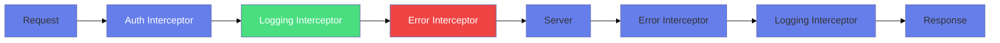
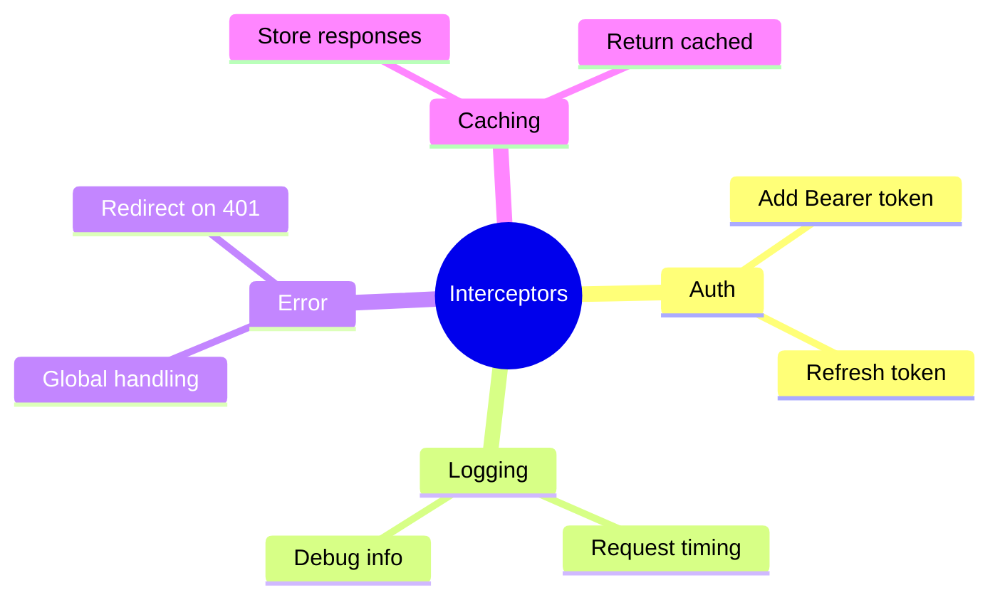

# 🔒 Use Case 4: HTTP Interceptors

> **Goal**: Implement cross-cutting concerns like auth, logging, and error handling.

---

## 1. 🔍 How It Works

Interceptors are **middleware** that intercept every HTTP request/response.

### 📊 Interceptor Chain



---

## 2. 🚀 Implementation

### Functional Interceptor (Angular 15+)

```typescript
export const authInterceptor: HttpInterceptorFn = (req, next) => {
    const token = localStorage.getItem('token');
    
    // Clone request (immutable!)
    const authReq = req.clone({
        headers: req.headers.set('Authorization', `Bearer ${token}`)
    });
    
    return next(authReq);
};
```

### Register in app.config.ts

```typescript
export const appConfig = {
    providers: [
        provideHttpClient(
            withInterceptors([authInterceptor, loggingInterceptor])
        )
    ]
};
```

---

## 3. 🌍 Real World Uses

1. **Auth tokens** - Add JWT to every request
2. **Request logging** - Track all API calls
3. **Global errors** - Show toasts on 500 errors
4. **Caching** - Return cached responses

---

## 🧠 Mind Map


