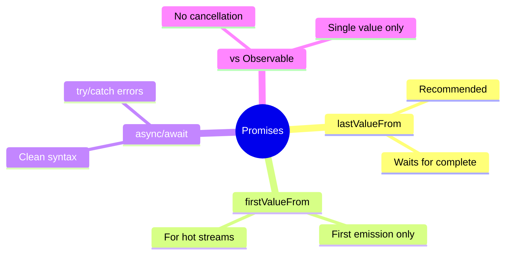

# 🤝 Use Case 5: Promise-based Requests

> **Goal**: Use async/await with HTTP requests via lastValueFrom.

---

## 1. 🔍 How It Works

`lastValueFrom()` converts Observable to Promise (replaces deprecated `toPromise()`).

### When to Use Promises

| Use Observable | Use Promise |
|---------------|-------------|
| Multiple emissions | Single response |
| Need operators | Simple request |
| Cancellation needed | async/await preference |
| Streams (WebSocket) | REST API calls |

---

## 2. 🚀 Implementation

### Basic Pattern

```typescript
async loadUsers(): Promise<void> {
    try {
        this.users = await lastValueFrom(
            this.apiService.getUsers()
        );
    } catch (err) {
        console.error(err);
    }
}
```

### Sequential Requests

```typescript
async loadSequential(): Promise<void> {
    const user = await lastValueFrom(this.getUser(1));
    const orders = await lastValueFrom(this.getOrders(user.id));
}
```

---

## 3. 🌍 Real World Uses

1. **Route resolvers** - Load data before navigation
2. **Form submission** - Simple POST and redirect
3. **Sequential logic** - When B depends on A

---

## 🧠 Mind Map


