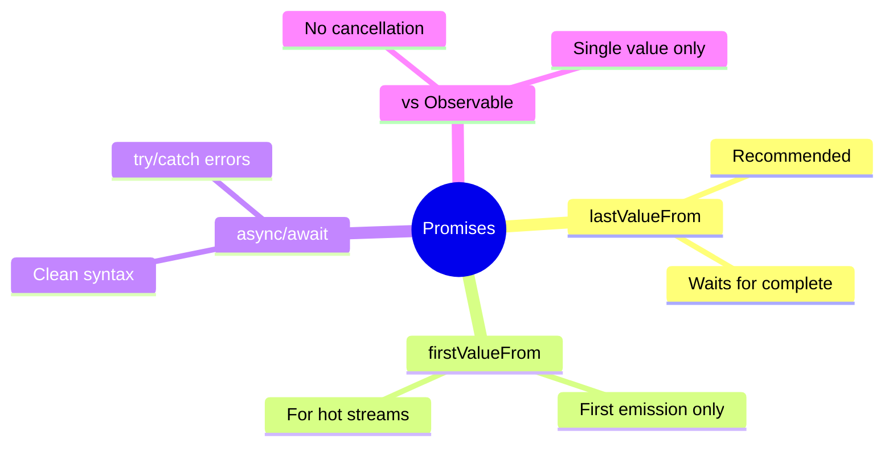

# 🤝 Use Case 5: Promise-based Requests

> **Goal**: Use async/await with HTTP requests via lastValueFrom.

---

## 1. 🔍 How It Works

`lastValueFrom()` converts Observable to Promise (replaces deprecated `toPromise()`).

### When to Use Promises

| Use Observable | Use Promise |
|---------------|-------------|
| Multiple emissions | Single response |
| Need operators | Simple request |
| Cancellation needed | async/await preference |
| Streams (WebSocket) | REST API calls |

---

## ☕ Coffee Shop Analogy (Easy to Remember!)

Think of Promises vs Observables like **ordering coffee**:

| Concept | Coffee Shop Analogy | Memory Trick |
|---------|--------------------|--------------| 
| **Promise** | ☕ **Ordering a single coffee**: You order once, wait, get ONE cup | **"One order, one cup"** |
| **Observable** | 📱 **Coffee subscription app**: You get notified every time a new blend arrives | **"Subscribe for updates"** |
| **async/await** | 🪑 **Sitting and waiting**: "I'll wait here until my coffee is ready" | **"Await patiently"** |
| **lastValueFrom** | 📦 **"Give me the FINAL order"**: After all drinks, give me the last one | **"Last drink wins"** |

### 📖 Story to Remember:

> ☕ **The Coffee Order**
>
> **Promise (awaiting one coffee):**
> ```
> You: "One latte please"
> Barista: "Coming right up!"
> You: *waits patiently* (await)
> Barista: "Here's your latte!" ✅
> You: "Thanks!" (single value received)
> ```
>
> **Observable (coffee subscription):**
> ```
> You: "I want to know about ALL new coffee flavors"
> Barista: "Sure, I'll notify you!" (subscribe)
> Barista: "New Caramel Macchiato!" 
> Barista: "New Hazelnut Mocha!"
> Barista: "New Pumpkin Spice!"
> You: "I'm leaving" (unsubscribe) - No more notifications
> ```

### 🎯 When to Use What:

```
☕ Promise (async/await) = "I want exactly ONE thing and I'll wait"
📱 Observable          = "Keep me updated on a STREAM of things"
```

---

## 2. 🚀 Implementation

### Basic Pattern

```typescript
async loadUsers(): Promise<void> {
    try {
        this.users = await lastValueFrom(
            this.apiService.getUsers()
        );
    } catch (err) {
        console.error(err);
    }
}
```

### Sequential Requests

```typescript
async loadSequential(): Promise<void> {
    const user = await lastValueFrom(this.getUser(1));
    const orders = await lastValueFrom(this.getOrders(user.id));
}
```

---

## 3. 🌍 Real World Uses

1. **Route resolvers** - Load data before navigation
2. **Form submission** - Simple POST and redirect
3. **Sequential logic** - When B depends on A

---

## 4. ❓ Interview Questions

### Basic Questions

#### Q1: What's the difference between lastValueFrom and firstValueFrom?
**Answer:**
| Function | Returns | Use When |
|----------|---------|----------|
| `lastValueFrom` | Last emitted value | HTTP (waits for complete) |
| `firstValueFrom` | First emitted value | Hot streams (take first) |

#### Q2: Why is toPromise() deprecated?
**Answer:** It was ambiguous. `lastValueFrom()` and `firstValueFrom()` make it explicit which value you want.

---

### Scenario-Based Questions

#### Scenario 1: Sequential API Calls
**Question:** You need to: 1) Get user, 2) Get user's orders, 3) Get order details. Each depends on the previous. How?

**Answer:**
```typescript
async loadUserOrderDetails(userId: number) {
    const user = await lastValueFrom(this.api.getUser(userId));
    const orders = await lastValueFrom(this.api.getOrders(user.id));
    const details = await lastValueFrom(this.api.getOrderDetails(orders[0].id));
    return { user, orders, details };
}
```

#### Scenario 2: Timeout
**Question:** Implement a 5-second timeout for an API call using Promises.

**Answer:**
```typescript
const result = await Promise.race([
    lastValueFrom(this.api.getData()),
    new Promise((_, reject) => 
        setTimeout(() => reject(new Error('Timeout')), 5000)
    )
]);
```

---

## 🧠 Mind Map



