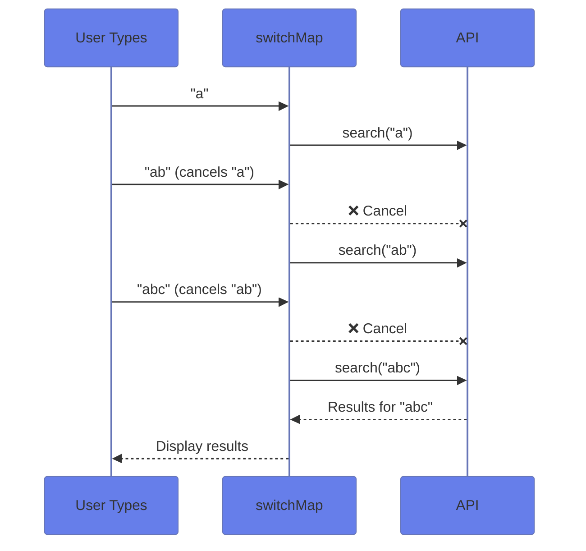
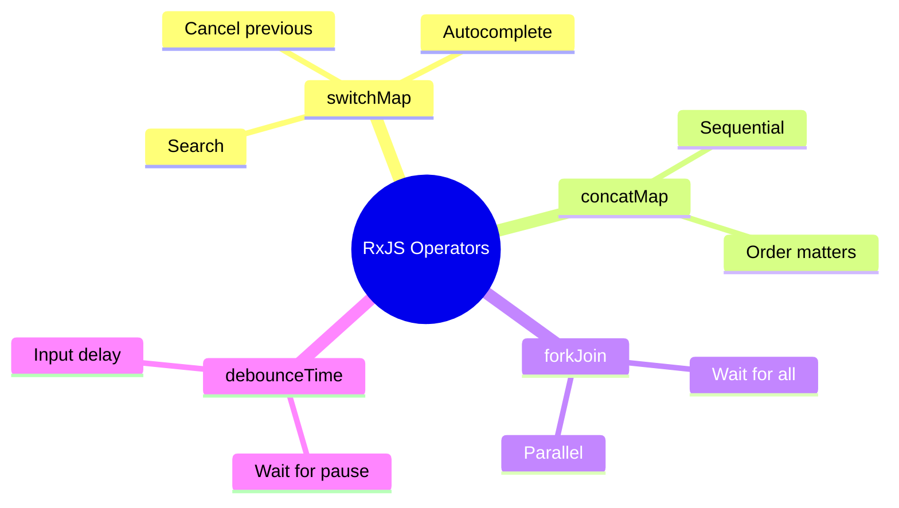

# 🔧 Use Case 6: RxJS Operators for HTTP

> **Goal**: Master essential RxJS operators for HTTP request handling.

---

## 1. 🔍 How It Works

### Operator Comparison

| Operator | Behavior | Best For |
|----------|----------|----------|
| `switchMap` | Cancels previous | Search, autocomplete |
| `concatMap` | Queues in order | Form submissions |
| `mergeMap` | Runs all parallel | Analytics, logging |
| `exhaustMap` | Ignores while busy | Login buttons |
| `forkJoin` | Waits for all | Dashboard init |

### 📊 switchMap Flow



---

## 2. 🚀 Implementation

### Search with Debounce + switchMap

```typescript
searchTerm$.pipe(
    debounceTime(300),
    distinctUntilChanged(),
    switchMap(term => this.api.search(term))
).subscribe(results => ...);
```

### Parallel with forkJoin

```typescript
forkJoin({
    users: this.api.getUsers(),
    products: this.api.getProducts()
}).subscribe(({ users, products }) => {
    // Both available!
});
```

---

## 3. 🌍 Real World Uses

1. **Search autocomplete** - switchMap + debounce
2. **Dashboard loading** - forkJoin for multiple APIs
3. **Form wizard** - concatMap for sequential saves

---

## 4. ❓ Interview Questions

### Basic Questions

#### Q1: What's the difference between switchMap and mergeMap?
**Answer:**
| Operator | Behavior | Use Case |
|----------|----------|----------|
| `switchMap` | Cancels previous inner Observable | Search autocomplete |
| `mergeMap` | Runs all in parallel | Bulk operations, logging |

#### Q2: When would you use exhaustMap?
**Answer:** When you want to ignore new requests while one is in progress. Perfect for login buttons to prevent double-clicks.

---

### Scenario-Based Questions

#### Scenario 1: Type-ahead Search
**Question:** Build a search that: 1) Waits 300ms after typing stops, 2) Doesn't search if query unchanged, 3) Cancels pending requests when user types more.

**Answer:**
```typescript
this.searchInput$.pipe(
    debounceTime(300),           // Wait 300ms
    distinctUntilChanged(),       // Skip if same
    switchMap(term =>            // Cancel previous
        this.api.search(term)
    )
).subscribe(results => this.results = results);
```

#### Scenario 2: Dashboard Loading
**Question:** Load users, products, and stats in parallel. All must succeed.

**Answer:**
```typescript
forkJoin({
    users: this.api.getUsers(),
    products: this.api.getProducts(),
    stats: this.api.getStats()
}).subscribe(result => {
    this.users = result.users;
    this.products = result.products;
    this.stats = result.stats;
});
```

---

## 🧠 Mind Map



