# 🔧 Use Case 6: RxJS Operators for HTTP

> **Goal**: Master essential RxJS operators for HTTP request handling.

---

## 1. 🔍 How It Works

### Operator Comparison

| Operator | Behavior | Best For |
|----------|----------|----------|
| `switchMap` | Cancels previous | Search, autocomplete |
| `concatMap` | Queues in order | Form submissions |
| `mergeMap` | Runs all parallel | Analytics, logging |
| `exhaustMap` | Ignores while busy | Login buttons |
| `forkJoin` | Waits for all | Dashboard init |

### 📊 switchMap Flow

```mermaid
%%{init: {'theme':'base', 'themeVariables': { 'primaryColor':'#667eea'}}}%%
sequenceDiagram
    participant U as User Types
    participant S as switchMap
    participant API as API
    
    U->>S: "a"
    S->>API: search("a")
    U->>S: "ab" (cancels "a")
    S--xAPI: ❌ Cancel
    S->>API: search("ab")
    U->>S: "abc" (cancels "ab")
    S--xAPI: ❌ Cancel
    S->>API: search("abc")
    API-->>S: Results for "abc"
    S-->>U: Display results
```



---

## 2. 🚀 Implementation

### Search with Debounce + switchMap

```typescript
searchTerm$.pipe(
    debounceTime(300),
    distinctUntilChanged(),
    switchMap(term => this.api.search(term))
).subscribe(results => ...);
```

### Parallel with forkJoin

```typescript
forkJoin({
    users: this.api.getUsers(),
    products: this.api.getProducts()
}).subscribe(({ users, products }) => {
    // Both available!
});
```

---

## 3. 🌍 Real World Uses

1. **Search autocomplete** - switchMap + debounce
2. **Dashboard loading** - forkJoin for multiple APIs
3. **Form wizard** - concatMap for sequential saves

---

## 🧠 Mind Map


