# 🔧 Use Case 6: RxJS Operators for HTTP

> **Goal**: Master essential RxJS operators for HTTP request handling with real-world patterns.

---

## 1. 🔍 Core Concepts

### Operator Comparison Table

| Operator | Behavior | Best For | Cancels Previous? |
|----------|----------|----------|-------------------|
| `switchMap` | Cancels previous, uses latest | Search, autocomplete | ✅ Yes |
| `concatMap` | Queues requests sequentially | Form wizard, ordered saves | ❌ No |
| `mergeMap` | Runs all requests in parallel | Bulk operations, logging | ❌ No |
| `exhaustMap` | Ignores new while busy | Login buttons, prevent double-click | ❌ No (ignores) |
| `forkJoin` | Waits for all to complete | Dashboard initialization | N/A (static) |
| `combineLatest` | Emits latest from each on any change | Filter + search combined | N/A (combination) |

### 📊 Operator Behavior Visualization

```mermaid
%%{init: {'theme':'base', 'themeVariables': { 'primaryColor':'#667eea'}}}%%
flowchart TB
    subgraph switchMap["🔄 switchMap (Cancel Previous)"]
        SW1[Request 1] -->|User types again| SW2[❌ Cancelled]
        SW3[Request 2] -->|User types again| SW4[❌ Cancelled]
        SW5[Request 3] --> SW6[✅ Complete]
    end
    
    subgraph concatMap["📋 concatMap (Queue in Order)"]
        CM1[Request 1] --> CM2[✅ Complete]
        CM2 --> CM3[Request 2]
        CM3 --> CM4[✅ Complete]
        CM4 --> CM5[Request 3]
        CM5 --> CM6[✅ Complete]
    end
    
    subgraph mergeMap["⚡ mergeMap (All Parallel)"]
        MM1[Request 1] --> MM4[✅]
        MM2[Request 2] --> MM5[✅]
        MM3[Request 3] --> MM6[✅]
    end
    
    subgraph exhaustMap["🚫 exhaustMap (Ignore While Busy)"]
        EM1[Request 1] --> EM2[Processing...]
        EM2 -->|Click ignored| EM3[🚫 Ignored]
        EM2 --> EM4[✅ Complete]
    end
```



---

## 🍕 Restaurant Analogy (Easy to Remember!)

Think of RxJS operators as **different ways a restaurant handles customer orders**:

| Operator | Restaurant Analogy | Memory Trick |
|----------|-------------------|--------------|
| **`switchMap`** | 🔄 **Impatient Customer**: "Actually, cancel my pizza, I want pasta instead!" The chef stops making pizza and starts pasta. Only the LAST order matters. | **"Switch to the new order"** |
| **`concatMap`** | 📋 **Patient Queue**: Orders are made ONE at a time, in order. Customer 2 waits until Customer 1's food is ready. | **"Concat = Queue in a line"** |
| **`mergeMap`** | ⚡ **Busy Kitchen**: All orders cook at the SAME TIME. First done = first served (no order guarantee). | **"Merge = All at once"** |
| **`exhaustMap`** | 🚫 **"We're Working!"**: Kitchen ignores new orders while cooking current one. "Please wait, we're busy!" | **"Exhausted = Too busy, ignore!"** |
| **`forkJoin`** | 🍽️ **Family Dinner**: Waiter waits for ALL dishes to be ready, then serves them TOGETHER. | **"Fork = Eat together"** |
| **`combineLatest`** | 🥗 **Build-Your-Own Salad**: Whenever ANY ingredient changes, you get a new salad with the latest of each ingredient. | **"Combine = Latest mix"** |

### 📖 Story to Remember:

> **The switchMap Chef** 🧑‍🍳
> 
> Imagine a chef who takes orders from an indecisive customer. Every time the customer changes their mind ("I want pizza... no wait, pasta... actually sushi!"), the chef **throws away the current dish** and starts the new one. Only the **final order** gets completed.
> 
> **The concatMap Waiter** 🙋
> 
> This waiter is super organized. They take **one order at a time** and don't move to the next customer until the current order is **fully served**. Perfect for a fancy restaurant where order matters!
> 
> **The mergeMap Chaos Kitchen** 🔥
> 
> In this kitchen, every order starts cooking **immediately**. 5 orders come in? 5 dishes start at once! Results come out in **whatever order** they finish - great for speed, chaotic for sequence.
> 
> **The exhaustMap Bouncer** 🚪
> 
> This bouncer says "One at a time!" If someone's already inside being served, **all other customers are IGNORED** until the first one leaves. Perfect for VIP entry or preventing spam!

### 🎯 Quick Mental Model:

```
User types: "a" → "ab" → "abc" → "abcd"

switchMap:  🔄 "abcd" wins (others cancelled)
concatMap:  📋 "a" → "ab" → "abc" → "abcd" (in order)
mergeMap:   ⚡ All 4 run, finish in any order
exhaustMap: 🚫 Only "a" runs, rest ignored
```

---

## 2. 🚀 Implementation Details

### Scenario 1: Type-ahead Search with switchMap

**Problem**: User types quickly, causing multiple API calls. We need to:
1. Wait for user to stop typing (debounce)
2. Only search if query changed (distinctUntilChanged)
3. Cancel previous search when new query arrives (switchMap)

#### Complete Implementation

```typescript
import { Subject, debounceTime, distinctUntilChanged, switchMap, catchError, of, takeUntil, tap } from 'rxjs';

// Component class
export class SearchComponent implements OnInit, OnDestroy {
    private searchSubject = new Subject<string>();
    private destroy$ = new Subject<void>();
    
    searchResults: any[] = [];
    searching = false;
    searchStats = { total: 0, cancelled: 0 };
    
    ngOnInit(): void {
        this.setupSearch();
    }
    
    setupSearch(): void {
        this.searchSubject.pipe(
            // 📊 Track total requests attempted
            tap(() => this.searchStats.total++),
            
            // ⏱️ Wait 300ms after user stops typing
            // WHY: Prevents API call on every keystroke
            // "laptop" = 1 call instead of 6!
            debounceTime(300),
            
            // 🔍 Only proceed if value changed from previous
            // WHY: Prevents duplicate searches (e.g., backspace then retype)
            distinctUntilChanged(),
            
            // 🔄 Show loading indicator
            tap(() => {
                this.searching = true;
                this.searchStats.cancelled++; // Track cancelled requests
            }),
            
            // ⚡ THE KEY OPERATOR: switchMap
            // - Cancels previous HTTP request if still pending
            // - Only keeps the latest request
            // - Perfect for search where only latest matters
            switchMap(term => {
                if (!term.trim()) {
                    return of({ results: [] }); // Return empty for empty query
                }
                return this.apiService.search(term).pipe(
                    // Handle errors gracefully - don't break the stream
                    catchError(error => {
                        console.error('Search failed:', error);
                        return of({ results: [] });
                    })
                );
            }),
            
            // 🧹 Auto-cleanup when component destroys
            takeUntil(this.destroy$)
        ).subscribe(response => {
            this.searchResults = response.results || [];
            this.searching = false;
        });
    }
    
    onSearchChange(value: string): void {
        this.searchSubject.next(value);
    }
    
    ngOnDestroy(): void {
        this.destroy$.next();
        this.destroy$.complete();
    }
}
```

#### switchMap Flow Diagram

```mermaid
%%{init: {'theme':'base', 'themeVariables': { 'primaryColor':'#667eea'}}}%%
sequenceDiagram
    participant U as 👤 User Types
    participant D as ⏱️ debounceTime
    participant DU as 🔍 distinctUntilChanged
    participant S as 🔄 switchMap
    participant API as 🌐 API
    
    U->>D: "a"
    Note over D: Waiting 300ms...
    U->>D: "ab" (resets timer)
    Note over D: Waiting 300ms...
    U->>D: "abc" (resets timer)
    Note over D: 300ms passed!
    D->>DU: "abc"
    DU->>S: "abc" (new value)
    S->>API: GET /search?q=abc
    Note over S: User types more...
    U->>D: "abcd"
    D->>DU: "abcd"
    DU->>S: "abcd" (changed!)
    S--xAPI: ❌ Cancel "abc" request
    S->>API: GET /search?q=abcd
    API-->>S: Results for "abcd"
    S-->>U: ✅ Display results
```



---

### Scenario 2: Dashboard Loading with forkJoin

**Problem**: Dashboard needs multiple API calls (users, products, stats). Sequential = slow!

#### Complete Implementation

```typescript
import { forkJoin, map, finalize, catchError, of } from 'rxjs';

interface DashboardData {
    users: User[];
    products: Product[];
    stats: {
        totalUsers: number;
        activeUsers: number;
        totalProducts: number;
        inStockProducts: number;
    };
}

loadDashboard(): void {
    this.loadingDashboard = true;
    this.dashboardData = null;
    const startTime = Date.now();

    // 🚀 forkJoin: Run ALL requests in PARALLEL
    // - Waits for ALL to complete before emitting
    // - Returns object with all results
    // - If ANY fails, entire forkJoin fails (handle with catchError)
    forkJoin({
        users: this.apiService.getUsers().pipe(
            catchError(err => {
                console.error('Failed to load users:', err);
                return of([]); // Return empty array on error
            })
        ),
        products: this.apiService.getProducts().pipe(
            catchError(err => {
                console.error('Failed to load products:', err);
                return of([]);
            })
        )
    }).pipe(
        // 📊 Transform raw data into dashboard format
        map(({ users, products }) => ({
            users,
            products,
            stats: {
                totalUsers: users.length,
                activeUsers: users.filter(u => u.isActive).length,
                totalProducts: products.length,
                inStockProducts: products.filter(p => p.inStock).length
            }
        })),
        // 🧹 Always set loading to false (success or error)
        finalize(() => this.loadingDashboard = false)
    ).subscribe({
        next: data => {
            this.dashboardData = data;
            this.loadTime = Date.now() - startTime;
            console.log(`Dashboard loaded in ${this.loadTime}ms`);
        },
        error: err => {
            console.error('Dashboard load failed:', err);
        }
    });
}
```

#### Performance Comparison


---

### Scenario 3: Infinite Scroll Pagination

**Problem**: Load more data as user scrolls, without duplicate requests.

#### Complete Implementation

```typescript
posts: Post[] = [];
loadingPosts = false;
currentPage = 1;
totalPages = 10;

loadInitialPosts(): void {
    this.loadPosts(1);
}

loadPosts(page: number): void {
    // 🛡️ Guard against duplicate/invalid requests
    if (this.loadingPosts || page > this.totalPages) {
        return;
    }

    this.loadingPosts = true;
    
    this.apiService.getPosts(page, 10).subscribe({
        next: (response) => {
            // 📦 Append new posts to existing array
            // Using spread to maintain immutability
            this.posts = [...this.posts, ...response.data];
            
            // 📊 Update pagination state
            this.currentPage = response.pagination.page;
            this.totalPages = response.pagination.totalPages;
            this.loadingPosts = false;
        },
        error: (err) => {
            console.error('Failed to load posts:', err);
            this.loadingPosts = false;
        }
    });
}

// 📜 Scroll event handler
onScroll(event: Event): void {
    const element = event.target as HTMLElement;
    
    // Calculate if user is near bottom (within 50px)
    const atBottom = element.scrollHeight - element.scrollTop <= element.clientHeight + 50;
    
    if (atBottom && !this.loadingPosts) {
        this.loadPosts(this.currentPage + 1);
    }
}
```

---

### Scenario 4: Chained Requests with concatMap

**Problem**: Need to load data sequentially where each request depends on the previous.

#### Complete Implementation

```typescript
import { concatMap, tap, map, finalize, of } from 'rxjs';

chainSteps: { text: string; complete: boolean }[] = [];
loadingChain = false;

loadChained(): void {
    this.loadingChain = true;
    this.chainSteps = [
        { text: 'Loading user...', complete: false },
        { text: 'Loading user products...', complete: false },
        { text: 'Computing recommendations...', complete: false }
    ];

    // 🔗 concatMap: Execute requests IN ORDER
    // Each request waits for the previous to complete
    this.apiService.getUser(1).pipe(
        // ✅ Step 1 complete
        tap(() => this.chainSteps[0].complete = true),
        
        // 🔗 Chain to products (needs user context)
        concatMap(user => {
            return this.apiService.getProducts().pipe(
                tap(() => this.chainSteps[1].complete = true),
                // Combine user and products for next step
                map(products => ({ user, products }))
            );
        }),
        
        // 🔗 Chain to recommendations (needs both user and products)
        concatMap(data => {
            // Simulate recommendation computation
            return of({
                ...data,
                recommendations: data.products.slice(0, 2)
            }).pipe(
                tap(() => this.chainSteps[2].complete = true)
            );
        }),
        
        finalize(() => this.loadingChain = false)
    ).subscribe({
        next: result => {
            console.log('Chain complete:', result);
        },
        error: err => {
            console.error('Chain failed:', err);
        }
    });
}
```

#### Chained Request Flow

```mermaid
%%{init: {'theme':'base', 'themeVariables': { 'primaryColor':'#f59e0b'}}}%%
sequenceDiagram
    participant C as Component
    participant API as API
    
    C->>API: 1️⃣ GET /users/1
    Note over C: Step 1: Loading user...
    API-->>C: ✅ User data
    
    C->>API: 2️⃣ GET /products
    Note over C: Step 2: Loading products...
    API-->>C: ✅ Products list
    
    C->>C: 3️⃣ Compute recommendations
    Note over C: Step 3: Computing...
    C-->>C: ✅ All complete!
```



---

## 3. 🌍 Real-World Use Cases

| Pattern | Operators | Example |
|---------|-----------|---------|
| Search Autocomplete | `debounceTime` + `distinctUntilChanged` + `switchMap` | Google search suggestions |
| Dashboard Init | `forkJoin` | Admin dashboard loading |
| Form Wizard | `concatMap` | Multi-step checkout |
| Login Button | `exhaustMap` | Prevent double-submit |
| Live Feed | `merge` + `scan` | Chat messages |
| Filter + Search | `combineLatest` | E-commerce product filter |

---

## 4. ⚠️ Common Mistakes

### ❌ Wrong: Using `map` instead of `switchMap`

```typescript
// 🚫 BAD: map doesn't flatten observables!
searchTerm$.pipe(
    map(term => this.api.search(term))  // Returns Observable<Observable<Results>>
).subscribe(obs => {
    // obs is an Observable, not results!
    // You'd need nested subscribe (BAD!)
});

// ✅ GOOD: switchMap flattens the inner observable
searchTerm$.pipe(
    switchMap(term => this.api.search(term))  // Returns Observable<Results>
).subscribe(results => {
    // results is the actual data!
    this.results = results;
});
```

### ❌ Wrong: Nested Subscribes

```typescript
// 🚫 BAD: Callback hell, no cleanup!
getUser(id).subscribe(user => {
    getProducts(user.id).subscribe(products => {
        getOrders(user.id).subscribe(orders => {
            // Deep nesting, hard to manage
        });
    });
});

// ✅ GOOD: Use concatMap for sequential
getUser(id).pipe(
    concatMap(user => getProducts(user.id).pipe(
        map(products => ({ user, products }))
    )),
    concatMap(data => getOrders(data.user.id).pipe(
        map(orders => ({ ...data, orders }))
    ))
).subscribe(result => {
    // Clean, flat, manageable!
});
```

### ❌ Wrong: Using `mergeMap` for Search

```typescript
// 🚫 BAD: mergeMap doesn't cancel - race condition!
searchTerm$.pipe(
    mergeMap(term => this.api.search(term))
).subscribe(results => {
    // Results might arrive out of order!
    // "abc" results could arrive after "ab" results
});

// ✅ GOOD: switchMap cancels previous
searchTerm$.pipe(
    switchMap(term => this.api.search(term))
).subscribe(results => {
    // Always the latest results!
});
```

---

## 5. 🧹 Cleanup Pattern

### The takeUntil Pattern (Recommended)

```typescript
export class MyComponent implements OnDestroy {
    private destroy$ = new Subject<void>();
    
    ngOnInit(): void {
        // All observables use takeUntil
        this.dataStream$.pipe(
            takeUntil(this.destroy$)
        ).subscribe(/* ... */);
        
        this.anotherStream$.pipe(
            takeUntil(this.destroy$)
        ).subscribe(/* ... */);
    }
    
    ngOnDestroy(): void {
        // Single cleanup point - clean and clear!
        this.destroy$.next();
        this.destroy$.complete();
    }
}
```

---

## 6. 🎯 Performance Considerations

| Technique | Impact | When to Use |
|-----------|--------|-------------|
| `debounceTime(300)` | Reduces API calls by ~80% | User input (search, forms) |
| `distinctUntilChanged()` | Prevents duplicate requests | Any user-driven trigger |
| `shareReplay(1)` | Caches response, shares subscription | Multiple subscribers to same data |
| `forkJoin` | 3x faster than sequential | Independent parallel requests |
| `takeUntil(destroy$)` | Prevents memory leaks | All long-lived subscriptions |

---

## 7. ❓ Interview Questions

### Basic Questions

#### Q1: What's the difference between `switchMap`, `mergeMap`, and `concatMap`?

**Answer:**

| Operator | Behavior | Use Case |
|----------|----------|----------|
| `switchMap` | **Cancels previous** inner Observable, subscribes to new | Search autocomplete (only latest matters) |
| `mergeMap` | Runs **all in parallel**, no order guarantee | Logging, analytics (order doesn't matter) |
| `concatMap` | **Queues sequentially**, maintains order | Form submissions, ordered operations |

#### Q2: When would you use `exhaustMap`?

**Answer:** Use `exhaustMap` when you want to **ignore new requests while one is in progress**. Perfect for:
- Login/submit buttons (prevent double-click)
- Payment processing (prevent duplicate charges)

```typescript
loginButton$.pipe(
    exhaustMap(() => this.authService.login())
).subscribe(); // Clicks during login are ignored!
```

#### Q3: What's the difference between `forkJoin` and `combineLatest`?

**Answer:**
- **`forkJoin`**: Waits for **all observables to complete**, emits **once** with final values. Best for HTTP requests.
- **`combineLatest`**: Emits **whenever any source emits**, after all have emitted at least once. Best for reactive streams (forms, filters).

---

### Scenario-Based Questions

#### Scenario 1: Type-ahead Search Optimization

**Question:** Build a search feature that:
1. Waits 300ms after user stops typing
2. Doesn't search if query is unchanged
3. Cancels pending requests when user types more
4. Handles errors gracefully

**Answer:**
```typescript
this.searchInput$.pipe(
    debounceTime(300),           // 1. Wait 300ms after typing stops
    distinctUntilChanged(),       // 2. Skip if same query
    switchMap(term =>             // 3. Cancel previous requests
        this.api.search(term).pipe(
            catchError(err => {    // 4. Handle errors
                console.error(err);
                return of([]);
            })
        )
    )
).subscribe(results => this.results = results);
```

#### Scenario 2: Dashboard with Partial Failure Handling

**Question:** Load users, products, and stats in parallel. If one fails, still show the others.

**Answer:**
```typescript
forkJoin({
    users: this.api.getUsers().pipe(
        catchError(() => of([]))  // Return empty on error
    ),
    products: this.api.getProducts().pipe(
        catchError(() => of([]))
    ),
    stats: this.api.getStats().pipe(
        catchError(() => of({ total: 0, active: 0 }))
    )
}).subscribe(({ users, products, stats }) => {
    // Partial data is available even if one fails
    this.users = users;
    this.products = products;
    this.stats = stats;
});
```

#### Scenario 3: Prevent Double Form Submission

**Question:** User rapidly clicks submit button. Ensure form is only submitted once until complete.

**Answer:**
```typescript
this.submitButton$.pipe(
    exhaustMap(() => 
        this.formService.submit(this.form.value).pipe(
            finalize(() => this.submitting = false)
        )
    )
).subscribe({
    next: () => this.showSuccess(),
    error: () => this.showError()
});
// All clicks during submission are IGNORED
```

---

### Advanced Questions

#### Q1: How would you implement retry logic with exponential backoff?

**Answer:**
```typescript
import { retryWhen, delayWhen, timer, scan, throwError } from 'rxjs';

this.api.getData().pipe(
    retryWhen(errors => 
        errors.pipe(
            scan((retryCount, error) => {
                if (retryCount >= 3) {
                    throw error; // Max retries exceeded
                }
                return retryCount + 1;
            }, 0),
            delayWhen(retryCount => timer(Math.pow(2, retryCount) * 1000))
            // Delays: 1s, 2s, 4s
        )
    )
).subscribe();
```

#### Q2: How do you share an HTTP response between multiple subscribers?

**Answer:**
```typescript
import { shareReplay } from 'rxjs';

// Service
@Injectable({ providedIn: 'root' })
export class DataService {
    private data$ = this.http.get('/api/data').pipe(
        shareReplay(1)  // Cache last value, share subscription
    );
    
    getData() {
        return this.data$;
    }
}

// Multiple components get the SAME cached response
// Only ONE HTTP request is made!
```

---

## 🧠 Mind Map


---

## 📚 Quick Reference Card

```typescript
// 🔍 SEARCH PATTERN
searchTerm$.pipe(
    debounceTime(300),
    distinctUntilChanged(),
    switchMap(term => api.search(term))
);

// 📊 PARALLEL LOADING
forkJoin({ a: api.getA(), b: api.getB() });

// 🔗 SEQUENTIAL CHAIN
api.getUser(id).pipe(
    concatMap(user => api.getOrders(user.id))
);

// 🚫 PREVENT DOUBLE-CLICK
button$.pipe(
    exhaustMap(() => api.submit())
);

// 🧹 CLEANUP
.pipe(takeUntil(this.destroy$))
ngOnDestroy() { this.destroy$.next(); this.destroy$.complete(); }
```
