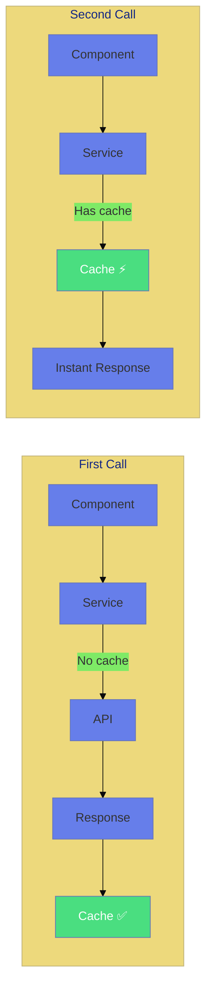
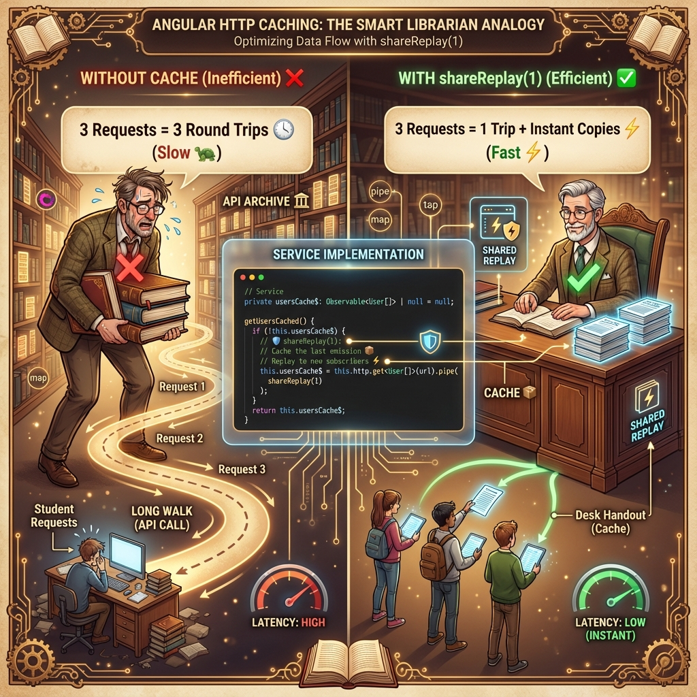
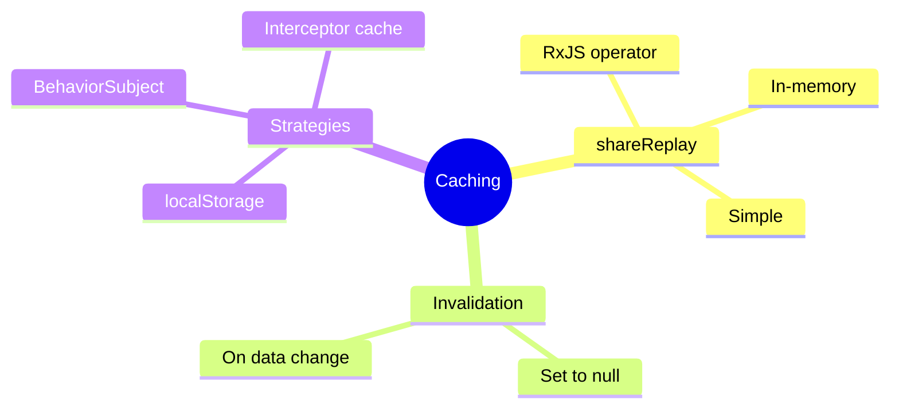

# 💾 Use Case 7: Caching Strategies

> **Goal**: Cache HTTP responses to improve performance and reduce server load.

---

## 1. 🔍 How It Works

### shareReplay

`shareReplay(1)` caches the last emission and replays it to new subscribers.

### 📊 Cache Flow



---

## 📚 Library Analogy (Easy to Remember!)



Think of HTTP Caching like **visiting a library**:

| Concept | Library Analogy | Memory Trick |
|---------|----------------|--------------|
| **No Cache** | 📖 **Ordering a rare book**: Library must order from another city every time | **"Fresh but slow"** |
| **With Cache** | 📕 **Popular book on the shelf**: Already here, grab it instantly! | **"Cached and fast"** |
| **shareReplay(1)** | 📋 **Making a photocopy**: One trip to the archive, copies for everyone | **"Share one copy"** |
| **Invalidate Cache** | 🗑️ **"Edition is outdated!"**: Remove old copy, order new version | **"Clear the shelf"** |

### 📖 Story to Remember:

> 📚 **The Smart Librarian**
>
> Imagine you're a librarian. Students keep asking for the same popular book:
>
> **Without caching (bad):**
> ```
> Student 1: "Harry Potter please!" → Librarian walks to archive (500ms)
> Student 2: "Harry Potter please!" → Librarian walks to archive AGAIN (500ms)  
> Student 3: "Harry Potter please!" → Librarian walks to archive AGAIN (500ms)
> Total: 3 trips! 😓
> ```
>
> **With shareReplay(1) (good):**
> ```
> Student 1: "Harry Potter please!" → Librarian walks to archive (500ms), makes copies
> Student 2: "Harry Potter please!" → "Already have it!" ⚡ instant
> Student 3: "Harry Potter please!" → "Already have it!" ⚡ instant
> Total: 1 trip! 🎉
> ```

### 🎯 Cache Invalidation:
> **"New edition released!"** → Throw out the old copy → Next request fetches fresh

---

## 2. 🚀 Implementation

```typescript
@Injectable({ providedIn: 'root' })
export class ApiService {
    private usersCache$: Observable<User[]> | null = null;

    getUsersCached(): Observable<User[]> {
        if (!this.usersCache$) {
            this.usersCache$ = this.http.get<User[]>(url).pipe(
                shareReplay(1) // Cache last emission
            );
        }
        return this.usersCache$;
    }

    invalidateCache(): void {
        this.usersCache$ = null;
    }
}
```

---

## 3. 🌍 Real World Uses

1. **Reference data** - Countries, categories
2. **User preferences** - Settings that rarely change
3. **Dashboard metrics** - Stats that update slowly

---

## 4. ❓ Interview Questions

### Basic Questions

#### Q1: How does shareReplay(1) work?
**Answer:** It caches the last emitted value and replays it to new subscribers without making a new HTTP request.

#### Q2: When should you invalidate the cache?
**Answer:**
- After creating/updating/deleting data
- When cache TTL expires
- On user logout
- When user manually refreshes

---

### Scenario-Based Questions

#### Scenario 1: Multiple Components Need Same Data
**Question:** Three components all need the user list. How do you prevent 3 API calls?

**Answer:**
```typescript
// Service
private usersCache$: Observable<User[]> | null = null;

getUsersCached(): Observable<User[]> {
    if (!this.usersCache$) {
        this.usersCache$ = this.http.get<User[]>(url).pipe(
            shareReplay(1)
        );
    }
    return this.usersCache$;
}
```

#### Scenario 2: Cache with Expiration
**Question:** Cache should expire after 5 minutes. How do you implement this?

**Answer:**
```typescript
private usersCache$: Observable<User[]> | null = null;
private cacheExpiry = 0;
private CACHE_TTL = 5 * 60 * 1000; // 5 minutes

getUsersCached(): Observable<User[]> {
    if (!this.usersCache$ || Date.now() > this.cacheExpiry) {
        this.cacheExpiry = Date.now() + this.CACHE_TTL;
        this.usersCache$ = this.http.get<User[]>(url).pipe(
            shareReplay(1)
        );
    }
    return this.usersCache$;
}
```

---

## 🧠 Mind Map



