# 💾 Use Case 7: Caching Strategies

> **Goal**: Cache HTTP responses to improve performance and reduce server load.

---

## 1. 🔍 How It Works

### shareReplay

`shareReplay(1)` caches the last emission and replays it to new subscribers.

### 📊 Cache Flow

```mermaid
%%{init: {'theme':'base', 'themeVariables': { 'primaryColor':'#667eea'}}}%%
flowchart LR
    subgraph First Call
        A1[Component] --> B1[Service]
        B1 -->|"No cache"| C1[API]
        C1 --> D1[Response]
        D1 --> E1[Cache ✅]
    end
    
    subgraph Second Call
        A2[Component] --> B2[Service]
        B2 -->|"Has cache"| E2[Cache ⚡]
        E2 --> F2[Instant Response]
    end
    
    style E1 fill:#4ade80,color:#fff
    style E2 fill:#4ade80,color:#fff
```



---

## 2. 🚀 Implementation

```typescript
@Injectable({ providedIn: 'root' })
export class ApiService {
    private usersCache$: Observable<User[]> | null = null;

    getUsersCached(): Observable<User[]> {
        if (!this.usersCache$) {
            this.usersCache$ = this.http.get<User[]>(url).pipe(
                shareReplay(1) // Cache last emission
            );
        }
        return this.usersCache$;
    }

    invalidateCache(): void {
        this.usersCache$ = null;
    }
}
```

---

## 3. 🌍 Real World Uses

1. **Reference data** - Countries, categories
2. **User preferences** - Settings that rarely change
3. **Dashboard metrics** - Stats that update slowly

---

## 🧠 Mind Map


