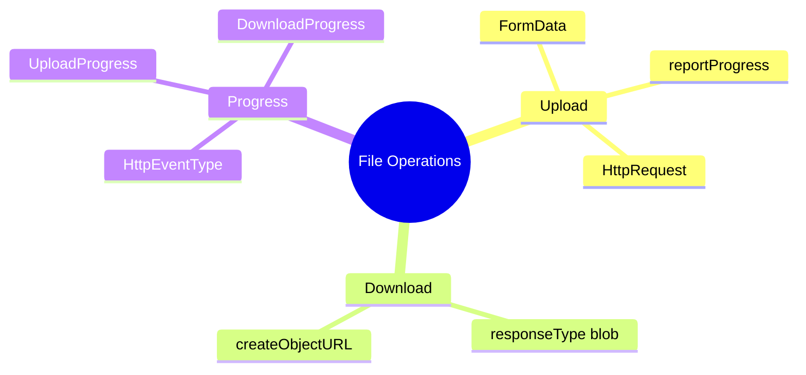

# 📁 Use Case 8: File Upload/Download

> **Goal**: Handle file operations with progress tracking.

---

## 1. 🔍 How It Works

### Key Concepts

| Feature | Config |
|---------|--------|
| Progress events | `reportProgress: true` |
| Download blob | `responseType: 'blob'` |
| Upload files | `FormData` |

---

## 🚚 Moving Truck Analogy (Easy to Remember!)

Think of file upload/download like **moving furniture with a truck**:

| Concept | Moving Analogy | Memory Trick |
|---------|---------------|--------------|
| **Upload (POST)** | 📦 **Loading the truck**: You're sending furniture TO the warehouse | **"Pack and send"** |
| **Download (GET blob)** | 🏠 **Unloading delivery**: Warehouse sends furniture TO you | **"Receive the package"** |
| **Progress Tracking** | 📊 **"How much loaded?"**: "50% of furniture is on the truck!" | **"Track the load"** |
| **FormData** | 📋 **Packing manifest**: List of all items with labels and descriptions | **"The shipping label"** |

### 📖 Story to Remember:

> 🚚 **The Moving Company**
>
> **Uploading a file = Loading a moving truck:**
> ```
> You: "Here's my furniture" (file data)
> Truck: "Loading... 25%... 50%... 75%... 100% ✅"
> Warehouse: "Got it! Here's your receipt" (server response)
> ```
>
> **Downloading a file = Receiving a delivery:**
> ```
> You: "Send me my furniture!" (request)
> Truck: "Delivering... 25%... 50%... 75%... 100% ✅"
> You: "Got it!" → Opens the packages (blob → createObjectURL)
> ```

### 🎯 Quick Memory:
```
📤 Upload   = You → Server  (sending your stuff away)
📥 Download = Server → You  (receiving stuff)
📊 Progress = "How much of the truck is loaded/unloaded?"
```

---

## 2. 🚀 Implementation

### Upload with Progress

```typescript
const formData = new FormData();
formData.append('file', file);

const req = new HttpRequest('POST', url, formData, {
    reportProgress: true
});

this.http.request(req).subscribe(event => {
    if (event.type === HttpEventType.UploadProgress) {
        this.progress = Math.round(100 * event.loaded / event.total!);
    }
});
```

### Download as Blob

```typescript
this.http.get(url, {
    responseType: 'blob'
}).subscribe(blob => {
    const url = URL.createObjectURL(blob);
    // Trigger download
});
```

---

## 3. ❓ Interview Questions

### Basic Questions

#### Q1: How do you track file upload progress?
**Answer:** Use `HttpRequest` with `reportProgress: true` and listen for `HttpEventType.UploadProgress`.

#### Q2: What's the difference between responseType 'blob' and 'arraybuffer'?
**Answer:**
| Type | Use Case |
|------|----------|
| `blob` | Files, images (browser handles) |
| `arraybuffer` | Binary processing, crypto |

---

### Scenario-Based Questions

#### Scenario 1: Upload with Progress Bar
**Question:** Show a progress bar during file upload.

**Answer:**
```typescript
const req = new HttpRequest('POST', '/api/upload', formData, {
    reportProgress: true
});

this.http.request(req).subscribe(event => {
    if (event.type === HttpEventType.UploadProgress && event.total) {
        this.progress = Math.round(100 * event.loaded / event.total);
    }
    if (event.type === HttpEventType.Response) {
        this.uploadComplete = true;
    }
});
```

#### Scenario 2: Download and Save File
**Question:** Download a PDF and trigger browser save dialog.

**Answer:**
```typescript
this.http.get('/api/report.pdf', { responseType: 'blob' })
    .subscribe(blob => {
        const url = URL.createObjectURL(blob);
        const a = document.createElement('a');
        a.href = url;
        a.download = 'report.pdf';
        a.click();
        URL.revokeObjectURL(url);
    });
```

---

## 🧠 Mind Map



