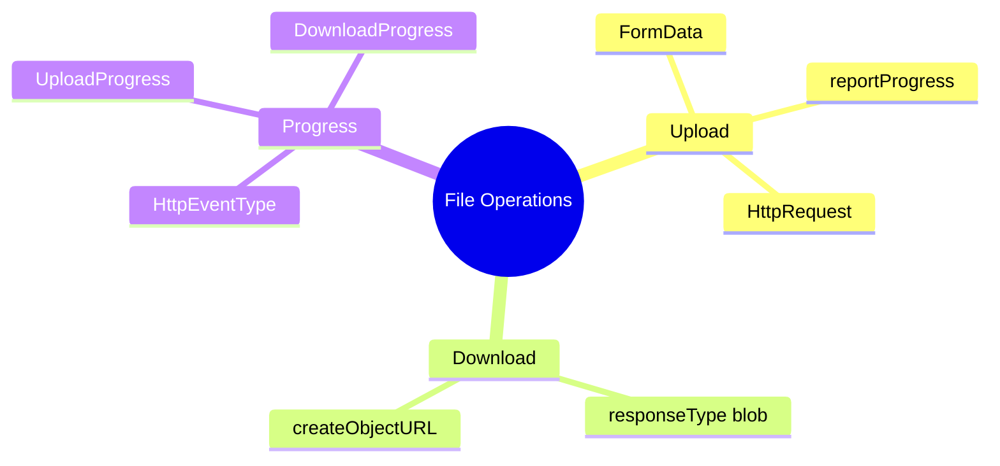

# 📁 Use Case 8: File Upload/Download

> **Goal**: Handle file operations with progress tracking.

---

## 1. 🔍 How It Works

### Key Concepts

| Feature | Config |
|---------|--------|
| Progress events | `reportProgress: true` |
| Download blob | `responseType: 'blob'` |
| Upload files | `FormData` |

---

## 2. 🚀 Implementation

### Upload with Progress

```typescript
const formData = new FormData();
formData.append('file', file);

const req = new HttpRequest('POST', url, formData, {
    reportProgress: true
});

this.http.request(req).subscribe(event => {
    if (event.type === HttpEventType.UploadProgress) {
        this.progress = Math.round(100 * event.loaded / event.total!);
    }
});
```

### Download as Blob

```typescript
this.http.get(url, {
    responseType: 'blob'
}).subscribe(blob => {
    const url = URL.createObjectURL(blob);
    // Trigger download
});
```

---

## 🧠 Mind Map


