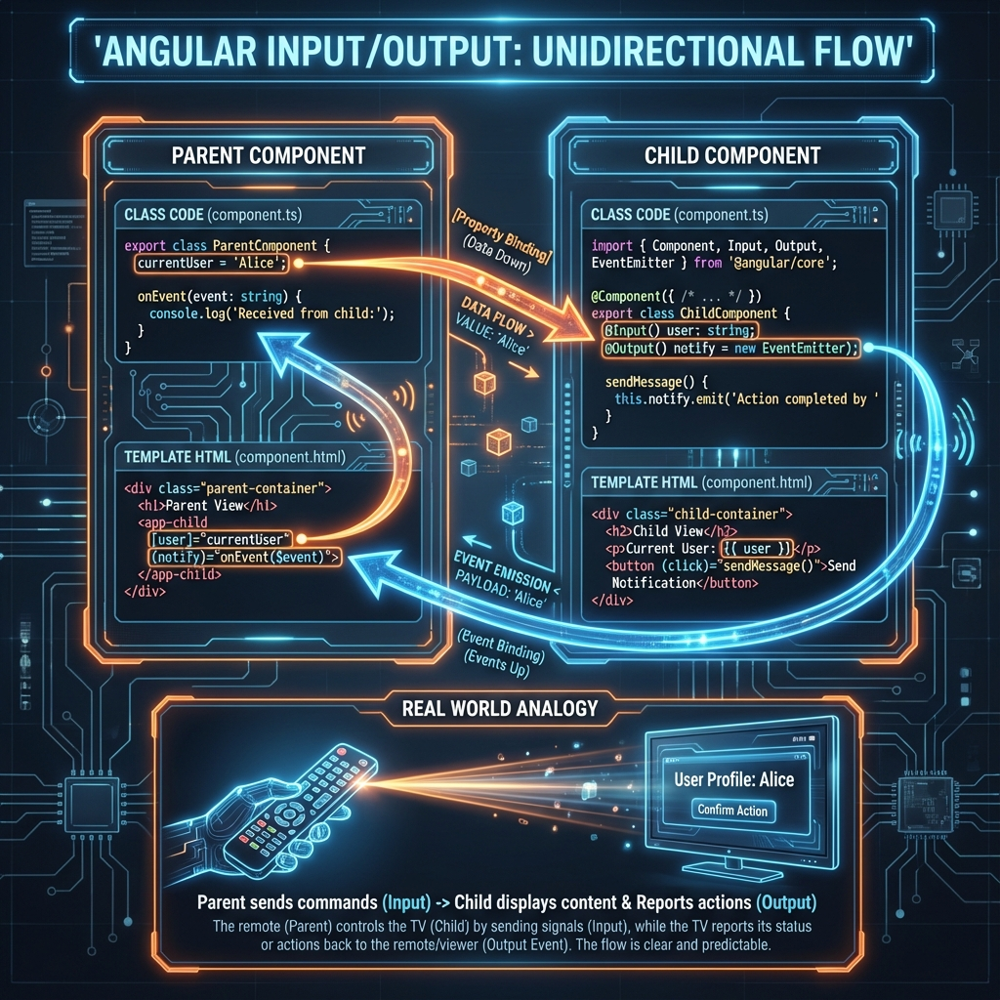
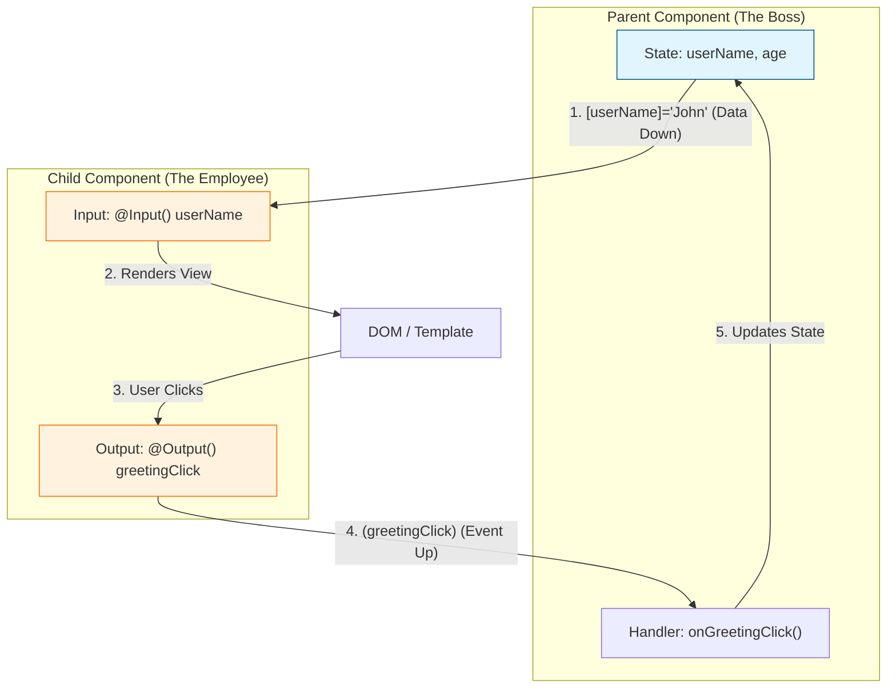
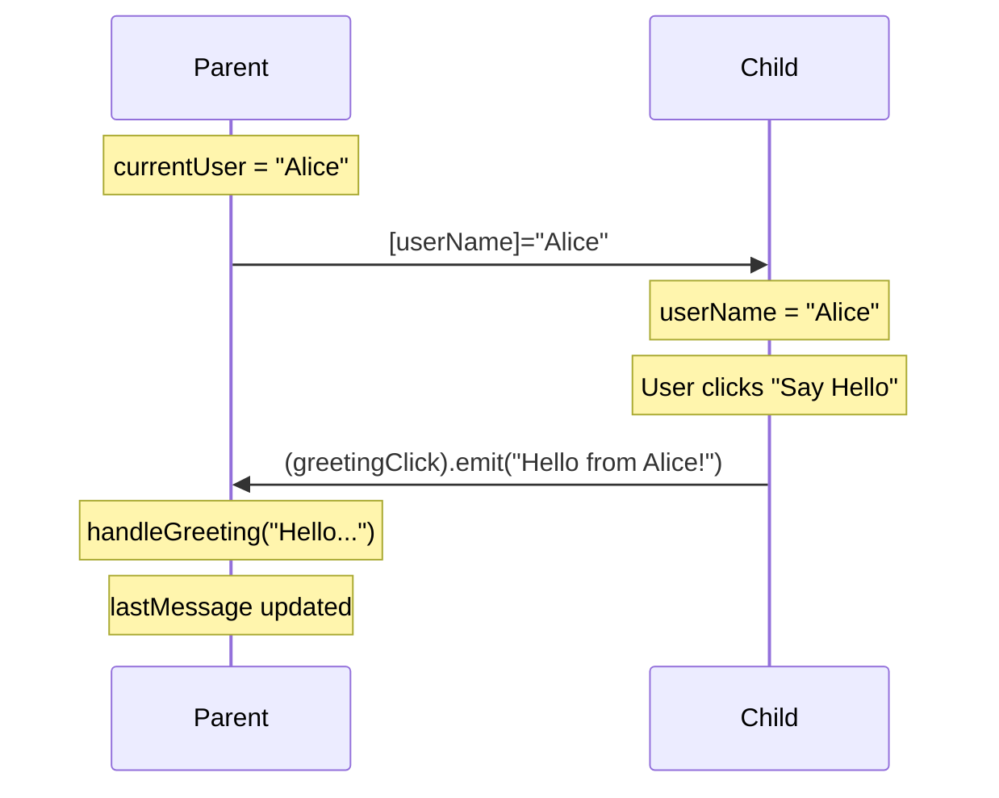
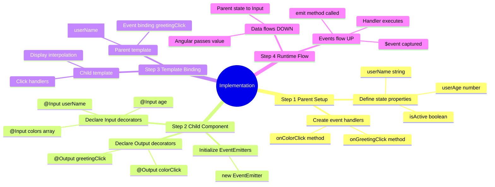
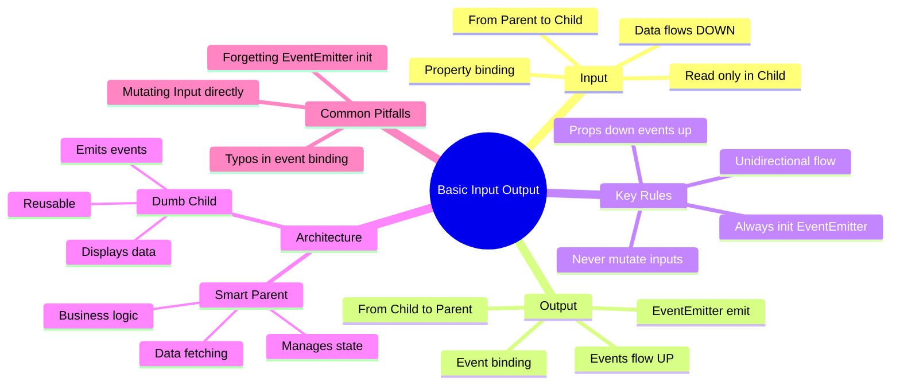
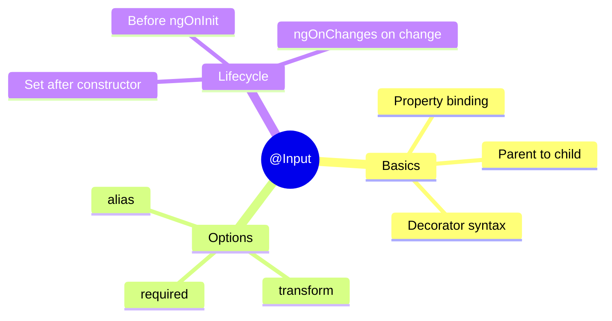

# 📡 Basic Input/Output (Props Down, Events Up)

> **Goal**: Master the fundamental communication pattern between Parent and Child components in Angular.

---

## ❓ What Problem Does It Solve?

Single-page applications are built from hundreds of components. Without a standard communication pattern:

1.  **Tight Coupling**: Components would need to reach inside each other to read/write data, making them impossible to test or reuse.
2.  **Unpredictable State**: If anyone can change data anywhere, debugging becomes a nightmare ("Who changed this value?!").
3.  **Spaghetti Code**: Relationships between components become a tangled mess of dependencies.

**The Solution**: Angular's strict **Unidirectional Data Flow** (Data Down, Events Up). This ensures:
*   **Predictability**: You always know where data comes from (Parent) and where events go (Parent).
*   **Reusability**: The Child component doesn't care *who* uses it, as long as they provide the right Inputs.
*   **Debuggability**: Data changes are easy to track.

---

## 1. 🔍 How It Works (The Concept)



### The Mechanism
This is the **foundation** of Angular component architecture. It relies on a strict **Unidirectional Data Flow**:
1.  **Data Flows DOWN ⬇️**: The Parent passes data to the Child using **Properties** (`@Input`).
2.  **Events Flow UP ⬆️**: The Child notifies the Parent of actions using **Events** (`@Output`).

### Default vs. Optimized Behavior
*   **Default (Tight Coupling)**: Writing all code in one giant component. Hard to maintain, impossible to reuse.
*   **Optimized (Loose Coupling)**: Splitting into "Smart" (Parent) and "Dumb" (Child) components. The Child knows *how* to display data but not *where* it comes from. The Parent knows *where* data comes from but not *how* it's rendered.

### 📊 Data Flow Diagram



### 📦 Data Flow Summary (Visual Box Diagram)

```
┌─────────────────────────────────────────────────────────────┐
│  PARENT COMPONENT                                           │
│                                                             │
│   (childEvent)="onEventHandler($event)" ◄──────────────┐    │
│                                                        │    │
│   [inputProperty]="parentData"  ──────────────────┐    │    │
│                                                   │    │    │
│   parentData = 'value'  ────► displays result     │    │    │
└───────────────────────────────────────────────────│────│────┘
                                                    │    │
                                    Data Down ⬇️    │    │  ⬆️ Events Up
                                  (Property Binding)│    │  (EventEmitter)
                                                    │    │
┌───────────────────────────────────────────────────│────│────┐
│  CHILD COMPONENT                                  │    │    │
│                                                   ▼    │    │
│   @Input() inputProperty ◄────────────────────────┘    │    │
│                                                        │    │
│   @Output() childEvent = new EventEmitter()            │    │
│                                                        │    │
│   User action ──► someMethod() ──► this.childEvent.emit(data)
│                                                             │
└─────────────────────────────────────────────────────────────┘
```

> **Key Takeaway**: Data always flows **DOWN** via `@Input()`, and events always flow **UP** via `@Output()`. This is the core of Angular's unidirectional data flow.

### 📦 Actual Implementation Example

Here's the same diagram with **real code** from the implementation below:

```
┌─────────────────────────────────────────────────────────────┐
│  ParentComponent                                            │
│                                                             │
│   currentUser = 'Alice';                                    │
│   lastMessage = '';                                         │
│                                                             │
│   Template:                                                 │
│   ┌───────────────────────────────────────────────────────┐ │
│   │ <app-child                                            │ │
│   │   [userName]="currentUser"  ──────────────────┐       │ │
│   │   (greetingClick)="handleGreeting($event)"> ◄─│───┐   │ │
│   │ </app-child>                                  │   │   │ │
│   └───────────────────────────────────────────────│───│───┘ │
│                                                   │   │     │
│   handleGreeting(message: string) {              │   │      │
│     this.lastMessage = message; // ◄─────────────│───┘      │
│   }                                              │          │
└──────────────────────────────────────────────────│──────────┘
                                                   │
                              'Alice' flows DOWN ⬇️│
                                                   │
┌──────────────────────────────────────────────────│──────────┐
│  ChildComponent                                  │          │
│                                                  ▼          │
│   @Input() userName: string = '';  ◄─────────────┘          │
│   // userName now equals 'Alice'                            │
│                                                             │
│   @Output() greetingClick = new EventEmitter<string>();     │
│                                                             │
│   Template:                                                 │
│   ┌───────────────────────────────────────────────────────┐ │
│   │ <h3>{{ userName }}</h3>        // Shows "Alice"       │ │
│   │ <button (click)="sendGreeting()">Say Hello</button>   │ │
│   └───────────────────────────────────────────────────────┘ │
│                                                             │
│   sendGreeting() {                                          │
│     this.greetingClick.emit(`Hello from ${this.userName}!`);│
│   }                     │                                   │
│                         │                                   │
│   // Emits: "Hello from Alice!" ────────────────────────────┼──► UP to Parent
│                                                             │
└─────────────────────────────────────────────────────────────┘
```

**Runtime Flow:**
1. Parent sets `currentUser = 'Alice'`
2. `[userName]="currentUser"` → Angular passes `'Alice'` DOWN to Child
3. Child's `userName` property receives `'Alice'`
4. User clicks "Say Hello" button
5. `sendGreeting()` calls `this.greetingClick.emit('Hello from Alice!')`
6. Event bubbles UP → Parent's `handleGreeting($event)` fires
7. Parent updates `lastMessage = 'Hello from Alice!'`

---

## 2. 🚀 Step-by-Step Implementation Guide

### Step 1: The Child Component (Provider)
The Child defines its "API" using `@Input` and `@Output`.

```typescript
// child.component.ts
import { Component, Input, Output, EventEmitter } from '@angular/core';

@Component({
  selector: 'app-child',
  template: `
    <div class="card">
      <h3>{{ userName }}</h3>
      <button (click)="sendGreeting()">Say Hello</button>
    </div>
  `
})
export class ChildComponent {
  // 1. Define what data I need
  @Input() userName: string = '';

  // 2. Define what events I emit
  // 🛡️ CRITICAL: Always initialize EventEmitter!
  @Output() greetingClick = new EventEmitter<string>();

  sendGreeting() {
    // 3. Emit the event with payload
    this.greetingClick.emit(`Hello from ${this.userName}!`);
  }
}
```

### Step 2: The Parent Component (Consumer)
The Parent binds to the Child's API.

```typescript
// parent.component.ts
import { Component } from '@angular/core';
import { ChildComponent } from './child.component';

@Component({
  selector: 'app-parent',
  imports: [ChildComponent],
  template: `
    <!-- 
      🛡️ CRITICAL: 
      [userName] -> Property Binding (Down)
      (greetingClick) -> Event Binding (Up)
    -->
    <app-child 
      [userName]="currentUser"
      (greetingClick)="handleGreeting($event)">
    </app-child>
    
    <p>Last message: {{ lastMessage }}</p>
  `
})
export class ParentComponent {
  currentUser = 'Alice';
  lastMessage = '';

  handleGreeting(message: string) {
    this.lastMessage = message;
  }
}
```

### 📊 Implementation Visualization



---

## 3. 🐛 Common Pitfalls & Debugging

### ❌ Mutating Inputs Directly
**Bad Code:**
```typescript
// In Child
@Input() user: { name: string };
updateName() {
  this.user.name = 'Bob'; // ❌ MUTATION! Parent object is modified directly.
}
```
**Why it fails:** This breaks unidirectional data flow. The parent's data changes without the parent knowing or explicitly handling it. It makes debugging a nightmare.
**Fix:** Emit an event (`userChange`) and let the Parent update the data.

### ❌ Forgetting `EventEmitter` Initialization
**Bad Code:**
```typescript
@Output() clicked; // ❌ undefined
```
**Why it fails:** Calling `this.clicked.emit()` will throw `Cannot read property 'emit' of undefined`.
**Fix:** `clicked = new EventEmitter<void>();`

### ❌ Typo in Event Binding
**Bad Code:**
```html
<app-child (clik)="handleClick()"></app-child> <!-- ❌ Typo 'clik' -->
```
**Why it fails:** Angular silently ignores events that don't match an `@Output`. Your handler will never fire.

---

## 4. ⚡ Performance & Architecture

### Performance Benefits
*   **Change Detection**: Angular knows exactly *what* changed. When an event fires, Angular runs change detection to update the view.
*   **OnPush Strategy**: If you use `ChangeDetectionStrategy.OnPush` in the Child, Angular will **skip** checking the Child entirely unless one of its `@Input` references changes. This is a massive performance boost for large apps.

### Architecture: Smart vs. Dumb Components
*   **Smart (Container)**: The Parent. Fetches data, manages state, handles business logic.
*   **Dumb (Presentational)**: The Child. Receives data, renders it, captures user input. deeply reusable.
    *   *Example*: A `ButtonComponent` is dumb. It takes a `label` and emits a `click`. It doesn't care *what* the button does.

---

## 5. 🌍 Real World Use Cases

1.  **User Profile Card**: Parent passes `User` object. Child displays photo, name, bio. Child emits `editProfile` event.
2.  **Action Buttons**: A reusable button that takes `[label]`, `[icon]`, `[disabled]` and emits `(clicked)`.
3.  **Status Badges**: Takes `[status]` (active/inactive) and renders a green or red pill. Purely presentational.

---

## 6. 📝 The Analogy: "The Remote Control" 📺

Think of the **Parent** as **You** and the **Child** as a **TV**.

*   **Inputs (Data Down)**: You press buttons on the remote (Power, Volume, Channel). You are sending "data" (commands) **down** to the TV.
*   **Outputs (Events Up)**: The TV screen changes. It emits light and sound. You (the Parent) see/hear this and react (maybe you laugh, or turn it down).
*   **Separation**: You don't need to know how the circuits inside the TV work (Child implementation). You just need to know which buttons to press (Inputs) and watch the screen (Outputs).

---

## 🔧 Implementation Flow Mindmap

This mindmap shows **how the use case is implemented** step-by-step:



---

## 🧠 Mind Map: Quick Visual Reference



---

## 7. ❓ Interview & Concept Questions

### Q1: What is Unidirectional Data Flow?
**A:** Data flows one way: from Parent to Child via Inputs. Children communicate back only via Events. This makes the application state predictable and easier to debug.

### Q2: Can a Child component modify an `@Input` property?
**A:** Technically yes (if it's an object), but **you should never do it**. It violates the principle of unidirectional flow. Always emit an event to request a change.

### Q3: What is the difference between `@Input()` and `@Output()`?
**A:** `@Input()` marks a property to receive data *from* a parent. `@Output()` marks a property (an `EventEmitter`) to send data *to* a parent.

### Q4: How do I pass data from Child to Parent?
**A:** You cannot "pass" data directly. You must **emit an event** using `@Output()` and `EventEmitter`. The parent listens to this event and captures the data (`$event`).

### Q5: Why use "Smart" and "Dumb" components?
**A:** Separation of concerns. "Dumb" components are reusable and easy to test because they have no dependencies (services, store). "Smart" components handle the complexity of data fetching and state management.

---

## 8. 📥 @Input() Deep Dive

> **💡 Lightbulb Moment**: `@Input()` is how parent components pass data DOWN to child components. Think of it like function parameters for components!

### Input with Default Value
```typescript
@Input() color: string = 'blue';  // Default if parent doesn't provide
```

### Required Input (Angular 16+)
```typescript
@Input({ required: true }) userId!: string;  // Error if not provided
```

### Input Transform (Angular 16+)
```typescript
@Input({ transform: booleanAttribute }) disabled: boolean = false;
// <app-child disabled> works as true!
```

### Input Alias
```typescript
@Input('buttonType') type: string = 'primary';
// Parent uses: [buttonType]="'secondary'"
```

---

## 9. 🎯 Scenario-Based Interview Questions

### Scenario 1: Object Input Not Updating
**Question:** You pass an object as @Input(). You modify a property of that object in the parent, but the child doesn't update. Why?

**Answer:**
```typescript
// Parent
user = { name: 'John', age: 25 };
updateAge() {
    this.user.age = 26;  // Same object reference!
}

// Fix: Create new object reference
updateAge() {
    this.user = { ...this.user, age: 26 };  // New reference
}
```
Angular's change detection compares references, not deep values.

---

### Scenario 2: Input Not Available in Constructor
**Question:** You try to use an @Input() value in the constructor but it's undefined. Why?

**Answer:** Inputs are set AFTER the constructor runs, during Angular's initialization. Use `ngOnInit()` or `ngOnChanges()` instead:
```typescript
constructor() {
    console.log(this.data);  // undefined!
}

ngOnInit() {
    console.log(this.data);  // Has value!
}
```

---

## 10. 📦 Package Delivery Analogy (Easy to Remember!)

Think of @Input() like **receiving packages at your door**:

| Concept | Delivery Analogy | Memory Trick |
|---------|----------------|--------------|
| **@Input()** | 📦 **Mailbox slot**: A designated spot where packages can arrive | **"Deliveries accepted here"** |
| **Parent component** | 🚚 **Delivery truck**: Decides what to send and when | **"The sender"** |
| **Child component** | 🏠 **Your house**: Receives and uses the packages | **"The receiver"** |
| **Property binding [prop]** | 📮 **Addressed package**: "Deliver THIS to THAT slot" | **"Label and send"** |
| **required: true** | ⚠️ **Signature required**: "This package MUST arrive!" | **"Mandatory delivery"** |

### 📖 Story to Remember:

> 📦 **Package Delivery Day**
>
> You (child component) are waiting for deliveries:
>
> **Setting up the mailbox (Child):**
> ```typescript
> @Input() userName: string = '';       // 📦 Standard mailbox
> @Input({ required: true }) id!: string; // ⚠️ Signature required
> ```
>
> **Sending the package (Parent):**
> ```html
> <app-profile [userName]="'John'" [id]="'123'"></app-profile>
> ```
>
> **The timeline:**
> ```
> 📅 Constructor runs      → Package not delivered yet ❌
> 📅 ngOnInit runs         → Package has arrived! ✅
> 📅 ngOnChanges runs      → New package every time it changes!
> ```
>
> **Parent controls what's sent. Child controls how it's used.**

### 🎯 Quick Reference:
```
📦 @Input()           = Mailbox (receive from parent)
🚚 Parent [prop]=     = Send package to child
🏠 Child uses value   = Open and use the package
⚠️ required: true     = Signature required (mandatory)
```

---

## 🧠 @Input Mind Map


