# 🧠 Mastering Immutability & OnPush in Angular

This guide explains **** (Complex Objects) in detail. It covers **How it works**, **How to implement it**, and **Why it matters**.

---

## 1. 🔍 How It Works (The Concept)

### The "Reference" Rule
In JavaScript, Objects are stored by **Reference** (Memory Address), not by Value. Angular's `OnPush` strategy uses this to save performance.

*   **Default Angular**: Checks everything, all the time. Safe but slow.
*   **OnPush Angular**: "I will ONLY update if the **Input Reference** changes."

### Visualizing the Difference

#### ❌ Mutation (The "Bad" Way)
You modify the data *inside* the object, but keep the same container.

```mermaid
graph LR
    Ref[Reference #123] --> Box[📦 Box Object]
    Box --> Content1["name: 'John'"]
    
    style Box fill:#ffcccc,stroke:#333,stroke-width:2px
    
    subgraph "After Mutation (name = 'Jane')"
    Ref --> Box
    Box --> Content2["name: 'Jane'"]
    end
```


*   **Result**: Angular sees `Ref #123 === Ref #123`. **NO UPDATE**.

#### ✅ Immutability (The "Good" Way)
You create a *brand new* container with updated data.

```mermaid
graph LR
    Ref1[Reference #123] --> Box1[📦 Old Box]
    Box1 --> Content1["name: 'John'"]
    
    Ref2[Reference #999] --> Box2[✨ New Box]
    Box2 --> Content2["name: 'Jane'"]
    
    style Box2 fill:#ccffcc,stroke:#333,stroke-width:2px
```


*   **Result**: Angular sees `Ref #123 !== Ref #999`. **UPDATE TRIGGERED!** 🚀

---

## 2. 🚀 Step-by-Step Implementation Guide

Here is exactly how to implement this pattern in your code.

### Step 1: Configure the Child Component
The Child must "sign the contract" by enabling `OnPush`.

1.  Import `ChangeDetectionStrategy` from `@angular/core`.
2.  Add `changeDetection: ChangeDetectionStrategy.OnPush` to the `@Component` decorator.

```typescript
// child.component.ts
import { Component, Input, ChangeDetectionStrategy } from '@angular/core';

@Component({
  selector: 'app-child',
  // 👇 THIS IS THE KEY STEP
  changeDetection: ChangeDetectionStrategy.OnPush,
  template: `...`
})
export class ChildComponent {
  @Input() data: any; // The input we are watching
}
```

### Step 2: Implement the Parent Logic
The Parent must respect the contract by **never mutating** data.

1.  **Don't do this**: `this.data.prop = 'new value'`
2.  **Do this**: `this.data = { ...this.data, prop: 'new value' }`

```typescript
// parent.component.ts
export class ParentComponent {
  user = { name: 'John', role: 'Admin' };

  updateUser() {
    // 👇 CREATE A NEW OBJECT REFERENCE
    this.user = {
      ...this.user,    // Copy all existing properties
      name: 'Jane'     // Overwrite the specific property
    };
  }
}
```

---

## 3. 💻 How It Is Implemented in Current Code

We have implemented this exact pattern in ****.

### A. The Child (`use-case-3/child.component.ts`)
We enabled `OnPush` to tell Angular to skip checks unless the `user` input changes.

```typescript
@Component({
  selector: 'app-use-case-3-child',
  // ... imports
  // ✅ IMPLEMENTATION: Enabling OnPush
  changeDetection: ChangeDetectionStrategy.OnPush,
  template: `...`
})
export class UseCase3ChildComponent {
  @Input() user!: UserProfile;
  // ...
}
```

### B. The Parent (`use-case-3/parent.component.ts`)
We provided two methods to demonstrate the difference.

#### 1. The "Broken" Method (Mutation)
This demonstrates what **NOT** to do.
```typescript
  mutateUser() {
    // ❌ BAD: Modifying the property directly on the SAME object
    this.currentUser.name = 'Mutated Name'; 
    
    // Result: Child component DOES NOT update because reference is the same.
  }
```

#### 2. The "Working" Method (Immutability)
This demonstrates the **Correct Implementation**.
```typescript
  updateUserImmutable() {
    // ✅ GOOD: Creating a NEW object using spread syntax (...)
    this.currentUser = {
      ...this.currentUser,
      name: 'Immutable Name'
    };
    
    // Result: Child component UPDATES because 'this.currentUser' is a new reference.
  }
```

---

## 4. ⚡ Performance & Architecture

### Why go through this trouble?
*   **Performance**: Turns Change Detection from **O(N)** (checking every single component) to **O(1)** (checking just the input reference).
    *   *Example*: In a table with 10,000 cells, `OnPush` lets Angular skip checking 9,999 of them when only one row updates.
*   **Architecture**: This forces you to use **Unidirectional Data Flow**, which makes your app predictable and easier to debug. It is the foundation of libraries like **NgRx** and **Redux**.

---

## 5. 🌍 Real World Use Cases

1.  **Data Grids / Tables**: Updating one row shouldn't re-render the entire table.
2.  **Dashboards**: A stock ticker updating every second shouldn't lag the UI.
3.  **Complex Forms**: Typing in one field shouldn't trigger validation on all other fields.
4.  **Chart Visualizations**: Re-drawing a chart is expensive; only do it when data actually changes.

---

## 6. The "Sticky Note" Analogy 📝

*   **Mutation**: You sneak into a worker's office and rewrite a line on their To-Do list sticky note. They don't notice because it's the **same paper**.
*   **Immutability**: You write a **brand new sticky note**, throw away the old one, and stick the new one on their monitor. They **immediately notice** the new paper.
