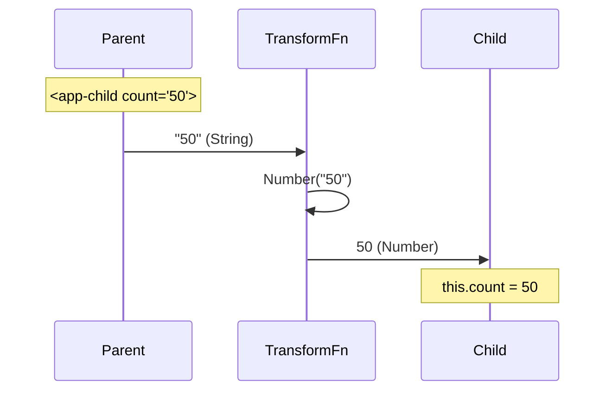
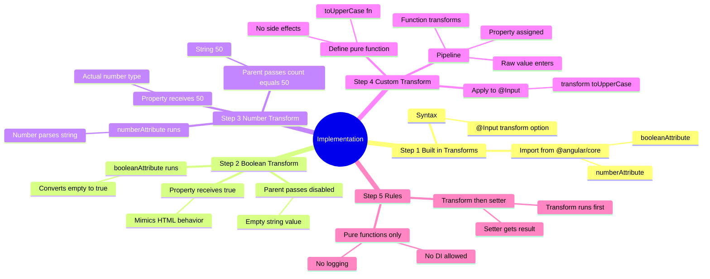
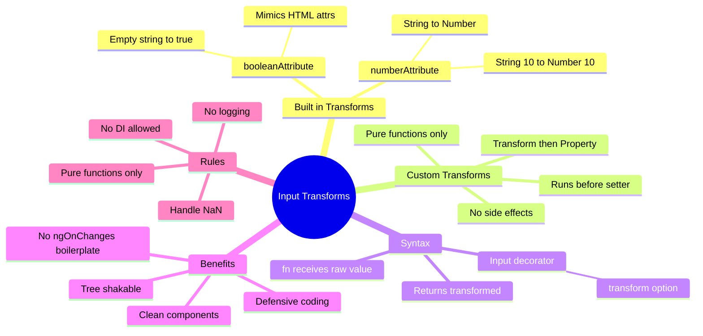

# 🪄 Input Transforms

> **Goal**: Simplify your components by automatically transforming, coercing, and sanitizing data as it enters your `@Input()` properties.

---


## ❓ What Problem Does It Solve?

In web development, HTML attributes are **always strings**. This creates a mismatch when your Angular component expects strongly typed inputs.

1.  **The Mismatch**: If a parent passes `<app-child disabled>`, Angular sees the string `""` (empty string). But your component logic likely expects a boolean `true`, not a string. `""` is falsy in some checks and truthy in others, leading to confused bugs.
2.  **The Boilerplate**: Traditionally, you had to write Getters/Setters or `ngOnChanges` code in *every* component just to parse `"123"` into `123` or `"true"` into `true`.

**The Solution**: **Input Transforms**. Angular now lets you define a `transform` function directly in the `@Input` decorator. It automatically converts data (coerces types) *before* it enters your component, keeping your code clean and your inputs type-safe.

---

## 1. 🔍 How It Works (The Concept)

### The Mechanism
Before Angular 16, if you wanted to accept a string "true" and treat it as a boolean `true`, you had to write a complex getter/setter or use `ngOnChanges`.
Now, Angular provides a built-in `transform` option in the `@Input` decorator. It acts like a **middleware** function that runs *before* the value is assigned to the property.

### Default vs. Optimized Behavior
*   **Default Behavior**: What you pass is what you get. If you pass `<app-child disabled>` (which is an empty string `""` in HTML attributes), your component receives `""` (truthy) but maybe you wanted a boolean `true`.
*   **Optimized Behavior (Transforms)**: You pass `<app-child disabled>`, and Angular automatically converts that empty string to `true` before your component even sees it.

### 📊 Data Flow Diagram

```mermaid
graph LR
    subgraph "Parent Template"
        Attr[Attribute: disabled]
        Val[Value: ""]
    end

    subgraph "Angular Transform Pipeline"
        Raw[Raw Value: ""]
        Transform[Function: booleanAttribute]
        Result[Result: true]
    end

    subgraph "Child Component"
        Prop[Property: @Input() disabled]
    end

    Attr --> Val
    Val --"Passes to"--> Raw
    Raw --> Transform
    Transform --> Result
    Result --"Assigns to"--> Prop

    style Transform fill:#fff3e0,stroke:#ff6f00
    style Prop fill:#e1f5fe,stroke:#01579b
```

### 📦 Data Flow Summary (Visual Box Diagram)

```
┌─────────────────────────────────────────────────────────────┐
│  PARENT COMPONENT (Template)                                │
│                                                             │
│   <!-- HTML attributes are ALWAYS strings -->               │
│   ┌───────────────────────────────────────────────────────┐ │
│   │ <app-button disabled count="42" label="hello">        │ │
│   │                 │          │            │             │ │
│   │                 │          │            │             │ │
│   │            ""(string) "42"(string) "hello"(string)    │ │
│   └─────────────────│──────────│────────────│─────────────┘ │
│                     │          │            │               │
└─────────────────────│──────────│────────────│───────────────┘
                      │          │            │
                      ▼          ▼            ▼
┌─────────────────────────────────────────────────────────────┐
│  ANGULAR TRANSFORM PIPELINE                                 │
│                                                             │
│   ┌─────────────┐  ┌─────────────┐  ┌─────────────────────┐ │
│   │ Input: ""   │  │ Input: "42" │  │ Input: "hello"      │ │
│   │      ↓      │  │      ↓      │  │        ↓            │ │
│   │booleanAttr  │  │ numberAttr  │  │   toUpperCase()     │ │
│   │      ↓      │  │      ↓      │  │        ↓            │ │
│   │Output: true │  │ Output: 42  │  │ Output: "HELLO"     │ │
│   └──────│──────┘  └──────│──────┘  └──────────│──────────┘ │
│          │                │                    │            │
└──────────│────────────────│────────────────────│────────────┘
           │                │                    │
           ▼                ▼                    ▼
┌─────────────────────────────────────────────────────────────┐
│  CHILD COMPONENT                                            │
│                                                             │
│   @Input({ transform: booleanAttribute })                   │
│   disabled: boolean = false;  ← receives TRUE               │
│                                                             │
│   @Input({ transform: numberAttribute })                    │
│   count: number = 0;  ← receives 42 (actual number)         │
│                                                             │
│   @Input({ transform: toUpperCase })                        │
│   label: string = '';  ← receives "HELLO"                   │
│                                                             │
│   // All values are now properly typed!                     │
└─────────────────────────────────────────────────────────────┘
```

**Transform Pipeline Flow:**
1. Parent passes HTML attributes (always strings in raw HTML)
2. Angular intercepts value BEFORE assigning to property
3. Transform function converts: `""` → `true`, `"42"` → `42`, `"hello"` → `"HELLO"`
4. Child receives properly typed values

> **Key Takeaway**: Use `booleanAttribute` and `numberAttribute` to make your components work like native HTML elements!

---

## 2. 🚀 Step-by-Step Implementation Guide

### Step 1: Built-in Transforms (Boolean & Number)
Angular provides `booleanAttribute` and `numberAttribute` out of the box.

```typescript
// child.component.ts
import { Component, Input, booleanAttribute, numberAttribute } from '@angular/core';

@Component({ ... })
export class ChildComponent {
  // 1. Handles HTML attributes: <app-child disabled> -> true
  @Input({ transform: booleanAttribute }) disabled: boolean = false;

  // 2. Handles string numbers: <app-child count="10"> -> 10
  @Input({ transform: numberAttribute }) count: number = 0;
}
```

### Step 2: Custom Transforms
You can write your own pure functions to transform data.

```typescript
// child.component.ts
function toUpperCase(value: string): string {
  return value?.toUpperCase() ?? '';
}

@Component({ ... })
export class ChildComponent {
  // 3. Custom logic: "hello" -> "HELLO"
  @Input({ transform: toUpperCase }) label: string = '';
}
```

### Step 3: The Parent Component (Consumer)
The parent doesn't need to know about the transform. It just passes data naturally.

```typescript
// parent.component.ts
@Component({
  template: `
    <!-- Passing a static string "50", child receives number 50 -->
    <app-child count="50"></app-child>

    <!-- Passing a boolean attribute (no value), child receives true -->
    <app-child disabled></app-child>
    
    <!-- Passing lowercase, child receives UPPERCASE -->
    <app-child label="important"></app-child>
  `
})
export class ParentComponent {}
```

### 📊 Implementation Visualization



---

## 3. 🐛 Common Pitfalls & Debugging

### ❌ Side Effects in Transform
**Bad Code:**
```typescript
function logAndTransform(val: any) {
  console.log(val); // ❌ Side effect!
  return val;
}
```
**Why it fails:** Transform functions should be **pure**. They might run multiple times or in unexpected contexts. Avoid logging, HTTP calls, or modifying external state inside them.

### ❌ Confusing `transform` with `set`
**Bad Code:**
```typescript
@Input({ transform: val => val + 1 }) 
set count(val: number) { ... }
```
**Clarification:** The `transform` runs **first**. The setter receives the *transformed* value.
*   Input: `10`
*   Transform: `10 + 1 = 11`
*   Setter receives: `11`

---

## 4. ⚡ Performance & Architecture

### Performance
*   **Efficiency**: Transforms are highly optimized. They run only when the input binding updates.
*   **Bundle Size**: Using `booleanAttribute` is tree-shakable and smaller than writing manual coercion logic in every component.

### Architecture
*   **Clean Code**: Removes "boilerplate" code from your components. No more `ngOnChanges` just to convert strings to numbers.
*   **Robustness**: Your component becomes more defensive. It guarantees `this.count` is a number, even if the parent passes a string "123".

---

## 5. 🌍 Real World Use Cases

1.  **HTML-like Attributes**: Creating a custom button that accepts `disabled`, `checked`, or `required` just like native HTML elements.
2.  **ID Coercion**: A component that accepts a User ID. The URL might provide it as a string `"42"`, but your API needs a number `42`. `numberAttribute` handles this automatically.
3.  **Data Formatting**: A "Tag" component that always displays text in `#lowercase-kebab-case`, regardless of how the user types it.

---

## 6. 📝 The Analogy: "The Universal Adapter" 🔌

Imagine traveling to a different country.
*   **Without Transform**: You try to plug your US laptop into a UK socket. It doesn't fit. You have to manually hold it or build a rig (Getter/Setter).
*   **With Transform**: You use a **Travel Adapter**.
    *   **Input**: US Plug (String "10").
    *   **Adapter (Transform)**: Converts the shape.
    *   **Output**: UK Plug (Number 10).
    *   The laptop (Component) works perfectly without knowing it's in a different country.

---

## 🔧 Implementation Flow Mindmap

This mindmap shows **how input transforms are implemented** step-by-step:



---

## 🧠 Mind Map: Quick Visual Reference



---

## 7. ❓ Interview & Concept Questions

### Q1: What is the difference between `booleanAttribute` and just typing `@Input() val: boolean`?
**A:** If you just use `@Input() val: boolean`, passing `<comp val>` (empty attribute) results in `val` being an empty string `""`. `booleanAttribute` converts that `""` to `true`, mimicking standard HTML boolean attribute behavior.

### Q2: When does the transform function run?
**A:** It runs **before** the value is assigned to the component property. If you have a setter, the transform runs before the setter.

### Q3: Can I use dependency injection in a transform function?
**A:** No. Transform functions must be **pure functions** or static methods. They operate solely on the input value.

### Q4: Why is this better than `ngOnChanges`?
**A:** It's more declarative and keeps the component logic clean. `ngOnChanges` is better suited for complex logic involving *multiple* inputs changing together, whereas `transform` is for 1-to-1 coercion.

### Q5: What happens if `numberAttribute` receives "abc"?
**A:** It returns `NaN` (Not a Number). You should still handle potential `NaN` values in your component if the input data isn't guaranteed.
