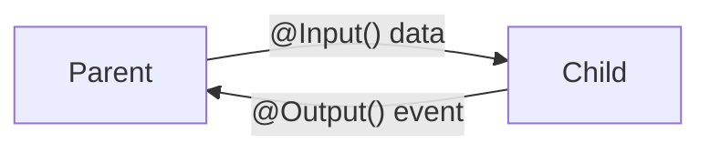

# 📘 @Input() & @Output() - Feature Overview

## What is @Input() and @Output()?

**@Input()** allows a parent component to pass data DOWN to a child component.  
**@Output()** allows a child component to emit events UP to the parent component.

```
┌──────────────────────────────────────────────────────────┐
│                    PARENT COMPONENT                       │
│  ┌─────────────────────────────────────────────────────┐ │
│  │  data: string = 'Hello'                             │ │
│  │  onReceive(event) { console.log(event) }            │ │
│  └─────────────────────────────────────────────────────┘ │
│                    │ @Input ↓      ↑ @Output             │
│  ┌─────────────────────────────────────────────────────┐ │
│  │              CHILD COMPONENT                        │ │
│  │  @Input() data: string                              │ │
│  │  @Output() notify = new EventEmitter()              │ │
│  └─────────────────────────────────────────────────────┘ │
└──────────────────────────────────────────────────────────┘
```

## Purpose & Use Cases

| Scenario | Example |
|----------|---------|
| Display data | Product card showing product.name |
| Form handling | Child form emits submit event |
| User actions | Button click notifies parent |
| Real-time updates | Counter value changes |

---

# 📄 Practice Requirement Document

## What You Will Implement

In these exercises, you will:
1. Create components that receive data via **@Input()**
2. Emit events to parent components via **@Output()**
3. Implement **two-way binding** pattern
4. Handle **complex objects** with proper change detection
5. Build **real-world scenarios** like shopping carts and forms

## Architecture & Behaviour



### Key Rules to Follow

1. **Naming Convention**: Use `Change` suffix for two-way binding (`valueChange`)
2. **Type Safety**: Always type your `EventEmitter<T>`
3. **Immutability**: Create new object references for OnPush
4. **Initialization**: Initialize EventEmitter in declaration

---

# 🟦 Basic Practice Exercises

## Exercise 1: Simple Data Display

**Objective**: Create a greeting card that displays a name from parent.

**Expected Behaviour**: Parent passes `userName`, child displays "Hello, {userName}!"

### Parent Component (starter code)

```typescript
// exercise-1/parent.component.ts
import { Component } from '@angular/core';
import { GreetingCardComponent } from './greeting-card.component';

@Component({
    selector: 'app-exercise1-parent',
    standalone: true,
    imports: [GreetingCardComponent],
    template: `
        <h2>Exercise 1: Simple @Input</h2>
        <input [(ngModel)]="userName" placeholder="Enter name">
        
        <!-- TODO: Pass userName to the greeting card -->
        <app-greeting-card></app-greeting-card>
    `
})
export class Exercise1ParentComponent {
    userName = 'Angular Developer';
}
```

### Child Component (to complete)

```typescript
// exercise-1/greeting-card.component.ts
import { Component, Input } from '@angular/core';

@Component({
    selector: 'app-greeting-card',
    standalone: true,
    template: `
        <div class="card">
            <!-- TODO: Display the greeting message using the name input -->
            <h3>Hello, ___!</h3>
        </div>
    `
})
export class GreetingCardComponent {
    // TODO: Add @Input() decorator to receive name from parent
    
}
```

---

## Exercise 2: Button Click Event

**Objective**: Create a button that emits a click count to parent.

**Expected Behaviour**: Each button click increments counter, parent displays total.

### Parent Component

```typescript
// exercise-2/parent.component.ts
@Component({
    selector: 'app-exercise2-parent',
    standalone: true,
    imports: [ClickButtonComponent],
    template: `
        <h2>Exercise 2: Simple @Output</h2>
        <p>Total clicks from child: {{ totalClicks }}</p>
        
        <!-- TODO: Listen for the clicked event from button -->
        <app-click-button></app-click-button>
    `
})
export class Exercise2ParentComponent {
    totalClicks = 0;

    // TODO: Create method to handle click event
    
}
```

### Child Component (to complete)

```typescript
// exercise-2/click-button.component.ts
import { Component, Output, EventEmitter } from '@angular/core';

@Component({
    selector: 'app-click-button',
    standalone: true,
    template: `
        <button (click)="handleClick()">
            Click Me ({{ clickCount }} times)
        </button>
    `
})
export class ClickButtonComponent {
    clickCount = 0;

    // TODO: Add @Output() decorator with EventEmitter<number>
    
    handleClick() {
        this.clickCount++;
        // TODO: Emit the click count to parent
        
    }
}
```

---

## Exercise 3: Two-Way Binding

**Objective**: Create a custom slider with two-way binding.

**Expected Behaviour**: Slider and parent input stay in sync.

### Parent Component

```typescript
// exercise-3/parent.component.ts
@Component({
    selector: 'app-exercise3-parent',
    template: `
        <h2>Exercise 3: Two-Way Binding</h2>
        <p>Parent value: {{ volume }}</p>
        <input type="number" [(ngModel)]="volume" min="0" max="100">
        
        <!-- TODO: Use [(volume)] two-way binding syntax -->
        <app-volume-slider></app-volume-slider>
    `
})
export class Exercise3ParentComponent {
    volume = 50;
}
```

### Child Component (to complete)

```typescript
// exercise-3/volume-slider.component.ts
import { Component, Input, Output, EventEmitter } from '@angular/core';

@Component({
    selector: 'app-volume-slider',
    standalone: true,
    template: `
        <div class="slider">
            <input 
                type="range" 
                [value]="volume"
                (input)="onSlide($event)"
                min="0" 
                max="100">
            <span>{{ volume }}%</span>
        </div>
    `
})
export class VolumeSliderComponent {
    // TODO: Add @Input() for volume
    
    // TODO: Add @Output() volumeChange (note the naming convention!)
    
    onSlide(event: Event) {
        const value = +(event.target as HTMLInputElement).value;
        // TODO: Emit the new volume value
        
    }
}
```

---

## Exercise 4: Multiple Inputs

**Objective**: Create a user card with multiple inputs.

**Expected Behaviour**: Card displays name, email, and avatar from parent.

### Child Component (to complete)

```typescript
// exercise-4/user-card.component.ts
import { Component, Input } from '@angular/core';

@Component({
    selector: 'app-user-card',
    standalone: true,
    template: `
        <div class="card">
            <!-- TODO: Display all user properties -->
            
            <h3>___</h3>
            <p>___</p>
            <span class="status" [class.online]="___">
                {{ ___ ? 'Online' : 'Offline' }}
            </span>
        </div>
    `
})
export class UserCardComponent {
    // TODO: Add @Input() for name (string)
    
    // TODO: Add @Input() for email (string)
    
    // TODO: Add @Input() for avatarUrl (string)
    
    // TODO: Add @Input() for isOnline (boolean)
    
}
```

---

# 🟥 Complex Scenario-Based Use Cases

## Scenario 1: Shopping Cart Item

**Real World Requirement**: E-commerce product card with add to cart functionality.

**Problem Statement**: Product card receives product data and emits add/remove events with quantities.

**Expected Result**: Parent cart updates when user adds/removes items.

### Interfaces

```typescript
// models/product.interface.ts
export interface Product {
    id: number;
    name: string;
    price: number;
    imageUrl: string;
    inStock: boolean;
}

export interface CartEvent {
    product: Product;
    quantity: number;
    action: 'add' | 'remove';
}
```

### Parent Component

```typescript
// scenario-1/cart.component.ts
@Component({
    selector: 'app-cart',
    standalone: true,
    imports: [ProductCardComponent, CommonModule],
    template: `
        <h2>Shopping Cart</h2>
        <div class="cart-summary">
            <p>Items: {{ cartItems.length }}</p>
            <p>Total: {{ cartTotal | currency }}</p>
        </div>
        
        <div class="products">
            @for (product of products; track product.id) {
                <!-- TODO: Pass product and listen for cartAction event -->
                <app-product-card></app-product-card>
            }
        </div>
    `
})
export class CartComponent {
    products: Product[] = [
        { id: 1, name: 'Laptop', price: 999, imageUrl: '/laptop.jpg', inStock: true },
        { id: 2, name: 'Mouse', price: 29, imageUrl: '/mouse.jpg', inStock: true }
    ];
    
    cartItems: CartEvent[] = [];
    cartTotal = 0;

    /*
      TODO: Implement handleCartAction method
      - If action is 'add', add to cartItems
      - If action is 'remove', remove from cartItems
      - Recalculate cartTotal
    */
    
}
```

### Child Component (to complete)

```typescript
// scenario-1/product-card.component.ts
@Component({
    selector: 'app-product-card',
    standalone: true,
    template: `
        <div class="product-card">
            
            <h3>{{ product.name }}</h3>
            <p class="price">{{ product.price | currency }}</p>
            
            <div class="quantity">
                <button (click)="decrementQty()">-</button>
                <span>{{ quantity }}</span>
                <button (click)="incrementQty()">+</button>
            </div>
            
            <button 
                [disabled]="!product.inStock"
                (click)="addToCart()">
                Add to Cart
            </button>
        </div>
    `
})
export class ProductCardComponent {
    // TODO: Add @Input() product: Product
    
    // TODO: Add @Output() cartAction: EventEmitter<CartEvent>
    
    quantity = 1;

    incrementQty() {
        this.quantity++;
    }

    decrementQty() {
        if (this.quantity > 1) this.quantity--;
    }

    addToCart() {
        /*
          TODO: Emit cartAction event with:
          - product: the current product
          - quantity: the selected quantity
          - action: 'add'
        */
        
    }
}
```

---

## Scenario 2: Real-time Chat Message

**Real World Requirement**: Chat application with message input and typing indicator.

**Problem Statement**: Message input emits new messages and typing status to parent.

**Expected Result**: Parent displays messages and shows "User is typing..." indicator.

### Interfaces

```typescript
export interface ChatMessage {
    id: number;
    text: string;
    sender: string;
    timestamp: Date;
}
```

### Message Input Component (to complete)

```typescript
// scenario-2/message-input.component.ts
@Component({
    selector: 'app-message-input',
    standalone: true,
    imports: [FormsModule],
    template: `
        <div class="message-input">
            <input 
                [(ngModel)]="messageText"
                (input)="onTyping()"
                (keyup.enter)="sendMessage()"
                placeholder="Type a message...">
            <button (click)="sendMessage()">Send</button>
        </div>
    `
})
export class MessageInputComponent {
    // TODO: Add @Input() for sender name
    
    // TODO: Add @Output() messageSent: EventEmitter<ChatMessage>
    
    // TODO: Add @Output() typing: EventEmitter<boolean>
    
    messageText = '';
    private typingTimeout: any;

    onTyping() {
        /*
          TODO: Implement typing indicator logic
          - Emit typing(true) when user starts typing
          - After 1 second of no typing, emit typing(false)
          - Use setTimeout/clearTimeout pattern
        */
        
    }

    sendMessage() {
        if (!this.messageText.trim()) return;
        
        /*
          TODO: Create and emit ChatMessage object
          - Generate unique id
          - Include timestamp
          - Clear messageText after sending
          - Emit typing(false)
        */
        
    }
}
```

---

## Scenario 3: Form with Validation Feedback

**Real World Requirement**: Registration form that provides real-time validation feedback.

**Problem Statement**: Form field component receives validation rules and emits validation status.

### Form Field Component (to complete)

```typescript
// scenario-3/form-field.component.ts
export interface ValidationResult {
    field: string;
    isValid: boolean;
    errors: string[];
}

export interface ValidationRule {
    type: 'required' | 'minLength' | 'maxLength' | 'pattern' | 'email';
    value?: any;
    message: string;
}

@Component({
    selector: 'app-form-field',
    standalone: true,
    imports: [FormsModule],
    template: `
        <div class="form-field" [class.invalid]="!isValid && touched">
            <label>{{ label }}</label>
            <input 
                [type]="type"
                [(ngModel)]="value"
                (blur)="onBlur()"
                (input)="onInput()">
            <div class="errors" *ngIf="errors.length && touched">
                @for (error of errors; track error) {
                    <span class="error">{{ error }}</span>
                }
            </div>
        </div>
    `
})
export class FormFieldComponent {
    // TODO: Add @Input() label: string
    
    // TODO: Add @Input() type: string = 'text'
    
    // TODO: Add @Input() rules: ValidationRule[] = []
    
    // TODO: Add @Input() fieldName: string
    
    // TODO: Add @Output() valueChange: EventEmitter<string>
    
    // TODO: Add @Output() validationChange: EventEmitter<ValidationResult>
    
    value = '';
    isValid = true;
    touched = false;
    errors: string[] = [];

    onBlur() {
        this.touched = true;
        this.validate();
    }

    onInput() {
        /*
          TODO: Emit valueChange
          If touched, run validate()
        */
        
    }

    validate() {
        /*
          TODO: Implement validation logic
          - Loop through rules array
          - Check each rule type (required, minLength, email, etc.)
          - Build errors array
          - Set isValid based on errors.length
          - Emit validationChange with ValidationResult
        */
        
    }
}
```

---

## Scenario 4: Drag & Drop Kanban Card

**Real World Requirement**: Kanban board with draggable task cards.

**Problem Statement**: Card emits drag events with position data, parent manages columns.

### Interfaces

```typescript
export interface KanbanTask {
    id: number;
    title: string;
    description: string;
    status: 'todo' | 'in-progress' | 'done';
    priority: 'low' | 'medium' | 'high';
}

export interface DragEvent {
    task: KanbanTask;
    fromColumn: string;
    toColumn: string;
}
```

### Kanban Card Component (to complete)

```typescript
// scenario-4/kanban-card.component.ts
@Component({
    selector: 'app-kanban-card',
    standalone: true,
    template: `
        <div 
            class="kanban-card"
            [class.dragging]="isDragging"
            [attr.draggable]="true"
            (dragstart)="onDragStart($event)"
            (dragend)="onDragEnd()">
            
            <span class="priority" [class]="task.priority">
                {{ task.priority }}
            </span>
            <h4>{{ task.title }}</h4>
            <p>{{ task.description }}</p>
            
            <div class="actions">
                <button (click)="edit()">Edit</button>
                <button (click)="remove()">Delete</button>
            </div>
        </div>
    `
})
export class KanbanCardComponent {
    // TODO: Add @Input() task: KanbanTask
    
    // TODO: Add @Input() column: string
    
    // TODO: Add @Output() dragStarted: EventEmitter<KanbanTask>
    
    // TODO: Add @Output() dragEnded: EventEmitter<void>
    
    // TODO: Add @Output() taskEdit: EventEmitter<KanbanTask>
    
    // TODO: Add @Output() taskDelete: EventEmitter<number>
    
    isDragging = false;

    onDragStart(event: globalThis.DragEvent) {
        /*
          TODO: 
          - Set isDragging to true
          - Set drag data using event.dataTransfer
          - Emit dragStarted with task
        */
        
    }

    onDragEnd() {
        /*
          TODO:
          - Set isDragging to false
          - Emit dragEnded
        */
        
    }

    edit() {
        // TODO: Emit taskEdit with task
        
    }

    remove() {
        // TODO: Emit taskDelete with task.id
        
    }
}
```

---

## Scenario 5: Multi-Step Wizard

**Real World Requirement**: Checkout wizard with step navigation and data collection.

**Problem Statement**: Each step component receives/emits data, parent orchestrates flow.

### Interfaces

```typescript
export interface WizardStep {
    id: number;
    title: string;
    isComplete: boolean;
    data: any;
}

export interface StepChangeEvent {
    currentStep: number;
    direction: 'next' | 'prev';
    stepData: any;
}
```

### Wizard Step Component (to complete)

```typescript
// scenario-5/wizard-step.component.ts
@Component({
    selector: 'app-wizard-step',
    standalone: true,
    imports: [CommonModule],
    template: `
        <div class="wizard-step" [class.active]="isActive">
            <div class="step-header">
                <span class="step-number">{{ stepNumber }}</span>
                <h3>{{ title }}</h3>
                <span class="status" *ngIf="isComplete">✓</span>
            </div>
            
            <div class="step-content" *ngIf="isActive">
                <ng-content></ng-content>
            </div>
            
            <div class="step-actions" *ngIf="isActive">
                <button 
                    *ngIf="stepNumber > 1"
                    (click)="goBack()">
                    Previous
                </button>
                <button 
                    [disabled]="!canProceed"
                    (click)="goNext()">
                    {{ isLastStep ? 'Complete' : 'Next' }}
                </button>
            </div>
        </div>
    `
})
export class WizardStepComponent {
    // TODO: Add @Input() stepNumber: number
    
    // TODO: Add @Input() title: string
    
    // TODO: Add @Input() isActive: boolean
    
    // TODO: Add @Input() isComplete: boolean
    
    // TODO: Add @Input() isLastStep: boolean
    
    // TODO: Add @Input() canProceed: boolean = true
    
    // TODO: Add @Input() stepData: any
    
    // TODO: Add @Output() stepChange: EventEmitter<StepChangeEvent>
    
    // TODO: Add @Output() stepComplete: EventEmitter<any>

    goBack() {
        /*
          TODO: Emit stepChange with:
          - currentStep
          - direction: 'prev'
          - stepData
        */
        
    }

    goNext() {
        /*
          TODO: 
          - If isLastStep, emit stepComplete with stepData
          - Otherwise, emit stepChange with direction: 'next'
        */
        
    }
}
```

---

# ⛳ Final Deliverables Summary

| Type | Count | Status |
|------|-------|--------|
| Basic Exercises | 4 | Boilerplate provided |
| Complex Scenarios | 5 | Boilerplate provided |
| Interfaces | 8 | Fully defined |
| Components | 9+ | Skeleton ready |

## How to Complete

1. Read the **Objective** for each exercise
2. Find all `// TODO:` comments
3. Implement the missing logic
4. Test by running the application
5. Verify the **Expected Behaviour**

## Success Criteria

✅ No TypeScript compilation errors  
✅ Components communicate correctly  
✅ Events emit proper payloads  
✅ Two-way binding syncs values  
✅ Complex scenarios work end-to-end
