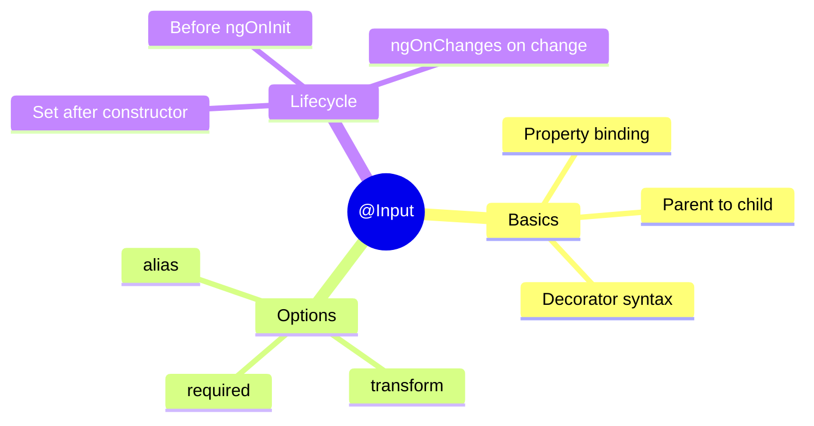

# 📥 Use Case 1: Basic @Input() Decorator

> **💡 Lightbulb Moment**: `@Input()` is how parent components pass data DOWN to child components. Think of it like function parameters for components!

---

## 1. 🔍 What is @Input()?

The `@Input()` decorator marks a property as an "input binding" - data flows from parent to child.

```typescript
// child.component.ts
@Input() title: string = '';
@Input() count: number = 0;

// parent.component.html
<app-child [title]="'Hello'" [count]="42"></app-child>
```

---

## 2. 🚀 Key Concepts

### Input with Default Value
```typescript
@Input() color: string = 'blue';  // Default if parent doesn't provide
```

### Required Input (Angular 16+)
```typescript
@Input({ required: true }) userId!: string;  // Error if not provided
```

### Input Transform (Angular 16+)
```typescript
@Input({ transform: booleanAttribute }) disabled: boolean = false;
// <app-child disabled> works as true!
```

### Input Alias
```typescript
@Input('buttonType') type: string = 'primary';
// Parent uses: [buttonType]="'secondary'"
```

---

## 3. ❓ Interview Questions

### Basic Questions

#### Q1: What is the difference between @Input() and a regular property?
**Answer:** `@Input()` properties can receive values from parent components via property binding. Regular properties are only accessible within the component itself.

#### Q2: When does ngOnChanges fire?
**Answer:** `ngOnChanges` fires:
- Once before `ngOnInit` with initial values
- Whenever any `@Input()` property value changes
- It does NOT fire for internal property changes

#### Q3: What is the required: true option?
**Answer:** Angular 16+ feature that makes an input mandatory. If parent doesn't provide it, Angular throws a compile-time error.

---

### Scenario-Based Questions

#### Scenario 1: Object Input Not Updating
**Question:** You pass an object as @Input(). You modify a property of that object in the parent, but the child doesn't update. Why?

**Answer:**
```typescript
// Parent
user = { name: 'John', age: 25 };
updateAge() {
    this.user.age = 26;  // Same object reference!
}

// Fix: Create new object reference
updateAge() {
    this.user = { ...this.user, age: 26 };  // New reference
}
```
Angular's change detection compares references, not deep values.

---

#### Scenario 2: Input Not Available in Constructor
**Question:** You try to use an @Input() value in the constructor but it's undefined. Why?

**Answer:** Inputs are set AFTER the constructor runs, during Angular's initialization. Use `ngOnInit()` or `ngOnChanges()` instead:
```typescript
constructor() {
    console.log(this.data);  // undefined!
}

ngOnInit() {
    console.log(this.data);  // Has value!
}
```

---

## 🧠 Mind Map


