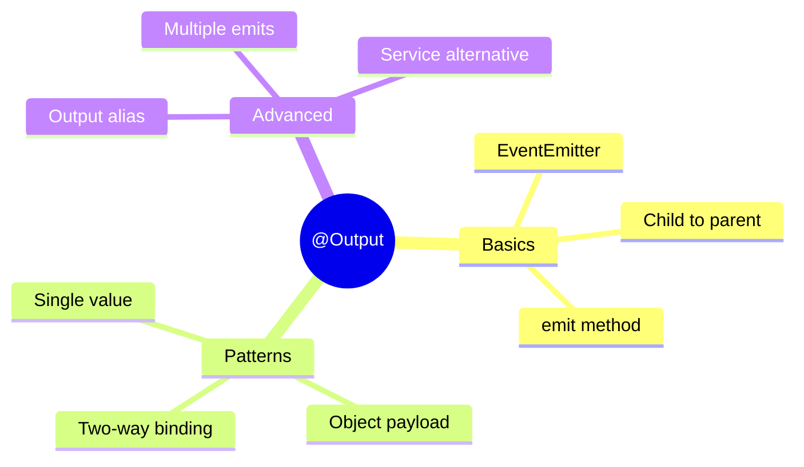

# 📤 Use Case 2: Basic @Output() Decorator

> **💡 Lightbulb Moment**: `@Output()` is how child components send data UP to parent components. It's the opposite of @Input()!

---

## 1. 🔍 What is @Output()?

The `@Output()` decorator marks an EventEmitter that the child can use to emit events to the parent.

```typescript
// child.component.ts
@Output() selected = new EventEmitter<string>();

onClick(item: string) {
    this.selected.emit(item);  // Send to parent
}

// parent.component.html
<app-child (selected)="onItemSelected($event)"></app-child>
```

---

## 2. 🚀 Key Concepts

### Basic EventEmitter
```typescript
@Output() clicked = new EventEmitter<void>();
@Output() valueChanged = new EventEmitter<string>();
@Output() dataSubmitted = new EventEmitter<{ name: string, age: number }>();
```

### Output Alias
```typescript
@Output('itemClick') selected = new EventEmitter<Item>();
// Parent uses: (itemClick)="handler($event)"
```

### $event in Template
```typescript
// Parent template
<app-child (selected)="handleSelection($event)"></app-child>

// $event contains the emitted value
handleSelection(item: string) {
    console.log('Selected:', item);
}
```

---

## 3. ❓ Interview Questions

### Basic Questions

#### Q1: What is EventEmitter?
**Answer:** EventEmitter is an Angular class that extends RxJS Subject. It's used with @Output() to emit custom events from child to parent components.

#### Q2: Can you emit multiple values from one @Output()?
**Answer:** Yes! You can emit as many times as needed:
```typescript
@Output() statusChanged = new EventEmitter<string>();

start() { this.statusChanged.emit('started'); }
stop() { this.statusChanged.emit('stopped'); }
```

#### Q3: What happens if you emit but parent isn't listening?
**Answer:** Nothing breaks - the event is simply ignored. It's safe to emit even if no one is listening.

---

### Scenario-Based Questions

#### Scenario 1: Pass Data from Grandchild to Grandparent
**Question:** You have a deeply nested component that needs to send data to a component 3 levels up. How?

**Answer:**
Option 1: Chain @Output() through each level (tedious)
```
Grandchild --emit--> Child --emit--> Parent --emit--> Grandparent
```

Option 2: Use a shared service
```typescript
@Injectable({ providedIn: 'root' })
export class EventBusService {
    private eventSubject = new Subject<any>();
    event$ = this.eventSubject.asObservable();
    
    emit(data: any) { this.eventSubject.next(data); }
}
```

Option 3: Use NgRx/Signals for state management

---

#### Scenario 2: Two-Way Binding
**Question:** How do you create a custom two-way binding like [(ngModel)]?

**Answer:** Create an @Input() and matching @Output() with "Change" suffix:
```typescript
@Input() value: string = '';
@Output() valueChange = new EventEmitter<string>();

updateValue(newValue: string) {
    this.value = newValue;
    this.valueChange.emit(newValue);
}

// Parent can use:
<app-custom [(value)]="myValue">
// Which is shorthand for:
<app-custom [value]="myValue" (valueChange)="myValue = $event">
```

---

## 🧠 Mind Map


