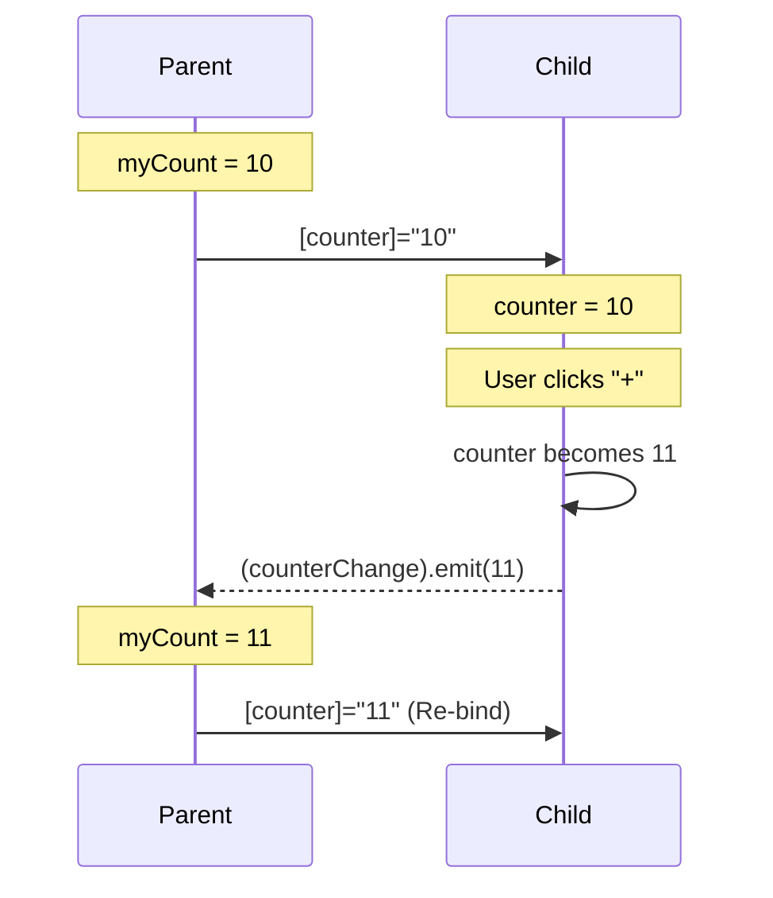
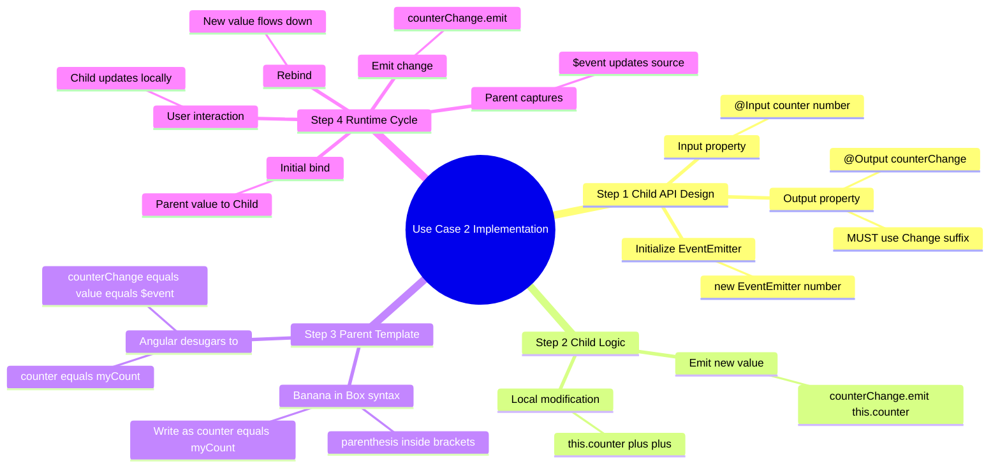
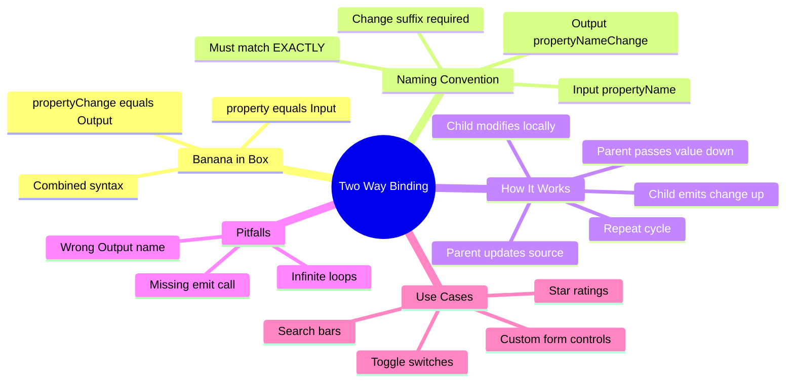

# 🍌 Use Case 2: Custom Two-Way Binding (The "Banana-in-a-Box")

> **Goal**: Master the art of syncing data between Parent and Child components seamlessly using Angular's `[(ngModel)]`-like syntax.

---

## 1. 🔍 How It Works (The Concept)

### The Mechanism
In Angular, **Two-Way Binding** is not magic; it's just "Syntactic Sugar" 🍬. It combines two standard patterns into one convenient syntax:
1.  **Property Binding (`[]`)**: Data flows **DOWN** from Parent to Child.
2.  **Event Binding (`()`)**: Data flows **UP** from Child to Parent.

When you write `[(counter)]="value"`, Angular "desugars" (expands) it into:
```html
<app-child 
  [counter]="value" 
  (counterChange)="value = $event">
</app-child>
```

### Default vs. Optimized Behavior
*   **Default (One-Way)**: Parent passes data. Child displays it. If Child changes it internally, Parent **never knows**.
*   **Optimized (Two-Way)**: Parent passes data. Child displays it. If Child changes it, it **notifies** Parent immediately, keeping both in perfect sync.

### 📊 Data Flow Diagram

```mermaid
graph TD
    subgraph "Parent Component"
        P_State[Parent State: value = 10]
        P_Template[Template: [(counter)]="value"]
    end

    subgraph "Child Component"
        C_Input[Input: @Input() counter]
        C_Output[Output: @Output() counterChange]
    end

    P_State --"1. Data Down [counter]"--> C_Input
    C_Input --"2. User Interaction"--> C_Output
    C_Output --"3. Event Up (counterChange)"--> P_Template
    P_Template --"4. Update State"--> P_State

    style P_State fill:#e1f5fe,stroke:#01579b
    style C_Input fill:#fff3e0,stroke:#ff6f00
    style C_Output fill:#fff3e0,stroke:#ff6f00
```

---

## 2. 🚀 Step-by-Step Implementation Guide

### Step 1: The Child Component (Provider)
The Child must follow a **STRICT Naming Convention**:
1.  Define an `@Input()` property (e.g., `counter`).
2.  Define an `@Output()` property with the **exact same name** + `Change` suffix (e.g., `counterChange`).

```typescript
// child.component.ts
import { Component, Input, Output, EventEmitter } from '@angular/core';

@Component({
  selector: 'app-child',
  template: `
    <button (click)="increment()">+</button>
    <span>{{ counter }}</span>
  `
})
export class ChildComponent {
  // 1. Data comes in
  @Input() counter: number = 0;

  // 2. Changes go out (MUST be named 'counterChange')
  // 🛡️ CRITICAL: The suffix 'Change' is mandatory for [( )] syntax to work!
  @Output() counterChange = new EventEmitter<number>();

  increment() {
    this.counter++;
    // 3. Notify parent of the new value
    this.counterChange.emit(this.counter); 
  }
}
```

### Step 2: The Parent Component (Consumer)
The Parent simply uses the "Banana-in-a-Box" syntax `[()]`.

```typescript
// parent.component.ts
import { Component } from '@angular/core';
import { ChildComponent } from './child.component';

@Component({
  selector: 'app-parent',
  imports: [ChildComponent],
  template: `
    <!-- 
      🛡️ CRITICAL: This single line handles both:
      - Passing 'myCount' down to child
      - Updating 'myCount' when child emits changes
    -->
    <app-child [(counter)]="myCount"></app-child>
    
    <p>Parent sees: {{ myCount }}</p>
  `
})
export class ParentComponent {
  myCount = 10;
}
```

### 📊 Implementation Visualization



---

## 3. 🐛 Common Pitfalls & Debugging

### ❌ The "Silent Failure" (Wrong Name)
**Bad Code:**
```typescript
@Input() value: string;
@Output() valueUpdated = new EventEmitter<string>(); // ❌ Wrong name
```
**Why it fails:** Angular looks for `valueChange`. If it doesn't find it, `[(value)]` will throw a template parse error or simply not update the parent.

**✅ Fixed Code:**
```typescript
@Input() value: string;
@Output() valueChange = new EventEmitter<string>(); // ✅ Correct suffix
```

### ❌ The "Infinite Loop" (Cyclic Updates)
**Bad Code:**
Inside `ngOnChanges`, if you emit an event for *every* input change, you might trigger a loop if the parent immediately sends the data back and `ngOnChanges` fires again.
**Fix:** Only emit events on **user interaction** (clicks, typing), not inside lifecycle hooks that react to data coming *down*.

---

## 4. ⚡ Performance & Architecture

### Performance Impact
*   **Event Noise**: Every keystroke in a two-way bound input triggers an event emission.
    *   *Cost*: Low for simple numbers/strings.
    *   *Risk*: High if the parent does heavy calculation on every update.
*   **Change Detection**: Events trigger Change Detection.
    *   *Optimization*: Use `OnPush` strategy in the Child to avoid checking the view unless the Input reference actually changes.

### Architectural Fit
*   **Leaf Components**: This pattern is **perfect** for "dumb" UI components (Inputs, DatePickers, Toggle Switches) that just report values.
*   **Smart Components**: **Avoid** this for complex containers. Use a Service or Store (NgRx/Signals) for managing state across large sections of the app.

---

## 5. 🌍 Real World Use Cases

1.  **Custom Form Controls**: A custom "Star Rating" component where the parent binds `[(rating)]="userScore"`.
2.  **Data Grids**: A "Pagination" component where `[(currentPage)]="page"` allows the grid to update the page, and the pager to update the grid.
3.  **Filters**: A "Search Bar" component where `[(query)]="searchTerm"` keeps the search logic in the parent in sync with the text box in the child.

---

## 6. 📝 The Analogy: "The Echo" 🗣️

Imagine you and a friend are standing in a canyon.

*   **One-Way Binding**: You shout "Hello!" (Input). Your friend hears it. If your friend whispers something back, you **don't** hear it.
*   **Two-Way Binding**: You hold a **Walkie-Talkie**.
    *   You speak (Input) -> Friend hears it.
    *   Friend speaks (Output) -> You hear it immediately.
    *   The **Walkie-Talkie** is the `[( )]` syntax ensuring the channel is open both ways.

---

## 🔧 Implementation Flow Mindmap

This mindmap shows **how the two-way binding is implemented** step-by-step:



---

## 🧠 Mind Map: Quick Visual Reference



---

## 7. ❓ Interview & Concept Questions

### Q1: What is "Banana-in-a-Box"?
**A:** It's the nickname for the `[( )]` syntax. The `[]` (box) represents Input, and the `()` (banana) represents Output. Together, they signify Two-Way Binding.

### Q2: Can I use Two-Way binding on a property that doesn't have a corresponding Output?
**A:** No. Angular expects a matching `@Output()` named `propertyName + Change`. Without it, you must manually bind `[property]` and `(event)`.

### Q3: How does this differ from Reactive Forms?
**A:** Two-way binding is template-driven and syncs values directly. Reactive Forms (`FormControl`) provide a layer of abstraction with built-in validation, dirty checking, and status tracking, which `[(ngModel)]` or custom two-way binding doesn't provide natively without extra work.

### Q4: Why might I avoid Two-Way binding in a large app?
**A:** It makes data flow less predictable ("unidirectional data flow" is often preferred). If data changes, it's harder to track *who* changed it (Parent or Child?). For complex state, Redux/Signals patterns are clearer.

### Q5: Implement a 'Toggle' component with Two-Way binding.
**A:**
```typescript
@Input() isOn: boolean;
@Output() isOnChange = new EventEmitter<boolean>();
toggle() { this.isOn = !this.isOn; this.isOnChange.emit(this.isOn); }
```
