# 🧠 Mastering Use Case 3: Complex Objects & Immutability

This guide provides a deep dive into **Use Case 3**, focusing on **OnPush Change Detection** and **Immutability**. This is the secret sauce to building high-performance Angular applications. 🚀

---

## 1. 🔍 How It Works (The Concept)

### The Core Mechanism: Reference vs. Value
Angular's default behavior is "paranoid"—it checks every component whenever anything happens. This is safe but slow. **OnPush** changes the rules. It tells Angular: *"Ignore me unless my **Input Reference** changes."*

*   **Default Behavior**: "Did the data inside the object change? I don't know, so I'll re-render."
*   **Optimized Behavior (OnPush)**: "Did the memory address of the object change? No? Then I'm sleeping." 😴

### Visualizing the Difference

```mermaid
graph TD
    subgraph Default_Strategy ["❌ Default Strategy (Slow)"]
        Event1[Click Event] --> Check1[Check Parent]
        Check1 --> Check2[Check Child]
        Check2 --> Check3[Check Grandchild]
        style Check1 fill:#ffcccc
        style Check2 fill:#ffcccc
        style Check3 fill:#ffcccc
    end

    subgraph OnPush_Strategy ["✅ OnPush Strategy (Fast)"]
        Event2[Click Event] --> CheckA[Check Parent]
        CheckA --> Decision{Ref Changed?}
        Decision -- No --> Sleep[😴 Skip Child]
        Decision -- Yes --> Update[🚀 Update Child]
        style CheckA fill:#ccffcc
        style Sleep fill:#e0e0e0,stroke-dasharray: 5 5
        style Update fill:#ccffcc
    end
```



### 📦 Data Flow Summary (Visual Box Diagram)

```
┌─────────────────────────────────────────────────────────────┐
│  PARENT COMPONENT                                           │
│                                                             │
│   user = { name: 'John', role: 'Admin' };  // Ref: 0x123    │
│                                                             │
│   ❌ BAD: Mutation (Same Reference)                         │
│   ┌───────────────────────────────────────────────────────┐ │
│   │ this.user.name = 'Jane';  // Still Ref: 0x123        │ │
│   │ // Angular sees: 0x123 === 0x123 → NO UPDATE! ❌      │ │
│   └───────────────────────────────────────────────────────┘ │
│                                                             │
│   ✅ GOOD: Immutable (New Reference)                        │
│   ┌───────────────────────────────────────────────────────┐ │
│   │ this.user = { ...this.user, name: 'Jane' };          │ │
│   │ // NEW Ref: 0x999                                     │ │
│   │ // Angular sees: 0x123 !== 0x999 → UPDATE! ✅         │ │
│   └─────────────────────────────────────────│─────────────┘ │
│                                             │               │
│   Pass new object via [user]="user"  ───────│───────────────│
└─────────────────────────────────────────────│───────────────┘
                                              │
                                    ⬇️ New Reference (0x999)
                                              │
┌─────────────────────────────────────────────│───────────────┐
│  CHILD COMPONENT (OnPush Strategy)          │               │
│                                             ▼               │
│   @Input() user: User;  ◄───────────────────┘               │
│                                                             │
│   changeDetection: ChangeDetectionStrategy.OnPush           │
│                                                             │
│   Angular's Decision:                                       │
│   ┌───────────────────────────────────────────────────────┐ │
│   │ if (oldRef !== newRef) {                             │ │
│   │   ✅ UPDATE VIEW                                      │ │
│   │ } else {                                              │ │
│   │   😴 SKIP (sleep, save CPU)                           │ │
│   │ }                                                     │ │
│   └───────────────────────────────────────────────────────┘ │
└─────────────────────────────────────────────────────────────┘
```

**Immutability + OnPush = Performance:**
1. Parent wants to change `user.name` from 'John' to 'Jane'
2. **Mutation** (❌): `this.user.name = 'Jane'` → Same object reference → Child skips update
3. **Immutable** (✅): `this.user = { ...this.user, name: 'Jane' }` → New reference → Child updates

> **Key Takeaway**: OnPush components only update when their `@Input` **reference** changes. Always create new objects with spread `{...}` or `[...].filter()` instead of mutating!

---

## 2. 🚀 Step-by-Step Implementation Guide

Follow these steps to implement this pattern in your code.

### Step 1: The Provider (Parent Component)
The parent is responsible for creating **New References** (Immutability).

```typescript
// parent.component.ts
export class ParentComponent {
  user = { name: 'John', role: 'Admin' };

  updateUser() {
    // 🛡️ CRITICAL: Create a NEW object using spread syntax
    // This changes the memory address (Reference)
    this.user = {
      ...this.user,    // Copy existing properties
      name: 'Jane'     // Overwrite specific property
    };
  }
}
```

### Step 2: The Consumer (Child Component)
The child signs the contract by enabling `OnPush`.

```typescript
// child.component.ts
import { Component, Input, ChangeDetectionStrategy } from '@angular/core';

@Component({
  selector: 'app-child',
  // 🛡️ CRITICAL: Enable OnPush Strategy
  changeDetection: ChangeDetectionStrategy.OnPush,
  template: `
    <div class="user-card">
      {{ user.name }}
    </div>
  `
})
export class ChildComponent {
  @Input() user: any;
}
```

### Implementation Flow Diagram

```mermaid
sequenceDiagram
    participant Parent
    participant Angular
    participant Child

    Note over Parent: User clicks "Update"
    Parent->>Parent: Creates NEW Object Ref (0x999)
    Parent->>Angular: Passes new Input to Child
    
    Note over Angular: Change Detection Runs
    Angular->>Child: Compare OldRef(0x123) vs NewRef(0x999)
    
    alt References are Different
        Angular->>Child: ✅ Update View!
    else References are Same
        Angular->>Child: 🛑 Skip Update!
    end
```



---

## 3. 🐛 Common Pitfalls & Debugging

### ❌ The "Bad" Way (Mutation)
This is the #1 reason for "My component isn't updating!" bugs.

```typescript
// ❌ BAD: Mutation
mutateUser() {
  // Modifying the property inside the SAME object
  this.user.name = 'New Name'; 
  
  // Angular sees: Ref #123 === Ref #123
  // Result: NO UPDATE 🛑
}
```

### ✅ The "Good" Way (Immutability)
Always replace the object container.

```typescript
// ✅ GOOD: Immutability
updateUser() {
  // Creating a BRAND NEW object
  this.user = { ...this.user, name: 'New Name' };
  
  // Angular sees: Ref #123 !== Ref #999
  // Result: UPDATE TRIGGERED 🚀
}
```

---

## 4. ⚡ Performance & Architecture

### Performance Gains
*   **Big O Notation**: Reduces Change Detection from **O(N)** (checking every node) to **O(1)** (checking input reference).
*   **CPU Cycles**: Skips thousands of unnecessary checks in large trees.

### Architectural Fit
*   **Smart vs. Dumb**:
    *   **Smart Components** (Parent) handle the logic of creating new objects.
    *   **Dumb Components** (Child) use `OnPush` to be purely presentational and fast.
*   **State Management**: Libraries like **NgRx** and **Redux** enforce this pattern by default, making them a perfect match for `OnPush`.

---

## 5. 🌍 Real World Use Cases

1.  **Data Grids / Tables**:
    *   *Scenario*: Updating a single cell in a 10,000-row table.
    *   *Benefit*: Only the specific row with the new reference re-renders. The other 9,999 rows are skipped.

2.  **Real-time Dashboards**:
    *   *Scenario*: A stock ticker updating 10 times per second.
    *   *Benefit*: Prevents the entire UI from freezing by isolating updates to just the ticker component.

3.  **Complex Forms**:
    *   *Scenario*: A multi-step wizard.
    *   *Benefit*: Typing in "Step 1" doesn't trigger validation logic in "Step 4".

---

## 6. 📝 The Analogy: The "Sticky Note"

*   **Mutation**: You sneak into a worker's office and rewrite a line on their To-Do list sticky note. They don't notice because it's the **same piece of paper**. They keep working on the old task. 🤷‍♂️
*   **Immutability**: You write a **brand new sticky note**, throw away the old one, and stick the new one on their monitor. They **immediately notice** the new paper and start working on the new task. 😲

---

## 🔧 Implementation Flow Mindmap

This mindmap shows **how OnPush and immutability is implemented** step-by-step:


---

## 🧠 Mind Map: Quick Visual Reference


---

## 7. ❓ Interview & Concept Questions

### Core Concepts
**Q1: What is the difference between `Default` and `OnPush` change detection?**
*   **Answer**: `Default` checks the component and all its children on every change detection cycle (e.g., clicks, timers). `OnPush` only checks the component if its **Input Reference** changes, an event originates from within it, or an async pipe emits.

**Q2: What is the difference between Reference and Value in JavaScript?**
*   **Answer**: Primitives (string, number) are stored by Value. Objects and Arrays are stored by Reference (memory address). `OnPush` relies on the Reference changing to trigger updates.

### Debugging
**Q3: Why does mutating an object property not trigger an update in an OnPush component?**
*   **Answer**: Because `OnPush` uses strict equality check (`===`) on inputs. If you mutate an object, the memory reference remains the same, so Angular thinks nothing changed and skips the update.

### Implementation
**Q4: How do you create an immutable copy of an object in JavaScript?**
*   **Answer**: Use the Spread Syntax (`...`). Example: `const newObj = { ...oldObj, updatedProp: 'value' };`. For deep copies, use `structuredClone()` or libraries like Lodash.

### Performance & Architecture
**Q5: How does OnPush improve performance in large applications?**
*   **Answer**: It prunes the Change Detection tree. Instead of checking every single component (O(N)), Angular can skip entire subtrees if their inputs haven't changed, significantly reducing CPU usage.

**Q6: What is the "Smart vs. Dumb" component pattern?**
*   **Answer**: "Smart" (Container) components manage state and logic (creating new references). "Dumb" (Presentational) components just display data via `@Input()` and emit events via `@Output()`. Dumb components are perfect candidates for `OnPush`.

### Real World Scenarios
**Q7: Scenario: You have a list of 1000 items. Clicking "Delete" on one item makes the UI lag. How do you fix it?**
*   **Answer**:
    1.  Make the Item Component `OnPush`.
    2.  Ensure the Parent updates the list immutably (e.g., `this.items = this.items.filter(...)`) instead of mutating it (`this.items.splice(...)`).
    3.  This ensures only the list container updates, and individual item components that didn't change are skipped.

**Q8: Scenario: An OnPush component isn't updating, but you CANNOT change the parent code to be immutable. What do you do?**
*   **Answer**: You can manually trigger change detection using `ChangeDetectorRef`. Inject it and call `this.cdr.markForCheck()` when you know data has changed. This is a "escape hatch" but should be used sparingly.
