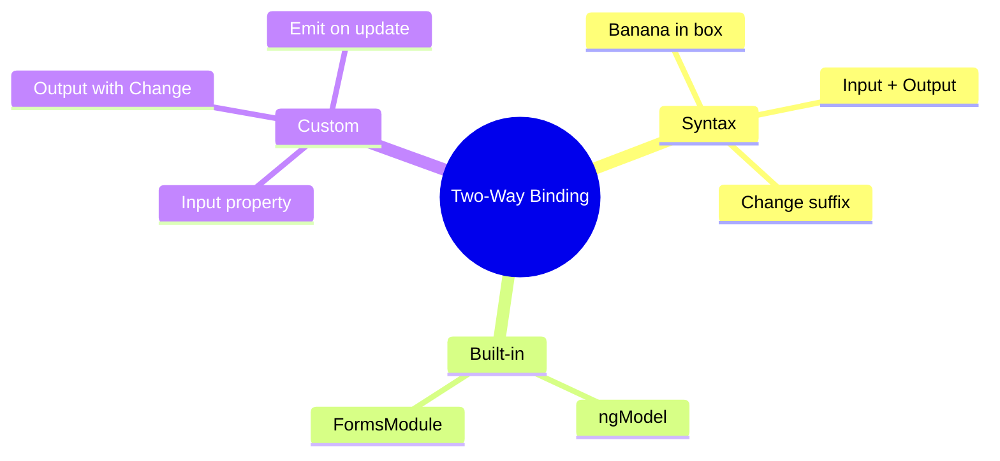

# 🔄 Use Case 3: Two-Way Binding

> **💡 Lightbulb Moment**: Two-way binding `[(x)]` is just syntactic sugar for `[x]` + `(xChange)` combined!

---

## 1. 🔍 How Two-Way Binding Works

The "banana in a box" syntax `[()]` combines:
- Property binding `[]` (data in)
- Event binding `()` (data out)

```typescript
// These are equivalent:
<input [(ngModel)]="name">

<input [ngModel]="name" (ngModelChange)="name = $event">
```

---

## 2. 🚀 Creating Custom Two-Way Binding

### The Pattern
```typescript
@Input() value: string = '';
@Output() valueChange = new EventEmitter<string>();  // Must be "propertyName" + "Change"

// Usage
<app-custom [(value)]="myValue">
```

### Complete Example
```typescript
@Component({
    selector: 'app-counter',
    template: `
        <button (click)="decrement()">-</button>
        <span>{{ count }}</span>
        <button (click)="increment()">+</button>
    `
})
export class CounterComponent {
    @Input() count: number = 0;
    @Output() countChange = new EventEmitter<number>();
    
    increment() {
        this.count++;
        this.countChange.emit(this.count);
    }
    
    decrement() {
        this.count--;
        this.countChange.emit(this.count);
    }
}

// Parent usage
<app-counter [(count)]="totalItems"></app-counter>
```

---

## 3. ❓ Interview Questions

### Basic Questions

#### Q1: What is the "banana in a box" syntax?
**Answer:** `[()]` is called "banana in a box" because the parentheses `()` look like a banana inside square brackets `[]`. It represents two-way data binding.

#### Q2: What naming convention must @Output follow for two-way binding?
**Answer:** The @Output must be named `<inputPropertyName>Change`. For example:
- `@Input() value` → `@Output() valueChange`
- `@Input() selected` → `@Output() selectedChange`

#### Q3: Is two-way binding required?
**Answer:** No! You can always use the expanded form:
```html
<input [ngModel]="value" (ngModelChange)="handleChange($event)">
```
This gives you more control over when/how to update.

---

### Scenario-Based Questions

#### Scenario 1: Custom Toggle Component
**Question:** Create a toggle component with two-way binding for `isOn`.

**Answer:**
```typescript
@Component({
    selector: 'app-toggle',
    template: `
        <button (click)="toggle()" [class.active]="isOn">
            {{ isOn ? 'ON' : 'OFF' }}
        </button>
    `
})
export class ToggleComponent {
    @Input() isOn: boolean = false;
    @Output() isOnChange = new EventEmitter<boolean>();
    
    toggle() {
        this.isOn = !this.isOn;
        this.isOnChange.emit(this.isOn);
    }
}

// Usage
<app-toggle [(isOn)]="lightSwitch"></app-toggle>
```

---

#### Scenario 2: One-Way vs Two-Way
**Question:** When would you use one-way binding instead of two-way?

**Answer:**
- **One-way** when you need to validate/transform before updating
- **One-way** for performance (avoids unnecessary change detection)
- **One-way** when parent needs full control over state

```typescript
// One-way with validation
<input [value]="email" (input)="validateAndUpdate($event)">

validateAndUpdate(event: Event) {
    const value = (event.target as HTMLInputElement).value;
    if (this.isValidEmail(value)) {
        this.email = value;
    }
}
```

---

## 📻 Walkie-Talkie Analogy (Easy to Remember!)

Think of two-way binding like **walkie-talkies**:

| Concept | Walkie-Talkie Analogy | Memory Trick |
|---------|----------------------|--------------| 
| **Two-way binding** | 📻 **Walkie-talkie pair**: Both can send AND receive | **"Both directions"** |
| **[input]** | 📥 **Receive only**: Just a radio (listen only) | **"Data in"** |
| **(output)** | 📤 **Send only**: Just a microphone (talk only) | **"Data out"** |
| **[(value)]** | 📻 **Full walkie**: Can both talk AND listen | **"Banana in box"** |
| **valueChange** | 📢 **Reply channel**: Specific frequency for responses | **"XxxChange suffixI"** |

### 📖 Story to Remember:

> 📻 **The Radio Station**
>
> You're setting up communication between parent and child:
>
> **One-Way (Radio OR Microphone):**
> ```html
> <!-- 📥 Radio only: Parent sends, child listens -->
> <child [message]="parentMessage">
> 
> <!-- 📤 Microphone only: Child sends, parent listens -->
> <child (reply)="handleReply($event)">
> ```
>
> **Two-Way (Walkie-Talkie):**
> ```html
> <!-- 📻 Full walkie: Both can send AND receive -->
> <child [(value)]="sharedValue">
> 
> <!-- Same as: -->
> <child [value]="sharedValue" (valueChange)="sharedValue = $event">
> ```
>
> **"Banana in a box" [( )] = walkie-talkie = two-way!**

### 🎯 Quick Reference:
```
📻 [(x)]        = Walkie-talkie (both directions)
📥 [x]          = Radio (receive only)
📤 (x)          = Microphone (send only)
📢 xChange      = Reply frequency (must match!)
🍌 [()]         = "Banana in box" syntax
```

---

## 🧠 Mind Map


