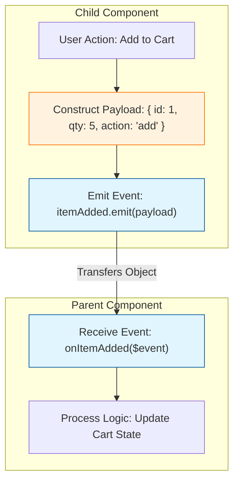
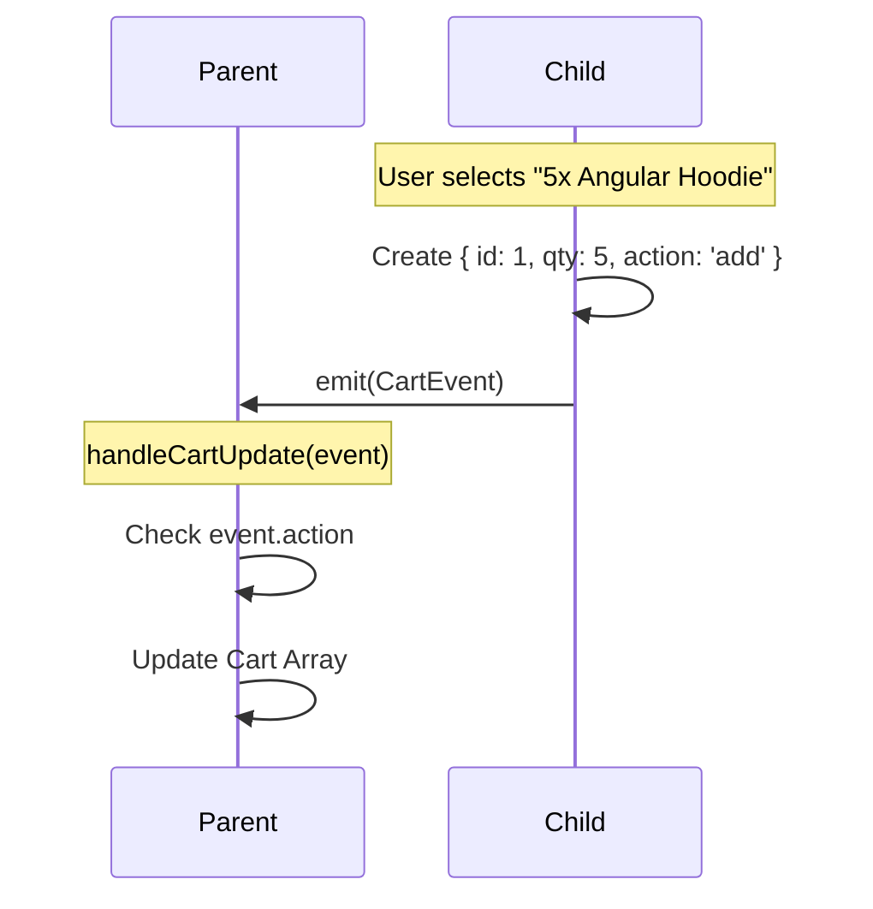
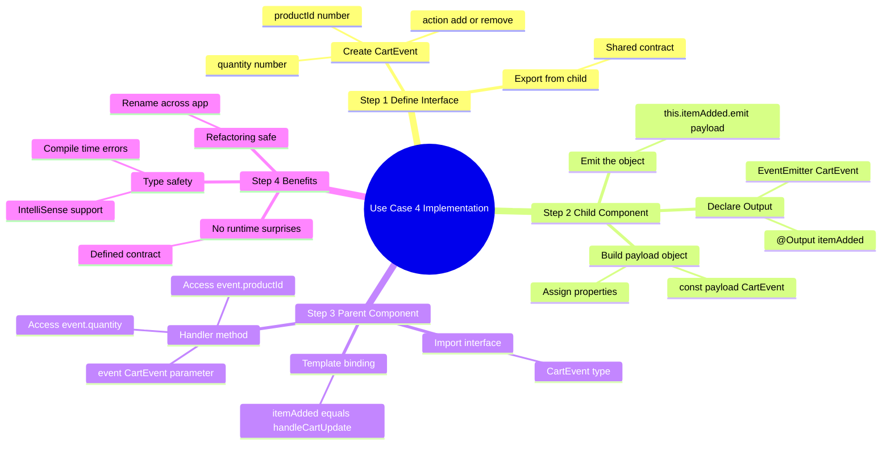
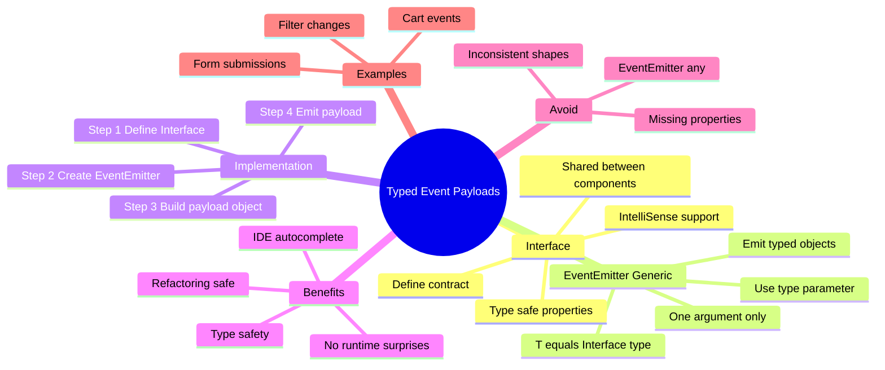

# 📦 Use Case 4: Custom Events with Typed Payloads

> **Goal**: Move beyond simple boolean/string events and master sending rich, type-safe data structures from Child to Parent.

---

## 1. 🔍 How It Works (The Concept)

### The Mechanism
In real-world applications, a simple "click" is rarely enough. You often need to say **WHAT** was clicked, **HOW** much of it, and **WHY**.
*   **Default Behavior (Primitive)**: Emitting `true`, `false`, or `"clicked"`. The parent has to guess the context or store extra state to know what happened.
*   **Optimized Behavior (Typed Payload)**: Emitting a structured **Object** (Interface) that contains all the context the parent needs.

### 📊 Data Flow Diagram



---

## 2. 🚀 Step-by-Step Implementation Guide

### Step 1: Define the Interface (The Contract)
Create a shared interface so both Parent and Child agree on the data shape.

```typescript
// child.component.ts
export interface CartEvent {
  productId: number;
  quantity: number;
  action: 'add' | 'remove';
}
```

### Step 2: The Child Component (Provider)
Construct and emit the object.

```typescript
// child.component.ts
import { Component, Output, EventEmitter } from '@angular/core';

@Component({ ... })
export class ChildComponent {
  // 🛡️ CRITICAL: Use the Interface in the Generic <CartEvent>
  @Output() itemAdded = new EventEmitter<CartEvent>();

  addToCart(id: number, qty: number) {
    // 1. Create the payload
    const payload: CartEvent = {
      productId: id,
      quantity: qty,
      action: 'add'
    };

    // 2. Emit the payload
    this.itemAdded.emit(payload);
  }
}
```

### Step 3: The Parent Component (Consumer)
Receive and type-check the event.

```typescript
// parent.component.ts
import { Component } from '@angular/core';
import { CartEvent } from './child.component'; // Import the interface

@Component({
  template: `
    <!-- $event contains the CartEvent object -->
    <app-child (itemAdded)="handleCartUpdate($event)"></app-child>
  `
})
export class ParentComponent {
  
  // 🛡️ CRITICAL: Type the argument explicitly!
  handleCartUpdate(event: CartEvent) {
    console.log(`Adding ${event.quantity} of product ${event.productId}`);
    // Now you have full IntelliSense support!
    if (event.action === 'add') {
      // ... logic
    }
  }
}
```

### 📊 Implementation Visualization



---

## 3. 🐛 Common Pitfalls & Debugging

### ❌ Using `any`
**Bad Code:**
```typescript
@Output() update = new EventEmitter<any>(); // ❌ Lazy typing
```
**Why it fails:** You lose all TypeScript benefits. If you rename a property in the Child (`qty` -> `quantity`), the Parent won't show an error, but it will break at runtime (`undefined`).
**Fix:** Always define and use an **Interface**.

### ❌ Inconsistent Data Shapes
**Bad Code:**
```typescript
this.update.emit({ id: 1 }); // Event A
this.update.emit({ name: 'Item' }); // Event B
```
**Why it fails:** The Parent expects a consistent shape. Handling random objects leads to `undefined` errors.
**Fix:** Use Union Types if needed: `EventEmitter<EventA | EventB>`, but preferably separate events.

---

## 4. ⚡ Performance & Architecture

### Performance
*   **Payload Size**: Passing objects is cheap (it's just a reference in memory).
*   **Copying**: Be careful if you modify the event object in the Parent. Since it's passed by reference, you might accidentally mutate state in the Child if you aren't careful (though usually, the event object is transient).

### Architecture
*   **Decoupling**: By defining the Interface in a shared location (or the Child), the Parent depends on the *Contract*, not the internal logic of the Child.
*   **Scalability**: As your app grows, typed events make refactoring safe. You can rename properties across the entire app with one click.

---

## 5. 🌍 Real World Use Cases

1.  **Shopping Cart**: Emitting `{ productId, quantity, options: { size, color } }` when adding an item.
2.  **Data Grid Filters**: Emitting `{ column: 'price', operator: 'gt', value: 100 }` when a user filters a list.
3.  **Form Submission**: A reusable "Address Form" component emitting a full `{ street, city, zip }` object on save.

---

## 6. 📝 The Analogy: "The Certified Mail" ✉️

*   **Simple Event (Boolean)**: Like a **Doorbell**. It just tells you *someone* is there. It doesn't tell you who or what they want.
*   **Typed Payload (Object)**: Like **Certified Mail**.
    *   It comes in a specific envelope (**Interface**).
    *   It contains specific documents inside (**Properties**).
    *   You sign for it, acknowledging you received exactly what was sent (**Type Safety**).

---

## 🔧 Implementation Flow Mindmap

This mindmap shows **how typed event payloads are implemented** step-by-step:



---

## 🧠 Mind Map: Quick Visual Reference



---

## 7. ❓ Interview & Concept Questions

### Q1: Why should I use an Interface for event payloads?
**A:** To ensure **Type Safety**. It prevents runtime errors caused by typos or missing properties and provides IntelliSense in the IDE, making development faster and less error-prone.

### Q2: Can I emit multiple arguments in `emit()`?
**A:** No. `EventEmitter.emit()` takes exactly **one** argument. If you need to pass multiple values, you **must** wrap them in an object (array or interface).

### Q3: Is the event object passed by value or reference?
**A:** By **Reference** (like all objects in JS). However, since you usually create a *new* object literal `{...}` inside the emit method, it acts like a unique snapshot of data.

### Q4: How do I handle multiple different events from one component?
**A:** You can define multiple `@Output()` properties (e.g., `saved`, `cancelled`, `deleted`). Or, use one generic event with a `type` discriminator (e.g., `{ type: 'save', data: ... }`).

### Q5: What happens if I don't type the `$event` in the parent's HTML?
**A:** Angular templates are loosely typed by default (unless strict mode is on). However, in the component class method (TypeScript), you should always specify the type to catch errors.
