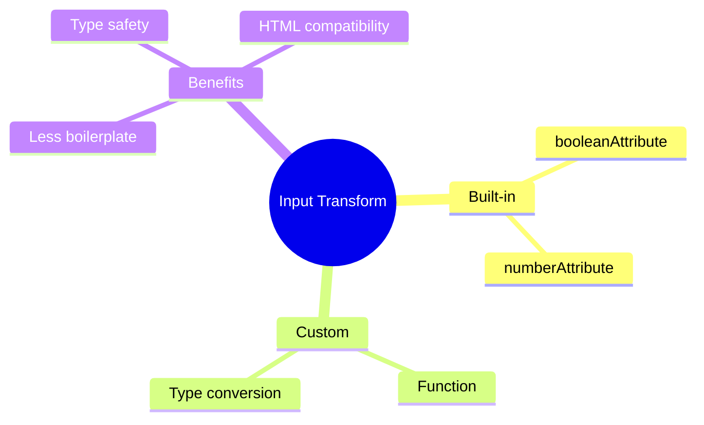

# ⚙️ Use Case 4: Input Transform

> **💡 Lightbulb Moment**: Input transforms (Angular 16+) let you automatically convert input values - like turning strings to booleans or numbers!

---

## 1. 🔍 What are Input Transforms?

Transform functions automatically convert input values before they're assigned.

```typescript
import { booleanAttribute, numberAttribute } from '@angular/core';

@Input({ transform: booleanAttribute }) disabled: boolean = false;
@Input({ transform: numberAttribute }) count: number = 0;
```

---

## 2. 🚀 Built-in Transforms

### booleanAttribute
```typescript
@Input({ transform: booleanAttribute }) disabled: boolean = false;

// These all set disabled = true:
<app-button disabled></app-button>
<app-button disabled=""></app-button>
<app-button disabled="true"></app-button>

// This sets disabled = false:
<app-button disabled="false"></app-button>
```

### numberAttribute
```typescript
@Input({ transform: numberAttribute }) count: number = 0;

<app-counter count="42"></app-counter>  // count = 42 (number, not string!)
```

---

## 3. 🔧 Custom Transforms

```typescript
function trimString(value: string | undefined): string {
    return value?.trim() ?? '';
}

@Input({ transform: trimString }) name: string = '';
```

---

## 4. ❓ Interview Questions

### Basic Questions

#### Q1: Why use input transforms?
**Answer:** 
- Handle HTML attribute strings (always strings)
- Reduce boilerplate conversion code
- Enforce consistent value types

#### Q2: What does booleanAttribute do?
**Answer:** Converts to boolean:
- Present attribute → true
- `"true"` → true
- `"false"` → false
- Empty string → true

---

### Scenario-Based Questions

#### Scenario: Legacy HTML Attributes
**Question:** Your component receives `disabled` from HTML but needs boolean. Old way vs new way?

**Answer:**
```typescript
// OLD way (pre-Angular 16)
private _disabled = false;
@Input()
get disabled(): boolean { return this._disabled; }
set disabled(value: boolean | string) {
    this._disabled = value === '' || value === true || value === 'true';
}

// NEW way (Angular 16+)
@Input({ transform: booleanAttribute }) disabled = false;
```

---

## 🧠 Mind Map


