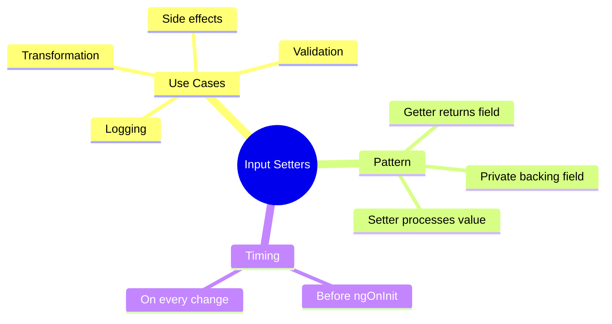

# 🎯 Use Case 5: Input Setters & Getters

> **💡 Lightbulb Moment**: Setters let you intercept input values before they're assigned - perfect for validation, transformation, or triggering side effects!

---

## 1. 🔍 Why Use Setters?

Sometimes you need to:
- Validate incoming data
- Transform values
- Trigger side effects when input changes
- Log/debug input changes

```typescript
private _color: string = 'blue';

@Input()
get color(): string { return this._color; }
set color(value: string) {
    // Validate
    const validColors = ['red', 'green', 'blue'];
    if (validColors.includes(value)) {
        this._color = value;
    } else {
        console.warn(`Invalid color: ${value}`);
        this._color = 'blue';  // Default
    }
}
```

---

## 2. 🚀 Common Patterns

### Coercion
```typescript
private _count = 0;

@Input()
get count(): number { return this._count; }
set count(value: number | string) {
    this._count = typeof value === 'string' ? parseInt(value, 10) : value;
}
```

### Trigger Side Effect
```typescript
private _data: any[] = [];

@Input()
get data(): any[] { return this._data; }
set data(value: any[]) {
    this._data = value;
    this.processData();  // Side effect
}
```

---

## 3. ❓ Interview Questions

### Basic Questions

#### Q1: Setter vs ngOnChanges - when to use which?
**Answer:**
| Use Case | Setter | ngOnChanges |
|----------|--------|-------------|
| Single input | ✅ | Overkill |
| Multiple inputs together | ❌ | ✅ |
| Previous value needed | ❌ | ✅ |
| First change detection | ❌ | ✅ |

#### Q2: Does the setter run before ngOnInit?
**Answer:** Yes! Input setters run during component initialization, BEFORE ngOnInit.

---

### Scenario-Based Questions

#### Scenario: Validate and Fallback
**Question:** Create an input that accepts T-shirt sizes (S, M, L, XL) and defaults to M if invalid.

**Answer:**
```typescript
type Size = 'S' | 'M' | 'L' | 'XL';
private _size: Size = 'M';

@Input()
get size(): Size { return this._size; }
set size(value: Size) {
    const validSizes: Size[] = ['S', 'M', 'L', 'XL'];
    this._size = validSizes.includes(value) ? value : 'M';
}
```

---

## 🧠 Mind Map


