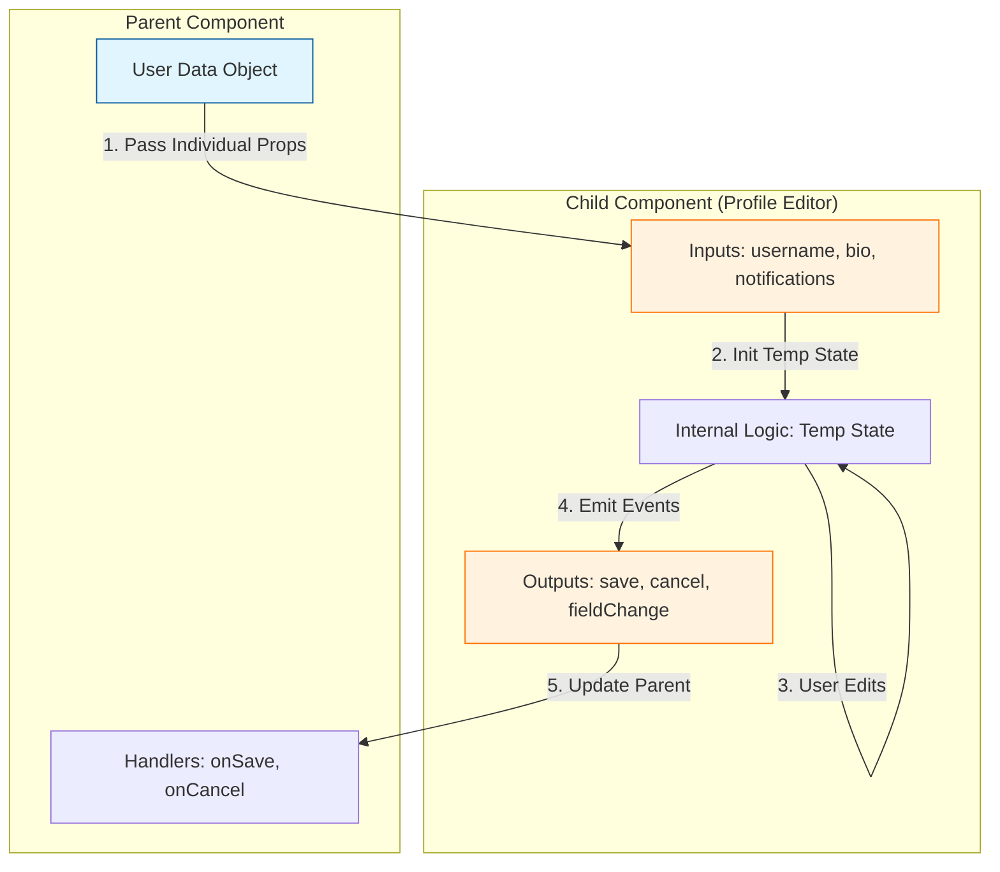
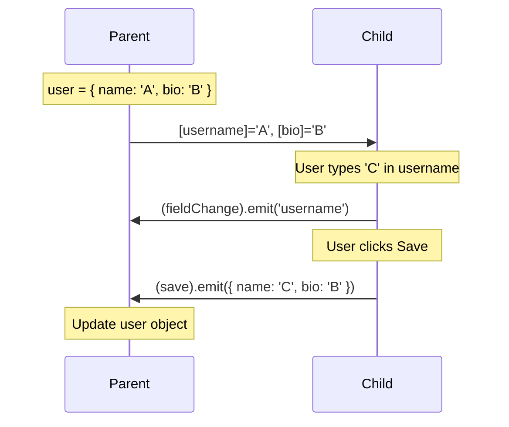
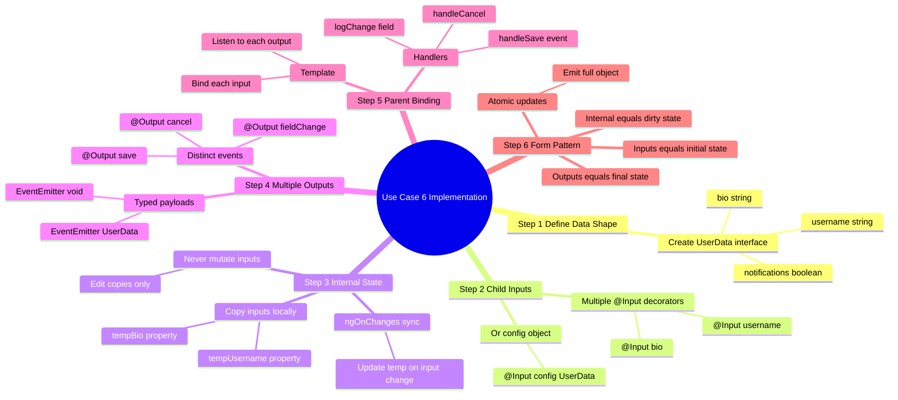
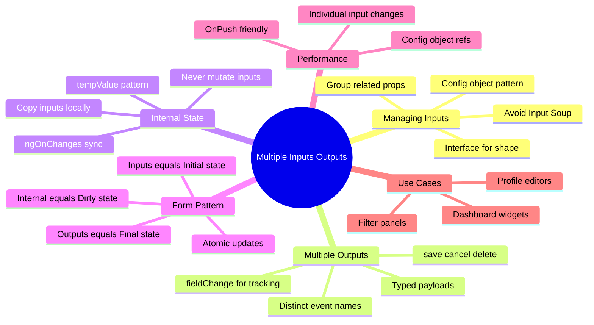

# 🎛️ Use Case 6: Multiple Inputs & Outputs

> **Goal**: Master the art of managing complex components that require many data points and emit multiple types of events.

---

## 1. 🔍 How It Works (The Concept)

### The Mechanism
Real-world components are rarely simple. A "User Profile Editor" might need a username, bio, avatar, and preferences (Inputs) and need to save, cancel, or validate (Outputs).
*   **Default Behavior**: Creating a separate `@Input` for every single property. This works but can get messy ("Input Soup").
*   **Optimized Behavior**: Grouping related inputs into **Configuration Objects** (Interfaces) and defining clear, distinct Output events for specific actions.

### 📊 Data Flow Diagram



### 📦 Data Flow Summary (Visual Box Diagram)

```
┌─────────────────────────────────────────────────────────────┐
│  PARENT COMPONENT                                           │
│                                                             │
│   user = { username: 'Dev', bio: 'Coding...', notify: true }│
│                                                             │
│   Template:                                                 │
│   ┌───────────────────────────────────────────────────────┐ │
│   │ <app-profile-editor                                   │ │
│   │   [username]="user.username"  ──────────────┐         │ │
│   │   [bio]="user.bio"  ────────────────────────┤         │ │
│   │   [notifications]="user.notify"  ───────────┤         │ │
│   │                                             │         │ │
│   │   (save)="handleSave($event)"  ◄────────────│─────┐   │ │
│   │   (cancel)="handleCancel()"  ◄──────────────│─────┤   │ │
│   │   (fieldChange)="logChange($event)">  ◄─────│─────┤   │ │
│   │ </app-profile-editor>                       │     │   │ │
│   └─────────────────────────────────────────────│─────│───┘ │
│                                                 │     │     │
│   handleSave(newData: UserData) {               │     │     │
│     this.user = newData;  ◄─────────────────────│─────┘     │
│   }                                             │           │
└─────────────────────────────────────────────────│───────────┘
                                                  │
                        Multiple ⬇️ Inputs        │  ⬆️ Multiple Outputs
                                                  │
┌─────────────────────────────────────────────────│───────────┐
│  CHILD COMPONENT (Profile Editor)               │           │
│                                                 ▼           │
│   // --- INPUTS ---                                         │
│   @Input() username: string = '';  ◄────────────┘           │
│   @Input() bio: string = '';                                │
│   @Input() notifications: boolean = false;                  │
│                                                             │
│   // --- INTERNAL STATE (Never mutate inputs!) ---          │
│   tempUsername = '';                                        │
│   tempBio = '';                                             │
│                                                             │
│   ngOnChanges() {                                           │
│     this.tempUsername = this.username;  // Sync on change   │
│     this.tempBio = this.bio;                                │
│   }                                                         │
│                                                             │
│   // --- OUTPUTS ---                                        │
│   @Output() save = new EventEmitter<UserData>();            │
│   @Output() cancel = new EventEmitter<void>();              │
│   @Output() fieldChange = new EventEmitter<string>();       │
│                                                             │
│   onSave() {                                                │
│     this.save.emit({                                        │
│       username: this.tempUsername,  // Emit full object     │
│       bio: this.tempBio,                                    │
│       notifications: this.notifications                     │
│     }); ─────────────────────────────────────────────► UP   │
│   }                                                         │
└─────────────────────────────────────────────────────────────┘
```

**Multiple Inputs/Outputs Pattern:**
1. Parent passes individual properties via multiple `@Input()` bindings
2. Child copies inputs to internal `temp` state (never mutate inputs!)
3. User edits the internal state
4. On Save: Child emits the full object via `@Output()`
5. Parent receives atomic update with all changes

> **Key Takeaway**: Use internal state (`temp...`) to avoid mutating inputs. Emit complete objects for atomic updates!

---

## 2. 🚀 Step-by-Step Implementation Guide

### Step 1: Define the Data Shape
Always start with an Interface.

```typescript
// child.component.ts
export interface UserData {
  username: string;
  bio: string;
  notifications: boolean;
}
```

### Step 2: The Child Component (Provider)
Handle multiple inputs and outputs. Use internal state (`temp...`) to avoid mutating inputs directly.

```typescript
// child.component.ts
@Component({ ... })
export class ChildComponent {
  // --- Inputs ---
  @Input() username: string = '';
  @Input() bio: string = '';
  
  // --- Outputs ---
  @Output() save = new EventEmitter<UserData>();
  @Output() cancel = new EventEmitter<void>();
  @Output() fieldChange = new EventEmitter<string>();

  // --- Internal State ---
  tempUsername = '';

  ngOnChanges() {
    // Sync inputs to internal state when they change
    this.tempUsername = this.username;
  }

  onSave() {
    // Emit the full object back
    this.save.emit({
      username: this.tempUsername,
      bio: this.bio, // ... etc
      notifications: false
    });
  }
}
```

### Step 3: The Parent Component (Consumer)
Bind everything in the template.

```typescript
// parent.component.ts
@Component({
  template: `
    <app-child
      [username]="user.username"
      [bio]="user.bio"
      (save)="handleSave($event)"
      (cancel)="handleCancel()"
      (fieldChange)="logChange($event)">
    </app-child>
  `
})
export class ParentComponent {
  user = { username: 'Dev', bio: 'Coding...' };

  handleSave(newData: UserData) {
    this.user = newData; // Update source of truth
  }
}
```

### 📊 Implementation Visualization



---

## 3. 🐛 Common Pitfalls & Debugging

### ❌ "Input Soup" (Too Many Inputs)
**Bad Code:**
```typescript
@Input() firstName: string;
@Input() lastName: string;
@Input() age: number;
@Input() address: string;
@Input() city: string;
// ... 20 more inputs
```
**Why it fails:** The template becomes unreadable: `<app-child [firstName]="..." [lastName]="..." ...>`.
**Fix:** Group them into a single configuration object: `@Input() config: UserConfig`.

### ❌ Mutating Inputs Directly
**Bad Code:**
```typescript
updateName(val: string) {
  this.username = val; // ❌ Modifying the Input directly!
}
```
**Why it fails:** If the parent re-renders, it will overwrite your local changes with the original value.
**Fix:** Copy inputs to a local property (`tempUsername`) on `ngOnInit` or `ngOnChanges`, edit the copy, then emit the result.

---

## 4. ⚡ Performance & Architecture

### Performance: Config Object vs. Individual Inputs
*   **Individual Inputs**: Good for Change Detection (Angular knows exactly which property changed).
*   **Config Object**: Cleaner code, but if you pass a new object reference every time, you might trigger unnecessary checks.
    *   *Tip*: Use `OnPush` change detection.

### Architecture: The "Form" Pattern
This pattern (Inputs -> Internal State -> Output) mimics how HTML Forms work.
*   **Inputs**: `value="..."` (Initial state)
*   **Internal**: User types (Dirty state)
*   **Output**: `(submit)` (Final state)

---

## 5. 🌍 Real World Use Cases

1.  **Rich Text Editor**: Inputs for `content`, `toolbarConfig`, `readOnly`. Outputs for `contentChange`, `selectionChange`, `save`.
2.  **Dashboard Widget**: Inputs for `title`, `chartType`, `data`. Outputs for `refresh`, `expand`, `remove`.
3.  **Complex Filter Panel**: Inputs for `currentFilters`. Outputs for `applyFilters`, `clearAll`.

---

## 6. 📝 The Analogy: "The Sound Mixing Board" 🎚️

Think of a **DJ's Mixing Board**.
*   **Inputs**: The music tracks coming in (Channels 1, 2, 3).
*   **Knobs & Sliders**: The DJ (Child Component) adjusts volume, bass, treble (Internal State).
*   **Outputs**: The final "Master Mix" sent to the speakers (Parent).
*   The DJ doesn't change the *original* record; they manipulate the signal and send out a *new* mix.

---

## 🔧 Implementation Flow Mindmap

This mindmap shows **how multiple inputs and outputs are implemented** step-by-step:



---

## 🧠 Mind Map: Quick Visual Reference



---

## 7. ❓ Interview & Concept Questions

### Q1: When should I group inputs into an object?
**A:** When the inputs are tightly coupled (e.g., `street`, `city`, `zip` usually go together) or when you have more than 5-6 inputs related to the same entity.

### Q2: How do I handle state synchronization?
**A:** Use `ngOnChanges`. When the Parent updates an Input, the Child should detect it and update its internal `temp` state to match, ensuring the UI stays in sync.

### Q3: Can I have an Output with the same name as an Input?
**A:** No, but you can have `name` and `nameChange` (Two-Way Binding pattern). If they are unrelated, use distinct names to avoid confusion.

### Q4: What is the benefit of emitting a full object on Save?
**A:** Atomicity. The Parent receives the entire valid state at once. It avoids partial updates where the username is updated but the bio isn't.

### Q5: How does `OnPush` affect multiple inputs?
**A:** With `OnPush`, the Child only checks for updates if the *reference* of an Input changes. If you mutate a property inside an input object (`user.name = 'new'`), the Child won't see it. You must pass a new object (`user = { ...user, name: 'new' }`).
