# @Input() & @ Output() - Visual Diagrams

Complete visual guide showing data flow and component communication patterns for all use cases.

---

## Basic @Input() and @Output()

```mermaid
%%{init: {'theme':'dark', 'themeVariables': { 'primaryColor':'#667eea','secondaryColor':'#764ba2','tertiaryColor':'#f093fb'}}}%%
flowchart TB
    subgraph Parent["👨‍💼 Parent Component"]
        P_Data["📦 Data State<br/>userName: 'John'<br/>userAge: 28<br/>isActive: true"]
        P_Handler["🎯 Event Handler<br/>onGreetingClick(msg)"]
    end
    
    subgraph Child["👶 Child Component"]
        C_Input["📥 @Input() Properties<br/>receives data"]
        C_Output["📤 @Output() Events<br/>emits events"]
        C_Display["🖼️ Template Display<br/>shows data"]
        C_Button["🔘 User Interaction<br/>clicks button"]
    end
    
    P_Data -->|"[userName]='John'"| C_Input
    C_Input -->|data binding| C_Display
    C_Button -->|user clicks| C_Output
    C_Output -->|"greetingClick.emit()"| P_Handler
    
    style Parent fill:#667eea,stroke:#764ba2,stroke-width:3px,color:#fff
    style Child fill:#764ba2,stroke:#667eea,stroke-width:3px,color:#fff
    style P_Data fill:#4c51bf,color:#fff
    style P_Handler fill:#5a67d8,color:#fff
    style C_Input fill:#9333ea,color:#fff
    style C_Output fill:#a855f7,color:#fff
    style C_Display fill:#c084fc,color:#fff
    style C_Button fill:#e879f9,color:#fff
```



### Data Flow Sequence

```mermaid
%%{init: {'theme':'dark'}}%%
sequenceDiagram
    participant P as 👨‍💼 Parent
    participant C as 👶 Child
    
    Note over P: userName = "John"
    P->>C: [userName]="John"
    Note over C: Receives via @Input()
    Note over C: Displays "Hello, John!"
    
    Note over C: User clicks greeting
    C->>P: greetingClick.emit("Hello from John!")
    Note over P: onGreetingClick() called
    Note over P: Updates event log
```



---

## Two-Way Binding

```mermaid
%%{init: {'theme':'dark', 'themeVariables': { 'primaryColor':'#10b981','secondaryColor':'#059669','tertiaryColor':'#34d399'}}}%%
flowchart LR
    subgraph Parent["👨‍💼 Parent Component"]
        P_Counter["📊 counter = 5"]
    end
    
    subgraph Child["👶 Child Component"]
        C_Input["📥 @Input() counter"]
        C_Output["📤 @Output() counterChange"]
        C_Control["🎛️ increment/decrement"]
    end
    
    P_Counter -->|"[(counter)]"| C_Input
    C_Input -.->|displays| C_Control
    C_Control -->|modifies| C_Output
    C_Output -->|"emit(newValue)"| P_Counter
    
    style Parent fill:#10b981,stroke:#059669,stroke-width:3px,color:#fff
    style Child fill:#059669,stroke:#10b981,stroke-width:3px,color:#fff
    style P_Counter fill:#047857,color:#fff
    style C_Input fill:#065f46,color:#fff
    style C_Output fill:#064e3b,color:#fff
```



### Two-Way Binding Breakdown

```mermaid
%%{init: {'theme':'dark'}}%%
graph TD
    A["[(counter)] = counter<br/>Banana-in-a-box syntax"] --> B["Expands to TWO bindings:"]
    B --> C["[counter]='counter'<br/>Property Binding DOWN ⬇️"]
    B --> D["(counterChange)='counter=$event'<br/>Event Binding UP ⬆️"]
    
    style A fill:#10b981,color:#fff
    style B fill:#059669,color:#fff
    style C fill:#047857,color:#fff
    style D fill:#065f46,color:#fff
```



---

## Complex Objects & Change Detection

```mermaid
%%{init: {'theme':'dark', 'themeVariables': { 'primaryColor':'#f59e0b','secondaryColor':'#d97706'}}}%%
flowchart TB
    subgraph Parent["👨‍💼 Parent Component"]
        P_User["👤 user: User<br/>{id, name, email, roles[]}"]
        P_Method["🔄 updateUser()<br/>Creates NEW object"]
    end
    
    subgraph Child["👶 Child Component<br/>ChangeDetection: OnPush"]
        C_Input["📥 @Input() user"]
        C_Render["🖼️ Render User Info"]
    end
    
    subgraph ChangeDetection["🔍 Change Detection"]
        CD_Compare["Compare object reference"]
        CD_Same{"Same reference?"}
        CD_Update["🔄 Update view"]
        CD_Skip["⏭️ Skip update"]
    end
    
    P_User -->|"[user]"| C_Input
    P_Method -.->|creates new User| P_User
    C_Input -->|triggers| CD_Compare
    CD_Compare --> CD_Same
    CD_Same -->|No - NEW object| CD_Update
    CD_Same -->|Yes - SAME object| CD_Skip
    CD_Update --> C_Render
    
    style Parent fill:#f59e0b,color:#000
    style Child fill:#d97706,color:#fff
    style ChangeDetection fill:#b45309,color:#fff
```



---

## Custom Event Payloads

```mermaid
%%{init: {'theme':'dark', 'themeVariables': { 'primaryColor':'#ef4444','secondaryColor':'#dc2626'}}}%%
flowchart TB
    subgraph Parent["👨‍💼 Shopping Cart Parent"]
        P_Cart["🛒 cart: CartItem[]"]
        P_Total["💰 total: number"]
        P_Handler["🎯 onItemAdded(item: CartItem)"]
    end
    
    subgraph Child["👶 Product Card Child"]
        C_Product["📦 @Input() product"]
        C_AddEvent["📤 @Output() itemAdded<br/>EventEmitter&lt;CartItem&gt;"]
        C_Button["➕ Add to Cart Button"]
    end
    
    subgraph EventPayload["📦 Event Payload: CartItem"]
        EP_Data["{<br/>  id: number,<br/>  name: string,<br/>  price: number,<br/>  quantity: number<br/>}"]
    end
    
    Parent -->|"[product]"| C_Product
    C_Button -->|click| C_AddEvent
    C_AddEvent -->|"emit(cartItem)"| EP_Data
    EP_Data -->|$event| P_Handler
    P_Handler -->|updates| P_Cart
    P_Handler -->|recalculates| P_Total
    
    style Parent fill:#ef4444,color:#fff
    style Child fill:#dc2626,color:#fff
    style EventPayload fill:#b91c1c,color:#fff
```



---

## Input Transforms & Validation

```mermaid
%%{init: {'theme':'dark', 'themeVariables': { 'primaryColor':'#8b5cf6','secondaryColor':'#7c3aed'}}}%%
flowchart LR
    subgraph Parent["👨‍💼 Parent"]
        P_Send["📤 Sends: '123'<br/>(string)"]
    end
    
    subgraph Transform["⚙️ Transform Function"]
        T_Input["Input: string"]
        T_Process["parseInt()"]
        T_Output["Output: number"]
    end
    
    subgraph Child["👶 Child"]
        C_Input["📥 @Input({transform})<br/>age: number"]
        C_Validate["✅ Validation<br/>isValid()"]
        C_Display["🖼️ Display"]
    end
    
    P_Send -->|"[age]='123'"| T_Input
    T_Input --> T_Process
    T_Process --> T_Output
    T_Output -->|123 (number)| C_Input
    C_Input --> C_Validate
    C_Validate -->|valid| C_Display
    
    style Parent fill:#8b5cf6,color:#fff
    style Transform fill:#7c3aed,color:#fff
    style Child fill:#6d28d9,color:#fff
```

---

## Multiple Inputs & Outputs

```mermaid
%%{init: {'theme':'dark', 'themeVariables': { 'primaryColor':'#06b6d4','secondaryColor':'#0891b2'}}}%%
flowchart TB
    subgraph Parent["👨‍💼 User Profile Parent"]
        P_Name["👤 userName"]
        P_Email["📧 userEmail"]
        P_Avatar["🖼️ userAvatar"]
        P_SaveHandler["💾 onSave()"]
        P_CancelHandler["❌ onCancel()"]
        P_ChangeHandler["🔄 onChange()"]
    end
    
    subgraph Child["👶 Profile Editor Child"]
        C_I1["📥 @Input() name"]
        C_I2["📥 @Input() email"]
        C_I3["📥 @Input() avatar"]
        C_O1["📤 @Output() save"]
        C_O2["📤 @Output() cancel"]
        C_O3["📤 @Output() change"]
        C_Form["📝 Edit Form"]
    end
    
    P_Name -->|[name]| C_I1
    P_Email -->|[email]| C_I2
    P_Avatar -->|[avatar]| C_I3
    
    C_I1 --> C_Form
    C_I2 --> C_Form
    C_I3 --> C_Form
    
    C_Form --> C_O1
    C_Form --> C_O2
    C_Form --> C_O3
    
    C_O1 -->|(save)| P_SaveHandler
    C_O2 -->|(cancel)| P_CancelHandler
    C_O3 -->|(change)| P_ChangeHandler
    
    style Parent fill:#06b6d4,color:#000
    style Child fill:#0891b2,color:#fff
```

---

## Complete Communication Pattern

```mermaid
%%{init: {'theme':'dark'}}%%
graph TB
    subgraph Legend["🎨 Color Legend"]
        L1["🟦 Data Flow (Input)"]
        L2["🟩 Event Flow (Output)"]
        L3["🟨 Two-Way Binding"]
        L4["🟥 Change Detection"]
    end
    
    subgraph Pattern["📋 Best Practices"]
        BP1["✅ Props down, events up"]
        BP2["✅ Keep child components reusable"]
        BP3["✅ Use TypeScript types for type safety"]
        BP4["✅ Follow naming conventions (Change suffix)"]
        BP5["✅ Immutable updates for complex objects"]
    end
    
    style Legend fill:#1e293b,color:#fff
    style Pattern fill:#334155,color:#fff
    style L1 fill:#3b82f6,color:#fff
    style L2 fill:#10b981,color:#fff
    style L3 fill:#f59e0b,color:#fff
    style L4 fill:#ef4444,color:#fff
```



---

## Summary: When to Use What

| Pattern | Use When | Example |
|---------|----------|---------|
| **@Input() only** | Child only displays data | Display components, presentational components |
| **@Output() only** | Child only emits events | Button components, event triggers |
| **@Input() + @Output()** | One-way data, events back | Most parent-child scenarios |
| **Two-way binding** | Synchronized state needed | Form controls, toggles, counters |
| **Complex objects** | Rich data structures | User profiles, product details |
| **Custom payloads** | Type-safe event data | Shopping carts, form submissions |

