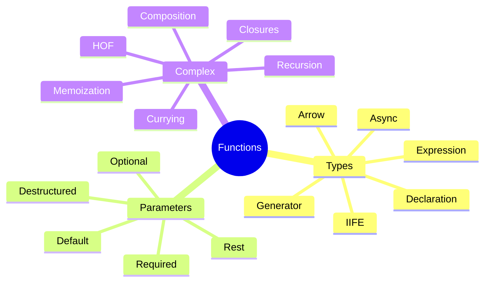

# 🔧 Use Case 2: Functions & Parameters - Complete Guide

> **💡 Lightbulb Moment**: Functions are first-class citizens in JavaScript - they can be stored in variables, passed as arguments, and returned from other functions!

---

## 1. 📋 Function Types in JavaScript

### 1.1 Function Declaration

```javascript
//Traditional function declaration
function greet(name) {
  return `Hello, ${name}!`;
}

console.log(greet('Alice')); // "Hello, Alice!"
```

**Characteristics:**
- Hoisted (can be called before declaration)
- Has `this` context
- Can be named or anonymous

---

### 1.2 Function Expression

```javascript
// Named function expression
const greet = function greetUser(name) {
  return `Hello, ${name}!`;
};

// Anonymous function expression
const sayHi = function(name) {
  return `Hi, ${name}!`;
};
```

**Characteristics:**
- NOT hoisted
- Can be anonymous
- Useful for conditional function definitions

---

### 1.3 Arrow Functions

```javascript
// Single parameter (no parentheses needed)
const double = x => x * 2;

// Multiple parameters
const add = (a, b) => a + b;

// Multi-line body (need explicit return)
const greetVerbose = name => {
  const greeting = `Hello, ${name}!`;
  return greeting;
};

// No parameters
const getRandom = () => Math.random();
```

**Characteristics:**
- Lexical `this` (inherits from parent scope)
- Cannot be used as constructors
- No `arguments` object
- Concise syntax

---

### 1.4 IIFE (Immediately Invoked Function Expression)

```javascript
(function() {
  console.log('I run immediately!');
})();

// With parameters
(function(name) {
  console.log(`Hello, ${name}!`);
})('Alice');

// Arrow IIFE
(() => {
  console.log('Arrow IIFE!');
})();
```

**Use Cases:**
- Create private scope
- Avoid polluting global namespace
- Module pattern

---

### 1.5 Generator Functions

```javascript
function* numberGenerator() {
  yield 1;
  yield 2;
  yield 3;
}

const gen = numberGenerator();
console.log(gen.next().value); // 1
console.log(gen.next().value); // 2

// Infinite generator
function* idGenerator() {
  let id = 1;
  while (true) {
    yield id++;
  }
}
```

**Characteristics:**
- Can pause and resume execution
- Returns iterator object
- Uses `yield` keyword

---

### 1.6 Async Functions

```javascript
async function fetchUser(id) {
  const response = await fetch(`/api/users/${id}`);
  return await response.json();
}

// Arrow async
const getData = async () => {
  return await somePromise;
};

// Error handling
async function fetchWithError() {
  try {
    const data = await fetchUser(1);
    return data;
  } catch (error) {
    console.error(error);
  }
}
```

---

### 1.7 Method Definitions

```javascript
const obj = {
  // ES6 method shorthand
  greet(name) {
    return `Hello, ${name}!`;
  },
  
  // Traditional
  sayHi: function(name) {
    return `Hi, ${name}!`;
  },
  
  // Arrow (caution: lexical this)
  sayBye: (name) => `Bye, ${name}!`
};
```

---

## 2. 🎯 Parameter Types

### 2.1 Required Parameters

```javascript
function add(a, b) {
  return a + b;
}

add(5, 3); // 8
add(5);    // NaN (b is undefined)
```

---

### 2.2 Optional Parameters

```javascript
function greet(name, greeting) {
  greeting = greeting || 'Hello';
  return `${greeting}, ${name}!`;
}

greet('Alice');           // "Hello, Alice!"
greet('Alice', 'Hi');     // "Hi, Alice!"
```

---

### 2.3 Default Parameters

```javascript
function greet(name, greeting = 'Hello') {
  return `${greeting}, ${name}!`;
}

greet('Alice');        // "Hello, Alice!"
greet('Alice', 'Hi');  // "Hi, Alice!"

// Complex defaults
function createUser(name, role = 'user', active = true) {
  return { name, role, active };
}
```

---

### 2.4 Rest Parameters

```javascript
function sum(...numbers) {
  return numbers.reduce((total, n) => total + n, 0);
}

sum(1, 2, 3, 4); // 10
sum(5);          // 5

// With other parameters
function multiply(multiplier, ...numbers) {
  return numbers.map(n => n * multiplier);
}

multiply(2, 1, 2, 3); // [2, 4, 6]
```

---

### 2.5 Destructured Parameters

```javascript
// Object destructuring
function createUser({ name, age, role = 'user' }) {
  return { name, age, role };
}

createUser({ name: 'Alice', age: 30 });

// Array destructuring
function getCoordinates([x, y, z = 0]) {
  return { x, y, z };
}

getCoordinates([10, 20]); // { x: 10, y: 20, z: 0 }

// Nested destructuring
function updateUser({ id, profile: { email, name } }) {
  return { id, email, name };
}
```

---

## 3. 🚀 Complex Implementations

### 3.1 Higher-Order Functions

```javascript
// Function that returns a function
function multiplier(factor) {
  return function(number) {
    return number * factor;
  };
}

const double = multiplier(2);
const triple = multiplier(3);

console.log(double(5)); // 10
console.log(triple(5)); // 15

// Function that takes function as argument
function applyOperation(arr, operation) {
  return arr.map(operation);
}

const numbers = [1, 2, 3];
applyOperation(numbers, x => x * 2); // [2, 4, 6]
```

---

### 3.2 Closures

```javascript
function createCounter() {
  let count = 0; // Private variable
  
  return {
    increment() {
      return ++count;
    },
    decrement() {
      return --count;
    },
    getCount() {
      return count;
    }
  };
}

const counter = createCounter();
counter.increment(); // 1
counter.increment(); // 2
counter.getCount();  // 2
```

---

### 3.3 Currying

```javascript
// Manual currying
function curry(a) {
  return function(b) {
    return function(c) {
      return a + b + c;
    };
  };
}

curry(1)(2)(3); // 6

// Generic curry helper
function curryN(fn) {
  return function curried(...args) {
    if (args.length >= fn.length) {
      return fn.apply(this, args);
    }
    return (...nextArgs) => curried(...args, ...nextArgs);
  };
}

function add(a, b, c) {
  return a + b + c;
}

const curriedAdd = curryN(add);
curriedAdd(1)(2)(3);     // 6
curriedAdd(1, 2)(3);     // 6
curriedAdd(1)(2, 3);     // 6
```

---

### 3.4 Function Composition

```javascript
const compose = (...fns) => x =>
  fns.reduceRight((acc, fn) => fn(acc), x);

const pipe = (...fns) => x =>
  fns.reduce((acc, fn) => fn(acc), x);

// Usage
const double = x => x * 2;
const addTen = x => x + 10;
const square = x => x * x;

const doubleThenAdd = compose(addTen, double);
doubleThenAdd(5); // 20 (5 * 2 + 10)

const addThenDouble = pipe(addTen, double);
addThenDouble(5); // 30 ((5 + 10) * 2)
```

---

### 3.5 Memoization

```javascript
function memoize(fn) {
  const cache = new Map();
  
  return function(...args) {
    const key = JSON.stringify(args);
    
    if (cache.has(key)) {
      console.log('From cache');
      return cache.get(key);
    }
    
    const result = fn.apply(this, args);
    cache.set(key, result);
    return result;
  };
}

// Expensive fibonacci
const fibonacci = memoize(function fib(n) {
  if (n <= 1) return n;
  return fib(n - 1) + fib(n - 2);
});

fibonacci(40); // Computed
fibonacci(40); // From cache (instant!)
```

---

### 3.6 Recursion Patterns

```javascript
// Basic recursion
function factorial(n) {
  if (n <= 1) return 1;
  return n * factorial(n - 1);
}

// Tail recursion (optimizable)
function factorialTail(n, acc = 1) {
  if (n <= 1) return acc;
  return factorialTail(n - 1, n * acc);
}

// Mutual recursion
function isEven(n) {
  if (n === 0) return true;
  return isOdd(n - 1);
}

function isOdd(n) {
  if (n === 0) return false;
  return isEven(n - 1);
}
```

---

## 4. 🌍 Real-World Use Cases

### Use Case 1: Middleware Pattern

```javascript
function createMiddleware() {
  const middlewares = [];
  
  return {
    use(fn) {
      middlewares.push(fn);
    },
    
    execute(context) {
      let index = 0;
      
      function next() {
        if (index < middlewares.length) {
          const middleware = middlewares[index++];
          middleware(context, next);
        }
      }
      
      next();
    }
  };
}

const app = createMiddleware();
app.use((ctx, next) => {
  console.log('Middleware 1');
  next();
});
app.use((ctx, next) => {
  console.log('Middleware 2');
  next();
});
```

---

### Use Case 2: Debounce & Throttle

```javascript
function debounce(fn, delay) {
  let timeoutId;
  
  return function(...args) {
    clearTimeout(timeoutId);
    timeoutId = setTimeout(() => fn.apply(this, args), delay);
  };
}

function throttle(fn, delay) {
  let lastCall = 0;
  
  return function(...args) {
    const now = Date.now();
    if (now - lastCall >= delay) {
      lastCall = now;
      fn.apply(this, args);
    }
  };
}

// Usage
const debouncedSearch = debounce((query) => {
  console.log('Searching for:', query);
}, 300);

const throttledScroll = throttle(() => {
  console.log('Scroll event');
}, 100);
```

---

## ❓ Interview Questions (25+)

### Basic Function Questions

**Q1: What's the difference between function declaration and expression?**
> A: Declarations are hoisted (can be called before definition); expressions are not hoisted and assigned to variables.

**Q2: What is an arrow function?**
> A: Concise syntax for functions with lexical `this` binding, cannot be used as constructors.

**Q3: When should you NOT use arrow functions?**
> A: When you need dynamic `this` (methods, event handlers), or need `arguments` object.

**Q4: What is hoisting?**
> A: Function declarations are moved to top of scope during compilation, allowing calls before definition.

**Q5: What's the difference between parameters and arguments?**
> A: Parameters are variables in function definition; arguments are actual values passed when calling.

---

### Advanced Function Questions

**Q6: What is a closure?**
> A: Function that remembers variables from its outer scope even after outer function has returned.

**Q7: What is a higher-order function?**
> A: Function that takes functions as arguments or returns a function.

**Q8: What is currying?**
> A: Transforming function with multiple arguments into sequence of functions each taking single argument.

**Q9: What is function composition?**
> A: Combining multiple functions where output of one is input of next: `compose(f, g)(x) = f(g(x))`.

**Q10: What is memoization?**
> A: Caching function results based on arguments to avoid recomputation.

---

### Parameter Questions

**Q11: What are rest parameters?**
> A: `...args` syntax that collects remaining arguments into an array.

**Q12: Difference between rest and spread?**
> A: Rest collects arguments INTO array; spread expands array INTO arguments.

**Q13: How do default parameters work?**
> A: `function fn(x = 5)` - parameter gets default value if undefined or not provided.

**Q14: Can default parameters reference other parameters?**
> A: Yes: `function fn(a, b = a * 2)` - but only previous parameters.

**Q15: What is destructured parameter?**
> A: Extracting values from objects/arrays directly in parameter: `function fn({ name, age })`.

---

### Generator & Async Questions

**Q16: What is a generator function?**
> A: Function that can pause/resume execution using `yield`, returns iterator.

**Q17: What does `yield` do?**
> A: Pauses generator execution and returns value, can resume later.

**Q18: What is async/await?**
> A: Syntactic sugar over Promises for writing asynchronous code synchronously.

**Q19: Can you use await outside async function?**
> A: No (except top-level await in modules in ES2022+).

**Q20: How to handle errors in async functions?**
> A: Use try/catch blocks or `.catch()` on returned Promise.

---

### Complex Pattern Questions

**Q21: What is IIFE?**
> A: Immediately Invoked Function Expression - `(function() {})()` - runs immediately.

**Q22: Why use IIFE?**
> A: Create private scope, avoid global namespace pollution, module pattern.

**Q23: What is  function binding?**
> A: Fixing `this` context using `.bind()`, arrow functions, or `call/apply`.

**Q24: What is tail call optimization?**
> A: Optimization where recursive call in tail position doesn't grow call stack.

**Q25: How to implement retry logic?**
> A: Recursive function with delay:
> ```javascript
> async function retry(fn, retries = 3) {
>   try {
>     return await fn();
>   } catch (err) {
>     if (retries > 0) return retry(fn, retries - 1);
>     throw err;
>   }
> }
> ```

---

## 🧠 Mind Map


