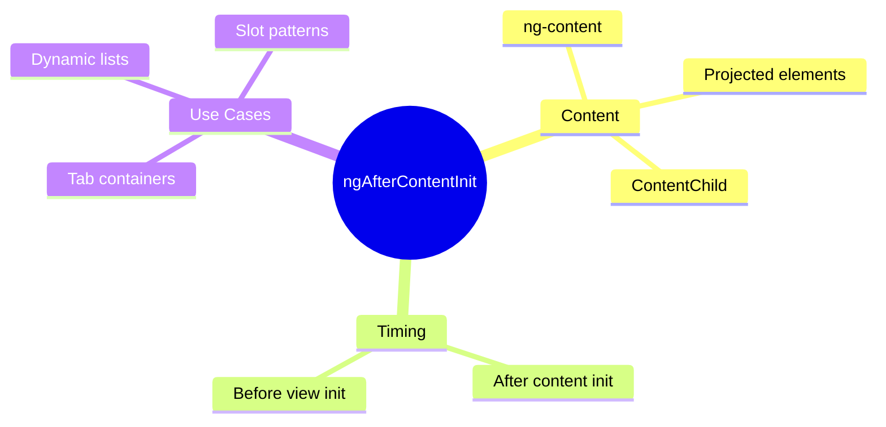

# 📦 ngAfterContentInit

> **💡 Lightbulb Moment**: `ngAfterContentInit` fires when PROJECTED CONTENT (ng-content) is initialized - use it for ContentChild queries!


## 📋 Table of Contents
- [1. 🔍 What is ngAfterContentInit?](#1--what-is-ngaftercontentinit)
- [2. 🚀 View vs Content](#2--view-vs-content)
  - [📦 Data Flow Summary (Visual Box Diagram)](#data-flow-summary-visual-box-diagram)
- [3. ❓ Interview Questions](#3--interview-questions)
  - [Basic Questions](#basic-questions)
    - [Q1: What's the difference between ViewChild and ContentChild?](#q1-whats-the-difference-between-viewchild-and-contentchild)
    - [Q2: When does ngAfterContentInit fire?](#q2-when-does-ngaftercontentinit-fire)
  - [Scenario-Based Questions](#scenario-based-questions)
    - [Scenario: Tab Container](#scenario-tab-container)
- [🧠 Mind Map](#mind-map)

---
---

## 1. 🔍 What is ngAfterContentInit?

Called ONCE after Angular projects content into the component.

```typescript
@Component({
    template: `
        <div class="tabs">
            <ng-content select="[tab]"></ng-content>
        </div>
    `
})
export class TabContainerComponent implements AfterContentInit {
    @ContentChildren(TabComponent) tabs!: QueryList<TabComponent>;
    
    ngAfterContentInit() {
        // Content is projected - ContentChild/Children ready!
        this.tabs.first?.activate();
    }
}
```

---

## 2. 🚀 View vs Content

| Type | What | Query | Hook |
|------|------|-------|------|
| View | Component's own template | @ViewChild | ngAfterViewInit |
| Content | Projected via ng-content | @ContentChild | ngAfterContentInit |

---

### 📦 Data Flow Summary (Visual Box Diagram)

```
┌─────────────────────────────────────────────────────────────┐
│  VIEW vs CONTENT                                            │
│                                                             │
│   PARENT COMPONENT:                                         │
│   ┌───────────────────────────────────────────────────────┐ │
│   │ <app-card>                                            │ │
│   │   <h1>Title</h1>     ← This is CONTENT (projected)    │ │
│   │   <p>Description</p> ← This is CONTENT (projected)    │ │
│   │ </app-card>                                           │ │
│   └───────────────────────────────────────────────────────┘ │
│                                                             │
│   CARD COMPONENT (app-card):                                │
│   ┌───────────────────────────────────────────────────────┐ │
│   │ template: `                                           │ │
│   │   <div class="card">                 ← VIEW           │ │
│   │     <ng-content></ng-content>        ← CONTENT slot   │ │
│   │     <footer>Built with ❤️</footer>   ← VIEW           │ │
│   │   </div>                                              │ │
│   │ `                                                     │ │
│   └───────────────────────────────────────────────────────┘ │
│                                                             │
│   LIFECYCLE ORDER:                                          │
│   ┌───────────────────────────────────────────────────────┐ │
│   │ ngAfterContentInit() → ContentChild ready (@Content)  │ │
│   │         ↓                                             │ │
│   │ ngAfterViewInit()    → ViewChild ready (@ViewChild)   │ │
│   └───────────────────────────────────────────────────────┘ │
└─────────────────────────────────────────────────────────────┘
```

> **Key Takeaway**: Content = projected from parent, View = component's own template. ngAfterContentInit runs BEFORE ngAfterViewInit!

---

## 3. ❓ Interview Questions

### Basic Questions

#### Q1: What's the difference between ViewChild and ContentChild?
**Answer:**
- **ViewChild**: Elements in component's OWN template
- **ContentChild**: Elements projected INTO component via ng-content

```typescript
// Parent
<app-card>
    <h1>Title</h1>  <!-- This is CONTENT (projected) -->
</app-card>

// Card component template
<div class="card">
    <ng-content></ng-content>          <!-- Content goes here -->
    <footer>Footer</footer>            <!-- This is VIEW -->
</div>
```

#### Q2: When does ngAfterContentInit fire?
**Answer:** After Angular initializes content children (projected via ng-content), before ngAfterViewInit.

---

### Scenario-Based Questions

#### Scenario: Tab Container
**Question:** Create a tab container that auto-selects the first tab.

**Answer:**
```typescript
@ContentChildren(TabItemComponent) tabs!: QueryList<TabItemComponent>;

ngAfterContentInit() {
    // Select first tab by default
    if (this.tabs.length > 0) {
        this.selectTab(this.tabs.first);
    }
}
```

---

## 🧠 Mind Map


