# 👁️ `ngAfterViewInit` & `ngAfterViewChecked` (View Lifecycle)

> **Goal**: Safely access DOM elements and third-party libraries that require the view to be rendered.

---

## 1. 🔍 How It Works (The Concept)

### The Mechanism
*   **`ngAfterViewInit`**: Called **once** after Angular fully initializes the view. This is when `@ViewChild` references become available.
*   **`ngAfterViewChecked`**: Called **every time** Angular checks the view for changes. Runs very frequently!

### Why These Hooks Matter
*   ✅ DOM elements exist and have dimensions
*   ✅ `@ViewChild` / `@ViewChildren` are populated
*   ✅ Third-party libraries (Chart.js, D3.js) can initialize

### 📊 View Lifecycle Diagram

```mermaid
graph TD
    A["ngOnInit"] --> B["View Rendered"]
    B --> C["ngAfterViewInit 👁️"]
    C --> D["View Running"]
    D --> E["ngAfterViewChecked 🔄"]
    E --> D

    style C fill:#c8e6c9,stroke:#2e7d32
    style E fill:#fff3e0,stroke:#ff6f00
```



---

## 2. 🚀 Step-by-Step Implementation Guide

### Step 1: Access Canvas in `ngAfterViewInit`

```typescript
import { Component, ViewChild, ElementRef, AfterViewInit } from '@angular/core';

@Component({
  template: `<canvas #chartCanvas></canvas>`
})
export class ChartComponent implements AfterViewInit {
  // 🛡️ CRITICAL: @ViewChild is undefined before ngAfterViewInit!
  @ViewChild('chartCanvas') canvasRef!: ElementRef<HTMLCanvasElement>;

  ngAfterViewInit(): void {
    console.log('👁️ Canvas is now available!');
    const ctx = this.canvasRef.nativeElement.getContext('2d');
    this.drawChart(ctx);
  }
}
```

### Step 2: Use `ngAfterViewChecked` for Updates (Carefully!)

```typescript
export class ChartComponent implements AfterViewInit, AfterViewChecked {
  private needsRedraw = false;
  
  ngOnChanges(changes: SimpleChanges) {
    if (changes['data']) {
      this.needsRedraw = true; // Flag for redraw
    }
  }

  ngAfterViewChecked(): void {
    // 🛡️ CRITICAL: Only run when needed!
    if (this.needsRedraw && this.canvasRef) {
      this.drawChart();
      this.needsRedraw = false; // Reset flag!
    }
  }
}
```

### 📊 Lifecycle Flow


---

## 3. 🐛 Common Pitfalls & Debugging

### ❌ Accessing @ViewChild in ngOnInit
**Bad Code:**
```typescript
ngOnInit() {
  console.log(this.canvasRef.nativeElement); // ❌ undefined!
}
```
**Fix:** Move to `ngAfterViewInit`.

### ❌ Infinite Loop in ngAfterViewChecked
**Bad Code:**
```typescript
ngAfterViewChecked() {
  this.counter++; // ❌ Modifies state -> triggers CD -> loops forever!
}
```
**Fix:** Use a flag pattern and reset after work.

---

## 4. ⚡ Performance & Architecture

### Performance: `ngAfterViewChecked` Warning ⚠️
*   Called on **every** change detection cycle
*   Avoid expensive operations
*   Use flags to prevent redundant work

### Best Practices
```typescript
ngAfterViewChecked() {
  // ✅ Check flag first
  if (!this.needsUpdate) return;
  
  // ✅ Do work
  this.updateChart();
  
  // ✅ Reset flag
  this.needsUpdate = false;
}
```

---

## 5. 🌍 Real World Use Cases

1.  **Chart Libraries**: Initialize Chart.js, D3.js, or Highcharts after canvas is ready.
2.  **Measuring Elements**: Get `getBoundingClientRect()` for positioning tooltips.
3.  **Third-Party Widgets**: Initialize Google Maps, video players, etc.

---

## 6. 📝 The Analogy: "The Art Gallery Opening" 🎨

*   **`ngAfterViewInit`**: The gallery is built. The paintings are on the walls. You can now walk through and see everything (one time grand opening).
*   **`ngAfterViewChecked`**: The security guard walks through every few minutes checking if anything changed (continuous patrol).

---

## 7. ❓ Interview & Concept Questions

### Q1: Why is `@ViewChild` undefined in `ngOnInit`?
**A:** The view hasn't been rendered yet. Angular resolves `@ViewChild` only after the view initializes.

### Q2: How often is `ngAfterViewChecked` called?
**A:** After **every** change detection cycle. It can be called many times per second!

### Q3: What causes `ExpressionChangedAfterItHasBeenCheckedError`?
**A:** Modifying a bound property in `ngAfterViewInit` or `ngAfterViewChecked` after Angular already checked it.

### Q4: How do I fix infinite loops in view hooks?
**A:** Use a boolean flag. Set it when data changes, reset it after you complete your work.

### Q5: Can I use async in `ngAfterViewInit`?
**A:** Yes, but wrap state changes in `setTimeout` or trigger `ChangeDetectorRef.detectChanges()` to avoid the "expression changed" error.
