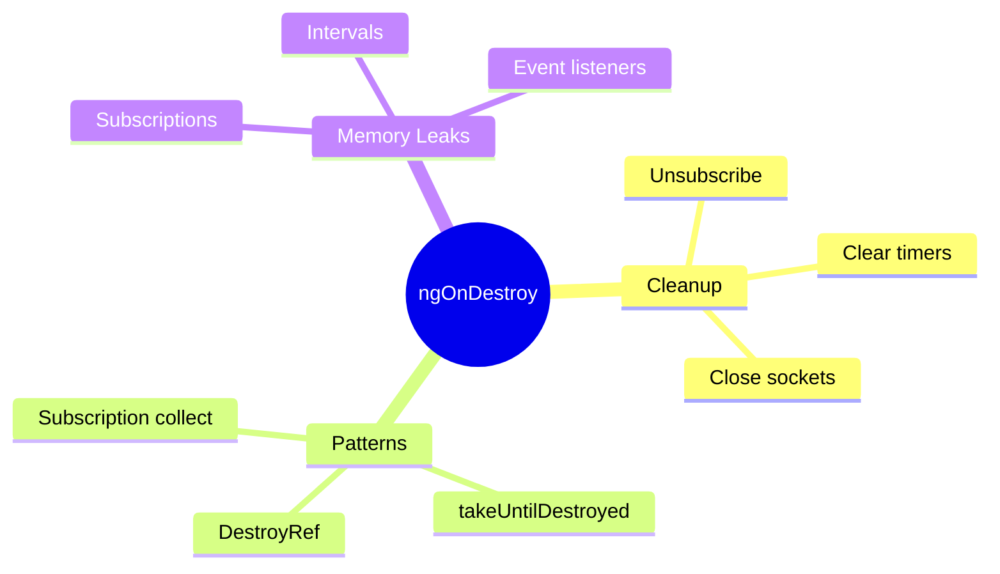

# 🗑️ ngOnDestroy

> **💡 Lightbulb Moment**: `ngOnDestroy` is your cleanup hook - unsubscribe, clear timers, disconnect sockets here!


## 📋 Table of Contents
- [1. 🔍 What is ngOnDestroy?](#1--what-is-ngondestroy)
- [2. 🚀 Common Cleanup Tasks](#2--common-cleanup-tasks)
  - [Unsubscribe from Observables](#unsubscribe-from-observables)
  - [Using takeUntilDestroyed (Angular 16+)](#using-takeuntildestroyed-angular-16)
  - [📦 Data Flow Summary (Visual Box Diagram)](#data-flow-summary-visual-box-diagram)
- [3. ❓ Interview Questions](#3--interview-questions)
  - [Basic Questions](#basic-questions)
    - [Q1: Why is ngOnDestroy important?](#q1-why-is-ngondestroy-important)
    - [Q2: What are common memory leak sources?](#q2-what-are-common-memory-leak-sources)
    - [Q3: Does async pipe need cleanup?](#q3-does-async-pipe-need-cleanup)
  - [Scenario-Based Questions](#scenario-based-questions)
    - [Scenario: WebSocket Cleanup](#scenario-websocket-cleanup)
- [🧠 Mind Map](#mind-map)

---
---

## 1. 🔍 What is ngOnDestroy?

Called just before Angular destroys the component. Used for cleanup.

```typescript
export class LiveDataComponent implements OnDestroy {
    private subscription: Subscription;
    private intervalId: any;
    
    ngOnInit() {
        this.subscription = this.dataService.stream$.subscribe(...);
        this.intervalId = setInterval(() => this.poll(), 5000);
    }
    
    ngOnDestroy() {
        this.subscription.unsubscribe();  // Prevent memory leak!
        clearInterval(this.intervalId);   // Stop timer!
    }
}
```

---

## 2. 🚀 Common Cleanup Tasks

### Unsubscribe from Observables
```typescript
private subscription = new Subscription();

ngOnInit() {
    this.subscription.add(this.data$.subscribe(...));
    this.subscription.add(this.events$.subscribe(...));
}

ngOnDestroy() {
    this.subscription.unsubscribe();  // Unsubscribes all
}
```

### Using takeUntilDestroyed (Angular 16+)
```typescript
private destroyRef = inject(DestroyRef);

ngOnInit() {
    this.data$.pipe(
        takeUntilDestroyed(this.destroyRef)
    ).subscribe(...);
}
// No manual cleanup needed!
```

---

### 📦 Data Flow Summary (Visual Box Diagram)

```
┌─────────────────────────────────────────────────────────────┐
│  ngOnDestroy: CLEANUP BEFORE DEATH                          │
│                                                             │
│   Component Lifecycle:                                      │
│   ┌───────────────────────────────────────────────────────┐ │
│   │ ngOnInit() → Start subscriptions, timers, sockets     │ │
│   │                                                       │ │
│   │   this.subscription = data$.subscribe(...);           │ │
│   │   this.intervalId = setInterval(..., 5000);           │ │
│   │   this.socket = new WebSocket(...);                   │ │
│   └───────────────────────────────────────────────────────┘ │
│                      │                                      │
│                      │ Component destroyed (ngIf=false,     │
│                      │ route change, etc.)                  │
│                      ▼                                      │
│   ┌───────────────────────────────────────────────────────┐ │
│   │ ngOnDestroy() → CLEANUP TIME! 🧹                      │ │
│   │                                                       │ │
│   │   this.subscription.unsubscribe();  // ✅ Stop stream │ │
│   │   clearInterval(this.intervalId);   // ✅ Stop timer  │ │
│   │   this.socket.close();              // ✅ Close socket│ │
│   └───────────────────────────────────────────────────────┘ │
│                                                             │
│   MODERN PATTERN (Angular 16+):                             │
│   ┌───────────────────────────────────────────────────────┐ │
│   │ private destroyRef = inject(DestroyRef);              │ │
│   │                                                       │ │
│   │ data$.pipe(                                           │ │
│   │   takeUntilDestroyed(this.destroyRef)  // Auto-clean! │ │
│   │ ).subscribe(...);                                     │ │
│   │                                                       │ │
│   │ // No manual cleanup needed! 🎉                       │ │
│   └───────────────────────────────────────────────────────┘ │
└─────────────────────────────────────────────────────────────┘
```

> **Key Takeaway**: Always cleanup in ngOnDestroy! Or use takeUntilDestroyed for automatic cleanup. Memory leaks are silent killers!

---

## 3. ❓ Interview Questions

### Basic Questions

#### Q1: Why is ngOnDestroy important?
**Answer:** Prevents memory leaks! Subscriptions, timers, event listeners continue running even after component is destroyed unless cleaned up.

#### Q2: What are common memory leak sources?
**Answer:**
- Observable subscriptions
- setInterval/setTimeout
- Event listeners
- WebSocket connections
- Third-party library instances

#### Q3: Does async pipe need cleanup?
**Answer:** No! Async pipe automatically unsubscribes when component is destroyed.

---

### Scenario-Based Questions

#### Scenario: WebSocket Cleanup
**Question:** Component connects to WebSocket. How to cleanup?

**Answer:**
```typescript
private socket: WebSocket;

ngOnInit() {
    this.socket = new WebSocket('ws://server');
    this.socket.onmessage = (e) => this.handleMessage(e);
}

ngOnDestroy() {
    if (this.socket) {
        this.socket.close();  // Close connection
        this.socket = null!;
    }
}
```

---

## 🧠 Mind Map


