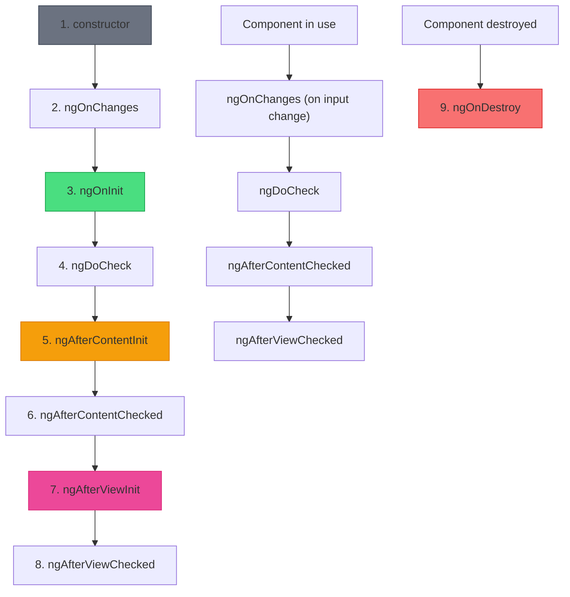

# 🎬 Complete Lifecycle Order Demo

> **Goal**: Understand the exact execution order of ALL Angular lifecycle hooks.

---

## 1. 🔍 The Complete Lifecycle Order



---

## 2. 📊 Lifecycle Summary Table

| # | Hook | Frequency | Purpose |
|---|------|-----------|---------|
| 1 | `constructor` | Once | Class instantiation, DI |
| 2 | `ngOnChanges` | On input change | React to @Input changes |
| 3 | `ngOnInit` | Once | Initialize component |
| 4 | `ngDoCheck` | Every CD | Custom change detection |
| 5 | `ngAfterContentInit` | Once | Content projection ready |
| 6 | `ngAfterContentChecked` | Every CD | Content checked |
| 7 | `ngAfterViewInit` | Once | View initialized |
| 8 | `ngAfterViewChecked` | Every CD | View checked |
| 9 | `ngOnDestroy` | Once | Cleanup |

---

## 3. 🚀 Implementation (All Hooks)

```typescript
@Component({ ... })
export class LifecycleDemoComponent implements
    OnChanges, OnInit, DoCheck,
    AfterContentInit, AfterContentChecked,
    AfterViewInit, AfterViewChecked, OnDestroy {

  @Input() message = '';
  @ViewChild('ref') viewRef!: ElementRef;
  @ContentChild('content') contentRef!: ElementRef;

  constructor() {
    console.log('1. constructor');
  }

  ngOnChanges(changes: SimpleChanges) {
    console.log('2. ngOnChanges', changes);
  }

  ngOnInit() {
    console.log('3. ngOnInit');
  }

  ngDoCheck() {
    console.log('4. ngDoCheck');
  }

  ngAfterContentInit() {
    console.log('5. ngAfterContentInit');
    // @ContentChild available here
  }

  ngAfterContentChecked() {
    console.log('6. ngAfterContentChecked');
  }

  ngAfterViewInit() {
    console.log('7. ngAfterViewInit');
    // @ViewChild available here
  }

  ngAfterViewChecked() {
    console.log('8. ngAfterViewChecked');
  }

  ngOnDestroy() {
    console.log('9. ngOnDestroy');
  }
}
```

---

## 4. 🔑 Key Rules to Remember

### Initialization Hooks (Run Once)
- `ngOnInit` → General initialization
- `ngAfterContentInit` → Content ready
- `ngAfterViewInit` → View ready

### Check Hooks (Run Frequently)
- `ngDoCheck` → Every CD cycle
- `ngAfterContentChecked` → Every CD cycle
- `ngAfterViewChecked` → Every CD cycle

### Cleanup Hook
- `ngOnDestroy` → Final cleanup opportunity

---

## 5. ❓ Interview & Concept Questions

### Q1: What runs first: `ngOnChanges` or `ngOnInit`?
**A:** `ngOnChanges` runs first (with initial input values), then `ngOnInit`.

### Q2: When is `@ViewChild` available?
**A:** From `ngAfterViewInit` onwards.

### Q3: When is `@ContentChild` available?
**A:** From `ngAfterContentInit` onwards.

### Q4: Which hooks run on *every* change detection cycle?
**A:** `ngDoCheck`, `ngAfterContentChecked`, `ngAfterViewChecked`.

### Q5: What's the order: Content or View first?
**A:** **Content first.** `ngAfterContentInit` runs before `ngAfterViewInit`.

---

## 6. 📝 Quick Reference Card

```
CREATION:
  constructor → ngOnChanges → ngOnInit → ngDoCheck →
  ngAfterContentInit → ngAfterContentChecked →
  ngAfterViewInit → ngAfterViewChecked

UPDATES (repeated):
  ngOnChanges → ngDoCheck →
  ngAfterContentChecked → ngAfterViewChecked

DESTRUCTION:
  ngOnDestroy
```


