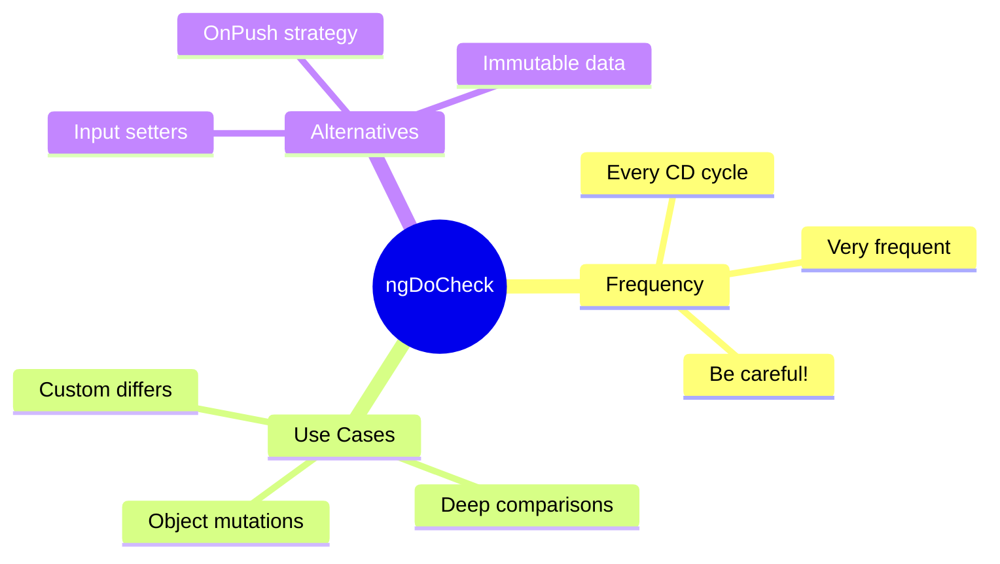

# 🔎 ngDoCheck

> **💡 Lightbulb Moment**: `ngDoCheck` runs during EVERY change detection cycle - use it for custom change detection logic!


## 📋 Table of Contents
- [1. 🔍 What is ngDoCheck?](#1--what-is-ngdocheck)
- [2. 🚀 Use Cases](#2--use-cases)
  - [Detect Object Mutations](#detect-object-mutations)
  - [Custom Differ](#custom-differ)
  - [📦 Data Flow Summary (Visual Box Diagram)](#data-flow-summary-visual-box-diagram)
- [3. ❓ Interview Questions](#3--interview-questions)
  - [Basic Questions](#basic-questions)
    - [Q1: When does ngDoCheck run?](#q1-when-does-ngdocheck-run)
    - [Q2: Why is ngDoCheck "expensive"?](#q2-why-is-ngdocheck-expensive)
  - [Scenario-Based Questions](#scenario-based-questions)
    - [Scenario: Array Mutation Detection](#scenario-array-mutation-detection)
- [⚠️ Warning](#warning)
- [🧠 Mind Map](#mind-map)

---
---

## 1. 🔍 What is ngDoCheck?

Called during every change detection run, after ngOnChanges and ngOnInit.

```typescript
export class ObjectDiffComponent implements DoCheck {
    @Input() data: any;
    private previousData: string = '';
    
    ngDoCheck() {
        const currentData = JSON.stringify(this.data);
        if (currentData !== this.previousData) {
            console.log('Deep change detected!');
            this.previousData = currentData;
            this.onDataChanged();
        }
    }
}
```

---

## 2. 🚀 Use Cases

### Detect Object Mutations
```typescript
@Input() user: User;
private previousName = '';

ngDoCheck() {
    if (this.user?.name !== this.previousName) {
        this.previousName = this.user?.name;
        this.handleNameChange();
    }
}
```

### Custom Differ
```typescript
private iterableDiffer: IterableDiffer<Item>;

constructor(private differs: IterableDiffers) {
    this.iterableDiffer = differs.find([]).create();
}

ngDoCheck() {
    const changes = this.iterableDiffer.diff(this.items);
    if (changes) {
        changes.forEachAddedItem(r => console.log('Added:', r.item));
        changes.forEachRemovedItem(r => console.log('Removed:', r.item));
    }
}
```

---

### 📦 Data Flow Summary (Visual Box Diagram)

```
┌─────────────────────────────────────────────────────────────┐
│  ngDoCheck: CUSTOM CHANGE DETECTION                         │
│                                                             │
│   ⚠️ WARNING: Runs on EVERY change detection cycle!         │
│                                                             │
│   USER TYPES    BUTTON CLICKED    TIMER FIRES               │
│       │              │                 │                    │
│       └──────────────┼─────────────────┘                    │
│                      ▼                                      │
│   ┌───────────────────────────────────────────────────────┐ │
│   │  CHANGE DETECTION CYCLE                               │ │
│   │                                                       │ │
│   │  ngOnChanges() → if @Input changed                    │ │
│   │       ↓                                               │ │
│   │  ngDoCheck()   → ALWAYS runs (every cycle!)           │ │
│   │       ↓                                               │ │
│   │  ... (rest of hooks)                                  │ │
│   └───────────────────────────────────────────────────────┘ │
│                                                             │
│   USE CASE: Detect object MUTATIONS:                        │
│   ┌───────────────────────────────────────────────────────┐ │
│   │ // ngOnChanges won't catch this:                      │ │
│   │ this.user.name = 'Jane';   // Object mutated          │ │
│   │                                                       │ │
│   │ // ngDoCheck CAN catch it:                            │ │
│   │ ngDoCheck() {                                         │ │
│   │   if (this.user.name !== this.previousName) {         │ │
│   │     this.handleChange();  // Manual detection!        │ │
│   │   }                                                   │ │
│   │ }                                                     │ │
│   └───────────────────────────────────────────────────────┘ │
│                                                             │
│   ⚡ PERFORMANCE: Keep ngDoCheck VERY lightweight!          │
└─────────────────────────────────────────────────────────────┘
```

> **Key Takeaway**: ngDoCheck = custom change detection for mutations. But it runs constantly - keep logic minimal!

---

## 3. ❓ Interview Questions

### Basic Questions

#### Q1: When does ngDoCheck run?
**Answer:** On EVERY change detection cycle - can be hundreds of times! Use sparingly.

#### Q2: Why is ngDoCheck "expensive"?
**Answer:** It runs frequently. Any heavy computation here will slow your app significantly.

---

### Scenario-Based Questions

#### Scenario: Array Mutation Detection
**Question:** Detect when items are added/removed from an array (mutations, not reference change).

**Answer:**
```typescript
private arrayDiffer: IterableDiffer<Item>;

constructor(differs: IterableDiffers) {
    this.arrayDiffer = differs.find([]).create();
}

ngDoCheck() {
    const changes = this.arrayDiffer.diff(this.items);
    if (changes) {
        this.handleArrayChanges(changes);
    }
}
```

---

## ⚠️ Warning

**ngDoCheck runs VERY frequently!** Keep it lightweight.

---

## 🧠 Mind Map


