# 🔍 `ngDoCheck` (Custom Change Detection)

> **Goal**: Implement custom change detection to catch object mutations that Angular's default CD misses.

---

## 1. 🔍 How It Works (The Concept)

### The Problem
Angular's default change detection checks **object references**, not deep values.
*   ✅ Detected: `user = { ...user, name: 'New' }` (new reference)
*   ❌ NOT Detected: `user.name = 'New'` (same reference)

### The Solution: `ngDoCheck`
Implement your own comparison logic to detect mutations.

### 📊 Detection Comparison

```mermaid
graph TD
    subgraph "ngOnChanges"
        A["user = newObject"] --> B["✅ Detected"]
        C["user.name = 'x'"] --> D["❌ NOT Detected"]
    end

    subgraph "ngDoCheck"
        E["user = newObject"] --> F["✅ Detected"]
        G["user.name = 'x'"] --> H["✅ Detected via custom logic"]
    end

    style B fill:#c8e6c9,stroke:#2e7d32
    style D fill:#ffcdd2,stroke:#c62828
    style F fill:#c8e6c9,stroke:#2e7d32
    style H fill:#c8e6c9,stroke:#2e7d32
```



---

## 2. 🚀 Step-by-Step Implementation Guide

### Step 1: Store Previous Value for Comparison

```typescript
@Component({ ... })
export class ObjectDiffComponent implements DoCheck {
  @Input() data: any;
  
  // 🛡️ CRITICAL: Store previous state
  private previousDataJson = '';
```

### Step 2: Implement `ngDoCheck` with Comparison

```typescript
ngDoCheck(): void {
  // Stringify for deep comparison
  const currentJson = JSON.stringify(this.data);
  
  if (currentJson !== this.previousDataJson) {
    // 🔔 Change detected!
    console.log('Object mutated!');
    this.handleChange();
    
    // Update previous value
    this.previousDataJson = currentJson;
  }
}
```

### 📊 Execution Flow


---

## 3. 🐛 Common Pitfalls & Debugging

### ❌ Expensive Comparison Logic
**Bad Code:**
```typescript
ngDoCheck() {
  // ❌ Deep clone and compare on every CD cycle!
  const clone = JSON.parse(JSON.stringify(this.data));
}
```
**Fix:** Use efficient comparison (stringify, or use `KeyValueDiffers`).

### ❌ Infinite Loop
**Bad Code:**
```typescript
ngDoCheck() {
  this.counter++; // ❌ Modifies state, triggers more CD cycles!
}
```
**Fix:** Only modify state when there's an actual change.

---

## 4. ⚡ Performance & Architecture

### Performance Warning ⚠️
*   `ngDoCheck` runs on **every** change detection cycle
*   Keep logic O(1) or O(n) with small n
*   Consider `KeyValueDiffers` / `IterableDiffers` for Maps/Arrays

### Better Alternative: Immutable Data
```typescript
// Instead of mutating:
this.user.name = 'John'; // ❌

// Create new reference:
this.user = { ...this.user, name: 'John' }; // ✅
```

---

## 5. 🌍 Real World Use Cases

1.  **Form Dirty Detection**: Track if any field in a complex object changed.
2.  **Undo/Redo**: Maintain history of object states.
3.  **Third-Party Integration**: Sync with non-Angular libraries that mutate objects.

---

## 6. 📝 The Analogy: "The Security Guard" 👮

*   **Default CD (ngOnChanges)**: A guard who only checks if someone's ID badge changed.
*   **ngDoCheck**: A detective who compares your entire appearance - haircut, clothes, shoes - to spot any change, even if you're the same person.

---

## 7. ❓ Interview & Concept Questions

### Q1: When should I use `ngDoCheck` vs `ngOnChanges`?
**A:** Use `ngOnChanges` for reference changes. Use `ngDoCheck` when you need to detect object mutations or implement custom comparison.

### Q2: How often is `ngDoCheck` called?
**A:** Every single change detection cycle - potentially hundreds of times!

### Q3: What are `KeyValueDiffers` and `IterableDiffers`?
**A:** Angular services for efficient diffing of objects and arrays. Inject them and use `.diff()` for optimized comparison.

### Q4: Can I prevent `ngDoCheck` from triggering?
**A:** No, but you can make it return early if no comparison is needed. Use flags or timestamps.

### Q5: Does `OnPush` affect `ngDoCheck`?
**A:** `ngDoCheck` still runs with `OnPush`, but the view won't update unless you trigger it manually or an input reference changes.
