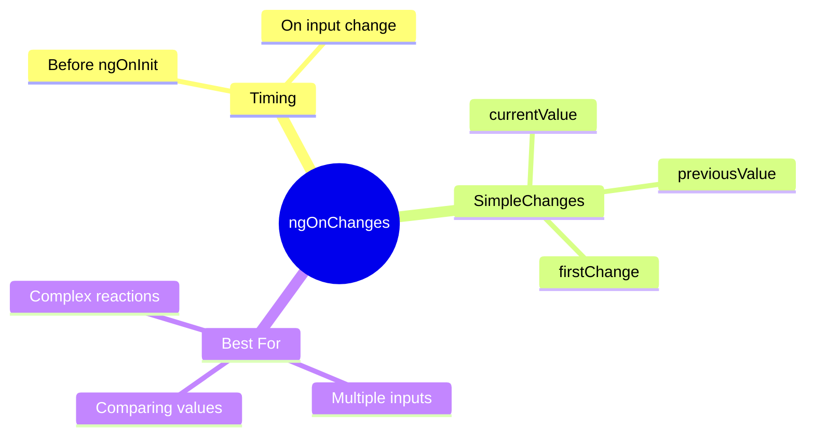

# 🔄 ngOnChanges

> **💡 Lightbulb Moment**: `ngOnChanges` fires BEFORE ngOnInit and then whenever ANY @Input() changes!


## 📋 Table of Contents
- [1. 🔍 What is ngOnChanges?](#1--what-is-ngonchanges)
- [2. 🚀 SimpleChanges Structure](#2--simplechanges-structure)
  - [📦 Data Flow Summary (Visual Box Diagram)](#data-flow-summary-visual-box-diagram)
- [3. ❓ Interview Questions](#3--interview-questions)
  - [Basic Questions](#basic-questions)
    - [Q1: ngOnChanges vs Input setter - when to use which?](#q1-ngonchanges-vs-input-setter---when-to-use-which)
    - [Q2: Does ngOnChanges fire for object mutations?](#q2-does-ngonchanges-fire-for-object-mutations)
  - [Scenario-Based Questions](#scenario-based-questions)
    - [Scenario: Reload on ID Change](#scenario-reload-on-id-change)
- [🎁 Gift Notification Analogy (Easy to Remember!)](#gift-notification-analogy-easy-to-remember)
  - [📖 Story to Remember:](#story-to-remember)
  - [🎯 Quick Reference:](#quick-reference)
- [🧠 Mind Map](#mind-map)
- [❓ Additional Interview Questions (20+)](#additional-interview-questions-20)
  - [Basic Questions](#basic-questions)
  - [Reference vs Mutation Questions](#reference-vs-mutation-questions)
  - [Timing Questions](#timing-questions)
  - [firstChange Questions](#firstchange-questions)
  - [Comparison Questions](#comparison-questions)
  - [Scenario Questions](#scenario-questions)
  - [Best Practice Questions](#best-practice-questions)

---
---

## 1. 🔍 What is ngOnChanges?

Lifecycle hook that responds to input property changes.

```typescript
export class UserCardComponent implements OnChanges {
    @Input() userId!: string;
    @Input() highlight: boolean = false;
    
    ngOnChanges(changes: SimpleChanges) {
        if (changes['userId']) {
            this.loadUserData();
        }
        if (changes['highlight']?.currentValue) {
            this.animateHighlight();
        }
    }
}
```

---

## 2. 🚀 SimpleChanges Structure

```typescript
{
    userId: {
        previousValue: '123',
        currentValue: '456',
        firstChange: false,
        isFirstChange: () => false
    },
    highlight: {
        previousValue: undefined,
        currentValue: true,
        firstChange: true,
        isFirstChange: () => true
    }
}
```

---

### 📦 Data Flow Summary (Visual Box Diagram)

```
┌─────────────────────────────────────────────────────────────┐
│  ngOnChanges: INPUT CHANGE DETECTION                        │
│                                                             │
│   Parent Component:                                         │
│   ┌───────────────────────────────────────────────────────┐ │
│   │ <app-user [userId]="currentId" [highlight]="isOn">    │ │
│   │                │                      │               │ │
│   │    "123" → "456"            false → true              │ │
│   └────────────────│──────────────────────│───────────────┘ │
│                    │                      │                 │
│                    └──────────┬───────────┘                 │
│                               ▼                             │
│   ngOnChanges(changes: SimpleChanges)                       │
│   ┌───────────────────────────────────────────────────────┐ │
│   │  changes['userId'] = {                                │ │
│   │    previousValue: '123',                              │ │
│   │    currentValue: '456',                               │ │
│   │    firstChange: false                                 │ │
│   │  }                                                    │ │
│   └───────────────────────────────────────────────────────┘ │
│                                                             │
│   ⚠️ IMPORTANT:                                             │
│   ┌───────────────────────────────────────────────────────┐ │
│   │ user.name = 'Jane';           → NO trigger (mutation) │ │
│   │ user = { ...user, name:'Jane'}; → YES trigger (newref)│ │
│   └───────────────────────────────────────────────────────┘ │
└─────────────────────────────────────────────────────────────┘
```

> **Key Takeaway**: ngOnChanges only fires for REFERENCE changes, not object mutations. Use immutable patterns!

---

## 3. ❓ Interview Questions

### Basic Questions

#### Q1: ngOnChanges vs Input setter - when to use which?
**Answer:**
| ngOnChanges | Input Setter |
|-------------|--------------|
| Multiple inputs | Single input |
| Need previous value | Just need new value |
| Compare changes | Simple transformation |

#### Q2: Does ngOnChanges fire for object mutations?
**Answer:** NO! Only for reference changes:
```typescript
// NO trigger
this.user.name = 'Jane';

// YES trigger
this.user = { ...this.user, name: 'Jane' };
```

---

### Scenario-Based Questions

#### Scenario: Reload on ID Change
**Question:** Component has productId input. On change, fetch new product.

**Answer:**
```typescript
ngOnChanges(changes: SimpleChanges) {
    const productIdChange = changes['productId'];
    if (productIdChange && !productIdChange.firstChange) {
        // Don't reload on initial value - ngOnInit handles that
        this.fetchProduct(productIdChange.currentValue);
    }
}
```

---

## 🎁 Gift Notification Analogy (Easy to Remember!)

Think of ngOnChanges like **getting notified about gift arrivals**:

| Concept | Gift Analogy | Memory Trick |
|---------|-------------|--------------| 
| **ngOnChanges** | 📬 **Gift notification**: "You received something!" | **"Input changed"** |
| **SimpleChanges** | 🧾 **Delivery receipt**: Shows old vs new, first delivery? | **"Change details"** |
| **previousValue** | 📦 **Old gift**: "This is what you HAD before" | **"Before value"** |
| **currentValue** | 🎁 **New gift**: "This is what you HAVE now" | **"After value"** |
| **firstChange** | 🆕 **First delivery ever?**: "Never received before!" | **"Initial value"** |

### 📖 Story to Remember:

> 🎁 **The Gift Tracker**
>
> You're receiving gifts (inputs) and want to track changes:
>
> **The Notification:**
> ```typescript
> ngOnChanges(changes: SimpleChanges) {
>   // Notification arrives: "Gift delivery update!"
>   
>   if (changes['productId']) {
>     const receipt = changes['productId'];
>     console.log('Previous gift:', receipt.previousValue);  // 📦 "Old book"
>     console.log('New gift:', receipt.currentValue);        // 🎁 "New toy"
>     console.log('First ever?:', receipt.firstChange);      // 🆕 true/false
>   }
> }
> ```
>
> **Important:**
> ```
> - First notification: arrives BEFORE ngOnInit
> - Later notifications: every time input changes
> - Object mutation: NO notification (same box, different contents)
> - New object: YES notification (new box!)
> ```
>
> **You only get notified when a NEW package arrives, not when contents change!**

### 🎯 Quick Reference:
```
📬 ngOnChanges     = Gift notification (input changed)
🧾 SimpleChanges   = Delivery receipt (change details)
📦 previousValue   = Old gift value
🎁 currentValue    = New gift value
🆕 firstChange     = First delivery ever?
```

---

## 🧠 Mind Map



---

## ❓ Additional Interview Questions (20+)

### Basic Questions

**Q3: When does ngOnChanges fire?**
> A: Before ngOnInit on first change, then whenever any @Input changes.

**Q4: Does ngOnChanges fire for all inputs or just changed ones?**
> A: SimpleChanges only contains entries for inputs that actually changed.

**Q5: What's the structure of SimpleChange object?**
> A: `{ previousValue, currentValue, firstChange, isFirstChange() }`.

---

### Reference vs Mutation Questions

**Q6: Why doesn't ngOnChanges fire for object property mutations?**
> A: Angular uses reference equality check - same reference = no change detected.

**Q7: How do you trigger ngOnChanges for nested object changes?**
> A: Create new object reference: `this.user = { ...this.user, name: 'New' }`.

**Q8: Does ngOnChanges fire for array push/pop?**
> A: No - use `this.arr = [...this.arr, newItem]` for new reference.

---

### Timing Questions

**Q9: Does ngOnChanges run before or after ngOnInit?**
> A: Before - first change detected before initialization.

**Q10: How many times does ngOnChanges fire on component creation?**
> A: Once for initial input values (if any inputs provided).

**Q11: Can ngOnChanges fire multiple times in one change detection?**
> A: No - batched into one call with all changes.

---

### firstChange Questions

**Q12: What is `firstChange` used for?**
> A: Distinguishes initial value from subsequent updates - useful to skip initial load.

**Q13: When is firstChange true?**
> A: When it's the very first value for that input (before ngOnInit).

---

### Comparison Questions

**Q14: ngOnChanges vs Input setter?**
> A: ngOnChanges for multiple inputs or comparing old/new; setter for single input transformation.

**Q15: When to use ngOnChanges vs ngDoCheck?**
> A: ngOnChanges for input changes; ngDoCheck for custom change detection (expensive).

---

### Scenario Questions

**Q16: React to productId change and fetch data.**
> A: Check `changes['productId']` and `!firstChange`, then fetch.

**Q17: Compare old and new values to decide action.**
> A: Use `previousValue` and `currentValue` from SimpleChange:
> ```typescript
> if (changes['status'].previousValue === 'pending' && 
  changes['status'].currentValue === 'done') { notify(); }
> ```

**Q18: Handle multiple input changes with dependencies.**
> A: Check all needed inputs in ngOnChanges, combine logic.

---

### Best Practice Questions

**Q19: Should you check firstChange in ngOnChanges?**
> A: Yes, often - avoid duplicate initial fetch (ngOnInit handles that).

**Q20: How to avoid ngOnChanges performance issues?**
> A: Use immutable data patterns, check `firstChange`, only react to specific inputs.

