# 🚀 `ngOnInit` & `ngOnDestroy` (Initialization & Cleanup)

> **Goal**: Master the most essential lifecycle hooks - initialize resources safely and prevent memory leaks.

---

## 1. 🔍 How It Works (The Concept)

### The Mechanism
*   **`ngOnInit`**: Called **once** after Angular sets up the component's inputs. This is the "safe zone" to start timers, subscriptions, and fetch data.
*   **`ngOnDestroy`**: Called **once** just before Angular destroys the component. This is your **last chance** to clean up and prevent memory leaks.

### Default vs. Optimized Behavior
*   **Default (No Cleanup)**: Timer starts in `ngOnInit`, component is destroyed, timer keeps running → **Memory Leak!**
*   **Optimized (Proper Cleanup)**: Timer starts in `ngOnInit`, timer is cleared in `ngOnDestroy` → **No Leak!**

### 📊 Lifecycle Flow Diagram

```mermaid
graph TD
    A[Component Created] --> B[constructor]
    B --> C[ngOnChanges]
    C --> D["ngOnInit 🚀"]
    D --> E[Component Running]
    E --> F["ngOnDestroy 💀"]
    F --> G[Component Removed]

    style D fill:#c8e6c9,stroke:#2e7d32
    style F fill:#ffcdd2,stroke:#c62828
```



---

## 2. 🚀 Step-by-Step Implementation Guide

### Step 1: Import and Implement the Interfaces

```typescript
import { Component, OnInit, OnDestroy } from '@angular/core';

@Component({ ... })
export class TimerComponent implements OnInit, OnDestroy {
  // 🛡️ CRITICAL: Store reference for cleanup
  private timerId: ReturnType<typeof setInterval> | null = null;
  seconds = 0;
```

### Step 2: Initialize in `ngOnInit`

```typescript
ngOnInit(): void {
  console.log('🚀 Component initialized - starting timer');
  
  // Start the timer
  this.timerId = setInterval(() => {
    this.seconds++;
  }, 1000);
}
```

### Step 3: Cleanup in `ngOnDestroy`

```typescript
ngOnDestroy(): void {
  console.log('💀 Component destroying - cleaning up');
  
  // 🛡️ CRITICAL: Clear the timer!
  if (this.timerId !== null) {
    clearInterval(this.timerId);
    this.timerId = null;
    console.log('🧹 Timer cleared - no memory leak!');
  }
}
```

### 📊 Cleanup Flow

```mermaid
sequenceDiagram
    participant Parent
    participant Angular
    participant Timer as TimerComponent

    Parent->>Angular: showTimer = true
    Angular->>Timer: Create component
    Timer->>Timer: ngOnInit() - Start timer ⏱️
    
    Note over Timer: Timer running...
    
    Parent->>Angular: showTimer = false
    Angular->>Timer: Destroy component
    Timer->>Timer: ngOnDestroy() - Clear timer 🧹
    Angular->>Angular: Remove from DOM
```



---

## 3. 🐛 Common Pitfalls & Debugging

### ❌ Forgetting to Clean Up
**Bad Code:**
```typescript
ngOnInit() {
  setInterval(() => this.seconds++, 1000); // ❌ NO REFERENCE SAVED!
}

// No ngOnDestroy at all
```
**Why it fails:** The timer keeps running forever, even after the component is gone. This causes memory leaks.

### ❌ Initializing in Constructor
**Bad Code:**
```typescript
constructor() {
  this.fetchData(); // ❌ @Input values not set yet!
}
```
**Fix:** Move to `ngOnInit` where inputs are available.

---

## 4. ⚡ Performance & Architecture

### Performance
*   Starting subscriptions/timers in `ngOnInit` is **O(1)** overhead.
*   Failing to cleanup causes memory to grow without bound over time.

### Architecture: The "Cleanup Checklist"
Always clean up:
- ✅ `setInterval` / `setTimeout` → `clearInterval` / `clearTimeout`
- ✅ RxJS Subscriptions → `.unsubscribe()` or use `takeUntil`
- ✅ Event Listeners → `removeEventListener`
- ✅ WebSocket connections → `.close()`

---

## 5. 🌍 Real World Use Cases

1.  **Polling Service**: Fetching data every 30 seconds. Must stop polling when user leaves the page.
2.  **WebSocket Chat**: Open connection in `ngOnInit`, close in `ngOnDestroy`.
3.  **Animation Frame**: Start `requestAnimationFrame` loop, cancel in `ngOnDestroy`.

---

## 6. 📝 The Analogy: "The Hotel Guest" 🏨

*   **`ngOnInit`**: Guest checks in. Opens the faucet (starts timer), turns on the TV (subscribes).
*   **Component Running**: Guest is in the room using resources.
*   **`ngOnDestroy`**: Guest checks out. **Must turn off faucet and TV!** Otherwise, water and electricity keep running even after they leave (memory leak).

---

## 7. ❓ Interview & Concept Questions

### Q1: Why use `ngOnInit` instead of `constructor`?
**A:** The constructor is for basic initialization. `@Input` values are **not set** in the constructor. `ngOnInit` is called after inputs are resolved, making it safe for initialization logic.

### Q2: What happens if you don't clean up in `ngOnDestroy`?
**A:** Memory leaks. Timers keep running, subscriptions keep emitting, and memory consumption grows until the app crashes.

### Q3: How do you clean up RxJS subscriptions?
**A:** Either call `.unsubscribe()` manually, or use the `takeUntil` pattern with a Subject that emits in `ngOnDestroy`.

### Q4: Can `ngOnDestroy` be async?
**A:** It can be `async`, but Angular won't wait for it. Any async cleanup might not complete before the component is gone.

### Q5: How many times is `ngOnInit` called?
**A:** Exactly **once** per component instance. If you destroy and recreate a component, a *new* instance gets a new `ngOnInit` call.
