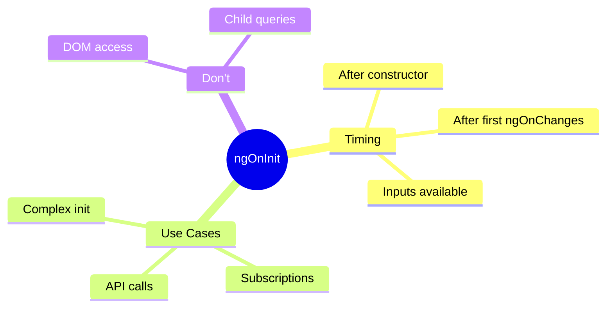

# 🔄 Use Case 1: ngOnInit

> **💡 Lightbulb Moment**: `ngOnInit` is where you initialize component data - it's the "ready" signal after inputs are set!

---

## 1. 🔍 What is ngOnInit?

The initialization hook that runs ONCE after Angular sets up inputs.

```typescript
export class MyComponent implements OnInit {
    @Input() userId!: string;
    user: User | null = null;
    
    ngOnInit() {
        // Inputs are available here!
        this.loadUser(this.userId);
    }
}
```

---

## 2. 🚀 Constructor vs ngOnInit

| Aspect | Constructor | ngOnInit |
|--------|-------------|----------|
| Purpose | Dependency injection | Initialization logic |
| Inputs | Not available | Available |
| DOM | Not ready | Still not ready |
| Called | By JavaScript | By Angular |

```typescript
constructor(private http: HttpClient) {
    // Only DI here - no logic!
}

ngOnInit() {
    // Initialize here
    this.http.get('/api/data').subscribe(...);
}
```

---

## 3. ❓ Interview Questions

### Basic Questions

#### Q1: Why not put initialization in constructor?
**Answer:** 
1. @Input() values aren't available yet
2. Makes testing harder
3. Separation of concerns - constructor is for DI

#### Q2: How many times does ngOnInit run?
**Answer:** Once per component instance. If Angular destroys and recreates, ngOnInit runs for the new instance.

#### Q3: What hooks run before ngOnInit?
**Answer:** ngOnChanges (with initial input values)

---

### Scenario-Based Questions

#### Scenario: Inputs in Constructor
**Question:** Developer uses @Input() in constructor. What happens?

**Answer:**
```typescript
@Input() name: string = '';

constructor() {
    console.log(this.name);  // '' (default, not parent's value!)
}

ngOnInit() {
    console.log(this.name);  // 'John' (actual value from parent)
}
```

---

## 🧠 Mind Map


