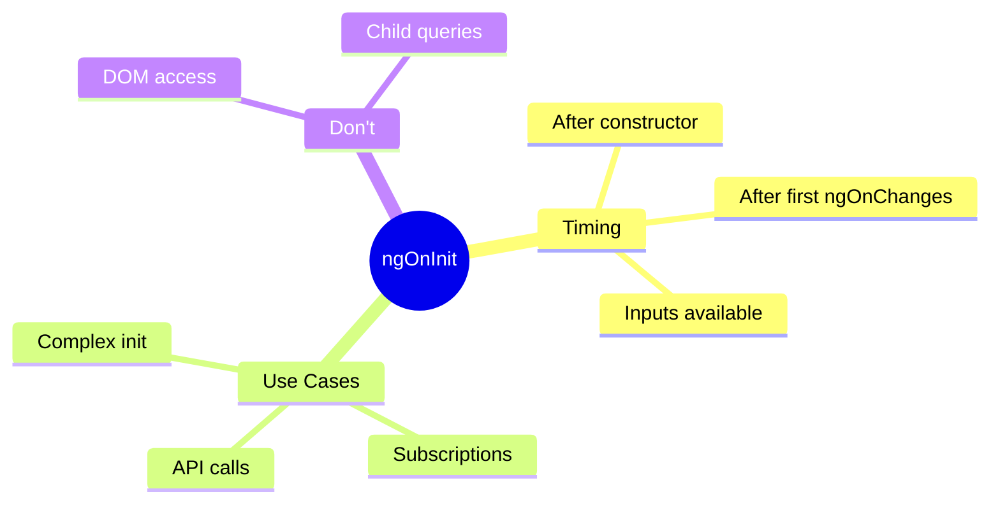

# 🔄 Use Case 1: ngOnInit

> **💡 Lightbulb Moment**: `ngOnInit` is where you initialize component data - it's the "ready" signal after inputs are set!

---

## 1. 🔍 What is ngOnInit?

The initialization hook that runs ONCE after Angular sets up inputs.

```typescript
export class MyComponent implements OnInit {
    @Input() userId!: string;
    user: User | null = null;
    
    ngOnInit() {
        // Inputs are available here!
        this.loadUser(this.userId);
    }
}
```

---

## 2. 🚀 Constructor vs ngOnInit

| Aspect | Constructor | ngOnInit |
|--------|-------------|----------|
| Purpose | Dependency injection | Initialization logic |
| Inputs | Not available | Available |
| DOM | Not ready | Still not ready |
| Called | By JavaScript | By Angular |

```typescript
constructor(private http: HttpClient) {
    // Only DI here - no logic!
}

ngOnInit() {
    // Initialize here
    this.http.get('/api/data').subscribe(...);
}
```

---

### 📦 Data Flow Summary (Visual Box Diagram)

```
┌─────────────────────────────────────────────────────────────┐
│  LIFECYCLE HOOK ORDER                                       │
│                                                             │
│   ① constructor()                                           │
│   ┌───────────────────────────────────────────────────────┐ │
│   │ • DI happens here (inject services)                   │ │
│   │ • @Input() NOT available yet ❌                       │ │
│   │ • DOM NOT ready ❌                                     │ │
│   └───────────────────────────────────────────────────────┘ │
│          │                                                  │
│          ▼                                                  │
│   ② ngOnChanges() (with initial inputs)                     │
│   ┌───────────────────────────────────────────────────────┐ │
│   │ • @Input() values NOW available ✅                    │ │
│   │ • SimpleChanges has firstChange: true                 │ │
│   │ • Called BEFORE ngOnInit                              │ │
│   └───────────────────────────────────────────────────────┘ │
│          │                                                  │
│          ▼                                                  │
│   ③ ngOnInit()  ⭐ THIS HOOK                                │
│   ┌───────────────────────────────────────────────────────┐ │
│   │ • @Input() values ready ✅                            │ │
│   │ • Runs ONCE only                                      │ │
│   │ • Best for: API calls, subscriptions, init logic      │ │
│   │ 🎒 "First day of school" - ready to work!             │ │
│   └───────────────────────────────────────────────────────┘ │
│                                                             │
│   constructor = Birth (DI only)                             │
│   ngOnInit = Ready to work (inputs available)               │
└─────────────────────────────────────────────────────────────┘
```

> **Key Takeaway**: Put initialization logic in ngOnInit (not constructor) because @Input() values are available!

---

## 3. ❓ Interview Questions

### Basic Questions

#### Q1: Why not put initialization in constructor?
**Answer:** 
1. @Input() values aren't available yet
2. Makes testing harder
3. Separation of concerns - constructor is for DI

#### Q2: How many times does ngOnInit run?
**Answer:** Once per component instance. If Angular destroys and recreates, ngOnInit runs for the new instance.

#### Q3: What hooks run before ngOnInit?
**Answer:** ngOnChanges (with initial input values)

---

### Scenario-Based Questions

#### Scenario: Inputs in Constructor
**Question:** Developer uses @Input() in constructor. What happens?

**Answer:**
```typescript
@Input() name: string = '';

constructor() {
    console.log(this.name);  // '' (default, not parent's value!)
}

ngOnInit() {
    console.log(this.name);  // 'John' (actual value from parent)
}
```

---

## 👶 Baby Growing Up Analogy (Easy to Remember!)

Think of lifecycle hooks like **stages of a baby's life**:

| Hook | Baby Analogy | Memory Trick |
|------|--------------|--------------| 
| **constructor** | 👶 **Born**: Baby exists but can't do much yet | **"Just born"** |
| **ngOnChanges** | 🎁 **Gets gifts**: Every time a gift arrives, react to it | **"New stuff received"** |
| **ngOnInit** | 🎒 **Ready for school**: All prepared, now start learning | **"Ready to work"** |
| **ngOnDestroy** | 👴 **Retirement**: Time to clean up and say goodbye | **"Cleanup time"** |

### 📖 Story to Remember:

> 👶 **The Component's Life Story**
>
> A component's life is like a person growing up:
>
> **Birth → Childhood → Adult Life → Retirement:**
> ```
> constructor()   → 👶 Baby born (just exists, no skills yet)
>                    Dependencies are given (DI = parents)
>                    Can't use @Input yet (too young!)
>                    
> ngOnChanges()   → 🎁 Receives first gifts (initial @Input values)
>                    Called EVERY time inputs change
>                    
> ngOnInit()      → 🎒 First day of school (ready to learn!)
>                    Inputs are available ✅
>                    Start fetching data, subscriptions
>                    Runs ONCE only
>                    
> ngOnDestroy()   → 👴 Retirement (cleanup time)
>                    Unsubscribe from observables
>                    Clear timers
>                    Release resources
> ```
>
> **"Born → Grow → Work → Retire"**

### 🎯 Quick Reference:
```
👶 constructor   = Birth (DI only, no logic)
🎁 ngOnChanges   = Gifts (input changes)
🎒 ngOnInit      = School (start work, inputs ready)
👴 ngOnDestroy   = Retire (cleanup subscriptions)
```

---

## 🧠 Mind Map



---

## 🎯 What Problem Does This Solve?

### The Problem: Initialization Logic in Wrong Place

**Initialization in Constructor (BAD):**
```typescript
@Component({...})
export class UserComponent {
    @Input() userId!: string;
    user: User | null = null;
    
    constructor(private userService: UserService) {
        // ❌ BAD: userId isn't set yet!
        this.userService.getUser(this.userId).subscribe(
            user => this.user = user
        );
        // userId is undefined or default value here!
    }
}
```

**Problems:**
1. **Inputs not available**: Constructor runs before Angular sets @Input values
2. **Testing difficulties**: Harder to mock/test constructor logic
3. **Mixed concerns**: DI and initialization code jumbled together
4. **Race conditions**: API calls with undefined input values

### How ngOnInit Solves This

**Initialization in ngOnInit (GOOD):**
```typescript
@Component({...})
export class UserComponent implements OnInit {
    @Input() userId!: string;
    user: User | null = null;
    
    constructor(private userService: UserService) {
        // ✅ Only DI - no logic!
    }
    
    ngOnInit(): void {
        // ✅ userId is now set by Angular!
        this.userService.getUser(this.userId).subscribe(
            user => this.user = user
        );
    }
}
```

| Problem | ngOnInit Solution |
|---------|------------------|
| Inputs not available | **Inputs ready**: Angular sets @Input before ngOnInit |
| Testing difficulties | **Easier testing**: Can set inputs before calling ngOnInit |
| Mixed concerns | **Separation**: Constructor for DI, ngOnInit for logic |
| Race conditions | **Predictable**: Consistent order of execution |

---

## 📚 Key Concepts Explained

### 1. `OnInit` Interface

```typescript
import { OnInit } from '@angular/core';

// Implement the interface
export class MyComponent implements OnInit {
    ngOnInit(): void {
        // Initialization logic here
    }
}
```

**Why implement the interface?**
- Provides type checking
- IDE autocomplete
- Clear contract for component lifecycle

---

### 2. Lifecycle Order

```
1. constructor()        → DI only
2. ngOnChanges()        → Initial @Input values
3. ngOnInit()           → ⭐ Initialization logic
4. ngDoCheck()          → Custom change detection
5. ngAfterContentInit() → After content projection
6. ngAfterContentChecked()
7. ngAfterViewInit()    → After child views ready
8. ngAfterViewChecked()
9. ngOnDestroy()        → Cleanup
```

---

### 3. When ngOnInit Runs

```typescript
// Parent template
<app-child [userId]="currentUserId"></app-child>

// Child component
export class ChildComponent implements OnInit {
    @Input() userId!: string;
    
    constructor() {
        console.log('1. Constructor - userId:', this.userId);  // undefined
    }
    
    ngOnInit() {
        console.log('2. ngOnInit - userId:', this.userId);  // "123" ✅
    }
}
```

---

## 🌍 Real-World Use Cases

### 1. Fetching Data on Component Load
```typescript
ngOnInit(): void {
    this.userService.getUser(this.userId).subscribe(user => {
        this.user = user;
    });
}
```

### 2. Setting Up Subscriptions
```typescript
ngOnInit(): void {
    this.route.params.pipe(
        takeUntilDestroyed(this.destroyRef)
    ).subscribe(params => {
        this.loadUser(params['id']);
    });
}
```

### 3. Computing Derived State
```typescript
ngOnInit(): void {
    this.fullName = `${this.firstName} ${this.lastName}`;
    this.isAdmin = this.roles.includes('ADMIN');
}
```

### 4. Form Initialization
```typescript
ngOnInit(): void {
    if (this.editMode && this.existingData) {
        this.form.patchValue(this.existingData);
    }
}
```

### 5. Third-Party Library Setup
```typescript
ngOnInit(): void {
    this.chart = new Chart(this.chartRef.nativeElement, this.chartConfig);
}
```

---

## ❓ Complete Interview Questions (25+)

### Basic Conceptual Questions

**Q4: What is the purpose of ngOnInit?**
> A: To run initialization logic after Angular has set up the component's inputs.

**Q5: Why implement OnInit interface?**
> A: For type safety, IDE autocomplete, and to clearly signal the component uses this hook.

**Q6: Can ngOnInit be async?**
> A: The method itself can't return Promise, but you can call async functions inside it.

**Q7: What happens if ngOnInit throws an error?**
> A: The error is thrown during change detection, which can crash the component or trigger error handling.

**Q8: Is ngOnInit required?**
> A: No, it's optional. Only implement if you need initialization logic.

---

### Timing Questions

**Q9: In what order do constructor and ngOnInit run?**
> A: constructor → ngOnChanges (with initial inputs) → ngOnInit

**Q10: Are @Input values available in ngOnInit?**
> A: Yes! That's the main reason to use ngOnInit over constructor.

**Q11: Can ngOnInit run multiple times?**
> A: No, only once per component instance. If component is destroyed and recreated, new instance gets new ngOnInit call.

**Q12: When does ngOnInit run relative to child components?**
> A: Parent's ngOnInit runs before children are created.

---

### Pattern Questions

**Q13: What should go in constructor vs ngOnInit?**
> A:
> - Constructor: Dependency injection only
> - ngOnInit: API calls, subscriptions, complex initialization

**Q14: How do you subscribe safely in ngOnInit?**
> A: Use takeUntil pattern or takeUntilDestroyed:
> ```typescript
> private destroyRef = inject(DestroyRef);
> 
> ngOnInit() {
>     this.data$.pipe(
>         takeUntilDestroyed(this.destroyRef)
>     ).subscribe();
> }
> ```

**Q15: How do you handle async initialization?**
> A:
> ```typescript
> async ngOnInit() {
>     this.user = await firstValueFrom(this.userService.getUser());
> }
> // Or use RxJS
> ngOnInit() {
>     this.userService.getUser().subscribe(user => this.user = user);
> }
> ```

---

### Scenario Questions

**Q16: Component needs input value for API call. Where do you put it?**
> A: In ngOnInit, because @Input values are guaranteed to be set.

**Q17: You need to set up a form with default values from @Input. How?**
> A:
> ```typescript
> @Input() defaultValues: FormData;
> 
> ngOnInit() {
>     this.form = this.fb.group({
>         name: [this.defaultValues.name],
>         email: [this.defaultValues.email]
>     });
> }
> ```

**Q18: Chart library needs DOM element. Can you use ngOnInit?**
> A: No! Use ngAfterViewInit. DOM elements via @ViewChild aren't ready in ngOnInit.

**Q19: You need to re-fetch data when input changes. Use ngOnInit?**
> A: No! Use ngOnChanges or a setter. ngOnInit only runs once.

---

### Advanced Questions

**Q20: What's the difference between ngOnInit and ngAfterViewInit?**
> A:
> - ngOnInit: After inputs are set, before view is rendered
> - ngAfterViewInit: After component's view AND child views are initialized

**Q21: Can you use inject() in ngOnInit?**
> A: No! inject() only works in constructor or field initializers. ngOnInit is too late.

**Q22: How do you test ngOnInit?**
> A:
> ```typescript
> beforeEach(() => {
>     component.userId = '123';  // Set inputs
>     component.ngOnInit();       // Manually call
>     // Or use fixture.detectChanges() which triggers it
> });
> ```

**Q23: What's the modern alternative to OnInit interface?**
> A: Signals-based approach with computed() that automatically tracks dependencies, though ngOnInit is still valid.

**Q24: Parent passes undefined to @Input. What happens in ngOnInit?**
> A: The @Input will be undefined. Always add null checks:
> ```typescript
> ngOnInit() {
>     if (this.userId) {
>         this.loadUser(this.userId);
>     }
> }
> ```

**Q25: How do you handle ngOnInit errors gracefully?**
> A:
> ```typescript
> ngOnInit() {
>     try {
>         this.initialize();
>     } catch (error) {
>         this.error = 'Initialization failed';
>         console.error(error);
>     }
> }
> ```

