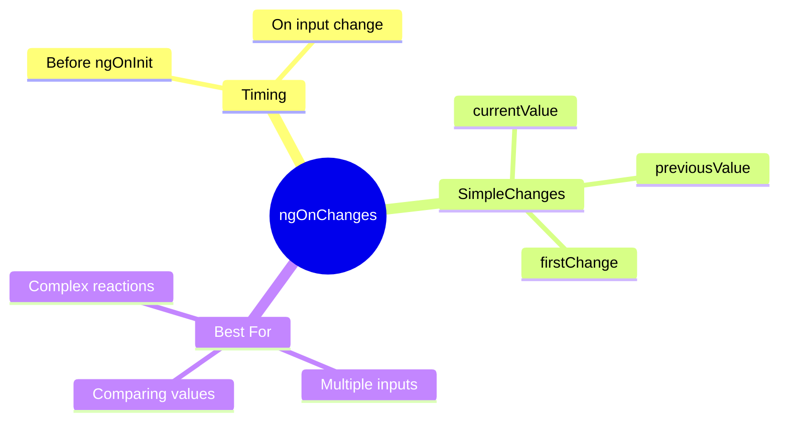

# 🔄 Use Case 2: ngOnChanges

> **💡 Lightbulb Moment**: `ngOnChanges` fires BEFORE ngOnInit and then whenever ANY @Input() changes!

---

## 1. 🔍 What is ngOnChanges?

Lifecycle hook that responds to input property changes.

```typescript
export class UserCardComponent implements OnChanges {
    @Input() userId!: string;
    @Input() highlight: boolean = false;
    
    ngOnChanges(changes: SimpleChanges) {
        if (changes['userId']) {
            this.loadUserData();
        }
        if (changes['highlight']?.currentValue) {
            this.animateHighlight();
        }
    }
}
```

---

## 2. 🚀 SimpleChanges Structure

```typescript
{
    userId: {
        previousValue: '123',
        currentValue: '456',
        firstChange: false,
        isFirstChange: () => false
    },
    highlight: {
        previousValue: undefined,
        currentValue: true,
        firstChange: true,
        isFirstChange: () => true
    }
}
```

---

## 3. ❓ Interview Questions

### Basic Questions

#### Q1: ngOnChanges vs Input setter - when to use which?
**Answer:**
| ngOnChanges | Input Setter |
|-------------|--------------|
| Multiple inputs | Single input |
| Need previous value | Just need new value |
| Compare changes | Simple transformation |

#### Q2: Does ngOnChanges fire for object mutations?
**Answer:** NO! Only for reference changes:
```typescript
// NO trigger
this.user.name = 'Jane';

// YES trigger
this.user = { ...this.user, name: 'Jane' };
```

---

### Scenario-Based Questions

#### Scenario: Reload on ID Change
**Question:** Component has productId input. On change, fetch new product.

**Answer:**
```typescript
ngOnChanges(changes: SimpleChanges) {
    const productIdChange = changes['productId'];
    if (productIdChange && !productIdChange.firstChange) {
        // Don't reload on initial value - ngOnInit handles that
        this.fetchProduct(productIdChange.currentValue);
    }
}
```

---

## 🎁 Gift Notification Analogy (Easy to Remember!)

Think of ngOnChanges like **getting notified about gift arrivals**:

| Concept | Gift Analogy | Memory Trick |
|---------|-------------|--------------| 
| **ngOnChanges** | 📬 **Gift notification**: "You received something!" | **"Input changed"** |
| **SimpleChanges** | 🧾 **Delivery receipt**: Shows old vs new, first delivery? | **"Change details"** |
| **previousValue** | 📦 **Old gift**: "This is what you HAD before" | **"Before value"** |
| **currentValue** | 🎁 **New gift**: "This is what you HAVE now" | **"After value"** |
| **firstChange** | 🆕 **First delivery ever?**: "Never received before!" | **"Initial value"** |

### 📖 Story to Remember:

> 🎁 **The Gift Tracker**
>
> You're receiving gifts (inputs) and want to track changes:
>
> **The Notification:**
> ```typescript
> ngOnChanges(changes: SimpleChanges) {
>   // Notification arrives: "Gift delivery update!"
>   
>   if (changes['productId']) {
>     const receipt = changes['productId'];
>     console.log('Previous gift:', receipt.previousValue);  // 📦 "Old book"
>     console.log('New gift:', receipt.currentValue);        // 🎁 "New toy"
>     console.log('First ever?:', receipt.firstChange);      // 🆕 true/false
>   }
> }
> ```
>
> **Important:**
> ```
> - First notification: arrives BEFORE ngOnInit
> - Later notifications: every time input changes
> - Object mutation: NO notification (same box, different contents)
> - New object: YES notification (new box!)
> ```
>
> **You only get notified when a NEW package arrives, not when contents change!**

### 🎯 Quick Reference:
```
📬 ngOnChanges     = Gift notification (input changed)
🧾 SimpleChanges   = Delivery receipt (change details)
📦 previousValue   = Old gift value
🎁 currentValue    = New gift value
🆕 firstChange     = First delivery ever?
```

---

## 🧠 Mind Map


