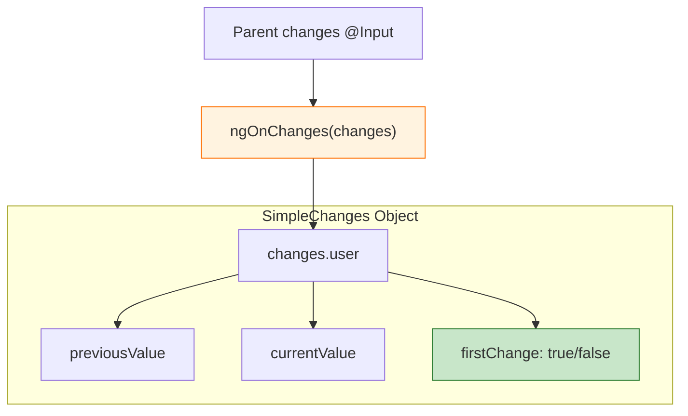
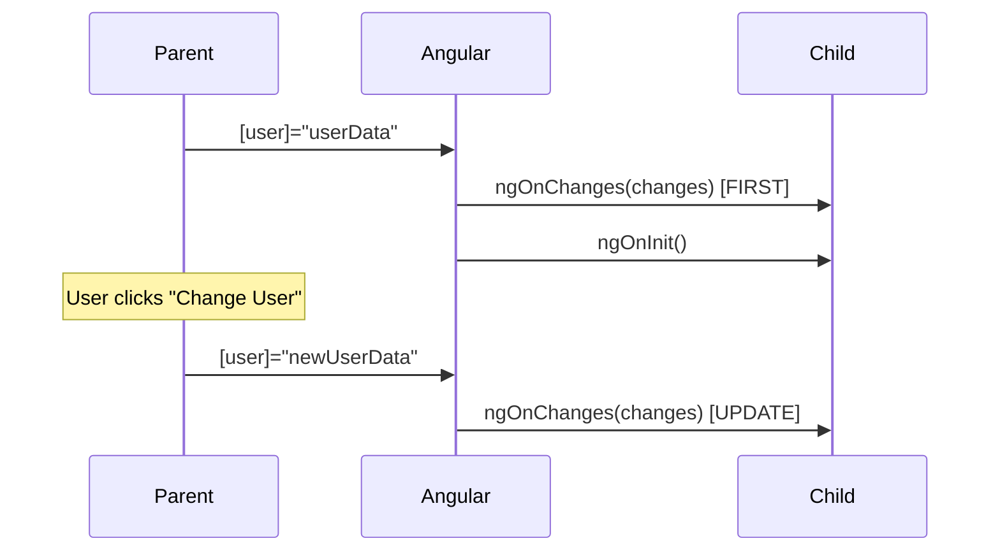

# 🔄 Use Case 2: `ngOnChanges` (Detecting Input Changes)

> **Goal**: Learn to react to `@Input()` changes using the `SimpleChanges` object with previous and current values.

---

## 1. 🔍 How It Works (The Concept)

### The Mechanism
*   **`ngOnChanges`** is called **before `ngOnInit`** with initial values, and then **every time** an `@Input` property's reference changes.
*   Receives a `SimpleChanges` object containing all changed properties in a single call.

### Key Insight: Reference vs. Mutation
*   ✅ **Detected**: `user = { ...user, name: 'New' }` (new reference)
*   ❌ **NOT Detected**: `user.name = 'New'` (same reference, mutation)

### 📊 SimpleChanges Structure



---

## 2. 🚀 Step-by-Step Implementation Guide

### Step 1: Import and Implement the Interface

```typescript
import { Component, Input, OnChanges, SimpleChanges } from '@angular/core';

@Component({ ... })
export class UserCardComponent implements OnChanges {
  @Input() user!: User;
  @Input() theme: 'light' | 'dark' = 'dark';
```

### Step 2: Implement `ngOnChanges`

```typescript
ngOnChanges(changes: SimpleChanges): void {
  console.log('🔄 ngOnChanges called');

  // Iterate through changed properties
  for (const propName in changes) {
    const change = changes[propName];
    
    // 🛡️ CRITICAL: Check if it's the first change (initial binding)
    if (change.isFirstChange()) {
      console.log(`📌 ${propName}: Initial value set to`, change.currentValue);
    } else {
      console.log(`🔄 ${propName}:`, change.previousValue, '→', change.currentValue);
    }
  }
}
```

### Step 3: Checking Specific Properties

```typescript
ngOnChanges(changes: SimpleChanges): void {
  // Check if a specific input changed
  if (changes['user']) {
    const userChange = changes['user'];
    if (!userChange.isFirstChange()) {
      // User was updated (not initial load)
      this.handleUserUpdate(userChange.previousValue, userChange.currentValue);
    }
  }
}
```

### 📊 Lifecycle Order



---

## 3. 🐛 Common Pitfalls & Debugging

### ❌ Object Mutation Not Detected
**Bad Code (Parent):**
```typescript
updateName() {
  this.user.name = 'John'; // ❌ Mutation - NOT detected!
}
```
**Fix:** Create a new object reference:
```typescript
updateName() {
  this.user = { ...this.user, name: 'John' }; // ✅ New reference
}
```

### ❌ Using `===` for Deep Comparison
**Bad Code:**
```typescript
if (changes['user'].previousValue === changes['user'].currentValue) // ❌
```
**Why it fails:** Always false for objects (different references). Use deep comparison or check specific properties.

---

## 4. ⚡ Performance & Architecture

### Performance
*   `ngOnChanges` is efficient - only called when references change.
*   With `OnPush` change detection, this hook becomes even more predictable.

### Architecture Tip
*   Use `ngOnChanges` for **reactive logic** that depends on input changes.
*   Use getters or pipes for **derived values** that don't need history.

---

## 5. 🌍 Real World Use Cases

1.  **Data Refresh**: Reload a chart when the data changes.
2.  **Form Reset**: Reset form state when the `formData` input changes.
3.  **Analytics**: Track how often users change filters or selections.

---

## 6. 📝 The Analogy: "The Package Tracker" 📦

*   **`ngOnChanges`**: You're a warehouse worker. Every time a package arrives (input changes), you log:
    *   What package? (`propName`)
    *   Where from? (`previousValue`)
    *   Where to? (`currentValue`)
    *   First delivery? (`firstChange`)

---

## 7. ❓ Interview & Concept Questions

### Q1: When is `ngOnChanges` called relative to `ngOnInit`?
**A:** `ngOnChanges` is called **before** `ngOnInit` with the initial input values.

### Q2: Why doesn't `ngOnChanges` detect object mutations?
**A:** Angular uses *reference equality* for change detection by default. Mutating an object doesn't change its reference.

### Q3: What is `firstChange` used for?
**A:** To distinguish between the initial binding and subsequent updates. Useful to skip certain logic on initialization.

### Q4: Can multiple inputs change in one `ngOnChanges` call?
**A:** Yes! If the parent updates multiple inputs at once, they all appear in the same `SimpleChanges` object.

### Q5: How does `OnPush` affect `ngOnChanges`?
**A:** With `OnPush`, the component only checks for changes when input references change, making `ngOnChanges` the primary change notification mechanism.
