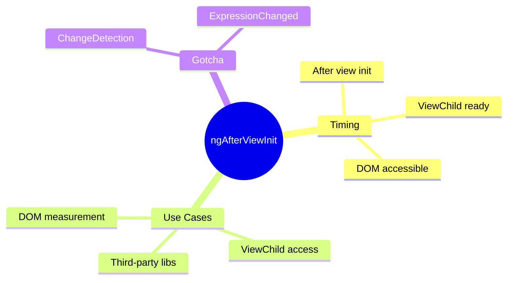

# 🖼️ Use Case 3: ngAfterViewInit

> **💡 Lightbulb Moment**: `ngAfterViewInit` is when the component's view (template) is fully initialized - DOM is ready!

---

## 1. 🔍 What is ngAfterViewInit?

Called ONCE after Angular initializes the component's view and child views.

```typescript
export class ChartComponent implements AfterViewInit {
    @ViewChild('canvas') canvasRef!: ElementRef<HTMLCanvasElement>;
    
    ngAfterViewInit() {
        // DOM is ready - safe to access ViewChild!
        const ctx = this.canvasRef.nativeElement.getContext('2d');
        this.initChart(ctx);
    }
}
```

---

## 2. 🚀 Key Points

### DOM is Ready
```typescript
@ViewChild('container') container!: ElementRef;

ngAfterViewInit() {
    // Safe to measure, manipulate DOM
    const width = this.container.nativeElement.offsetWidth;
}
```

### ViewChild is Populated
```typescript
@ViewChild(ChildComponent) child!: ChildComponent;

ngAfterViewInit() {
    // Child component reference is available
    this.child.doSomething();
}
```

---

## 3. ❓ Interview Questions

### Basic Questions

#### Q1: ngOnInit vs ngAfterViewInit - what's the difference?
**Answer:**
| ngOnInit | ngAfterViewInit |
|----------|-----------------|
| Inputs ready | View/DOM ready |
| ViewChild NOT ready | ViewChild ready |
| API calls | DOM manipulation |
| One-time init | View-dependent init |

#### Q2: Why use ViewChild in ngAfterViewInit?
**Answer:** ViewChild queries aren't populated until the view initializes. Accessing in ngOnInit gives undefined.

---

### Scenario-Based Questions

#### Scenario: Chart Library Integration
**Question:** Initialize a Chart.js chart on a canvas element.

**Answer:**
```typescript
@ViewChild('chartCanvas') canvas!: ElementRef<HTMLCanvasElement>;

ngAfterViewInit() {
    new Chart(this.canvas.nativeElement, {
        type: 'bar',
        data: this.chartData
    });
}
```

---

## 🎭 Stage Curtain Analogy (Easy to Remember!)

Think of ngAfterViewInit like **curtain rising on stage**:

| Concept | Stage Analogy | Memory Trick |
|---------|---------------|--------------| 
| **ngOnInit** | 🎫 **Rehearsal**: Actors ready, but stage not visible | **"Logic ready"** |
| **ngAfterViewInit** | 🎭 **Curtain rises**: Stage visible, set pieces in place | **"View ready"** |
| **ViewChild** | 🎬 **Spot the actor**: "There's Alice on stage!" | **"Can see elements"** |
| **DOM ready** | 🎪 **Stage is built**: Can measure stage width now | **"Can touch DOM"** |
| **Runs once** | 📸 **Opening night**: Happens once per show | **"One-time"** |

### 📖 Story to Remember:

> 🎭 **Opening Night at the Theater**
>
> Your component is a theater performance:
>
> **During Rehearsal (ngOnInit):**
> ```typescript
> ngOnInit() {
>   // 🎫 Actors memorized lines (logic ready)
>   // 🔒 But curtain is DOWN - can't see stage!
>   this.canvasRef; // ❌ undefined! Curtain still closed!
> }
> ```
>
> **Curtain Rises (ngAfterViewInit):**
> ```typescript
> ngAfterViewInit() {
>   // 🎭 Curtain UP! Stage visible!
>   this.canvasRef.nativeElement; // ✅ Can see it now!
>   
>   // 🎬 Initialize chart (set goes live!)
>   new Chart(this.canvasRef.nativeElement, {...});
> }
> ```
>
> **Wait for curtain to rise before interacting with stage!**

### 🎯 Quick Reference:
```
🎫 ngOnInit          = Rehearsal (logic ready, view not)
🎭 ngAfterViewInit   = Curtain rises (view ready!)
🎬 ViewChild         = Spot actors on stage
🎪 DOM               = Stage is built & measurable
📸 Runs once         = Opening night only
```

---

## 🧠 Mind Map


