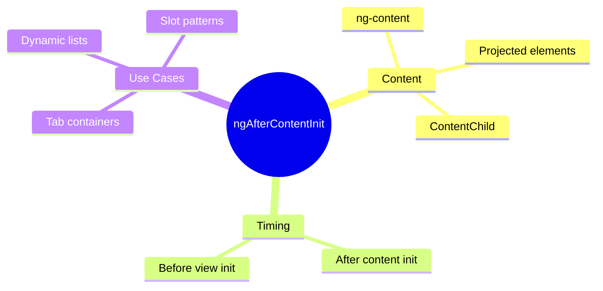

# 📦 Use Case 4: ngAfterContentInit

> **💡 Lightbulb Moment**: `ngAfterContentInit` fires when PROJECTED CONTENT (ng-content) is initialized - use it for ContentChild queries!

---

## 1. 🔍 What is ngAfterContentInit?

Called ONCE after Angular projects content into the component.

```typescript
@Component({
    template: `
        <div class="tabs">
            <ng-content select="[tab]"></ng-content>
        </div>
    `
})
export class TabContainerComponent implements AfterContentInit {
    @ContentChildren(TabComponent) tabs!: QueryList<TabComponent>;
    
    ngAfterContentInit() {
        // Content is projected - ContentChild/Children ready!
        this.tabs.first?.activate();
    }
}
```

---

## 2. 🚀 View vs Content

| Type | What | Query | Hook |
|------|------|-------|------|
| View | Component's own template | @ViewChild | ngAfterViewInit |
| Content | Projected via ng-content | @ContentChild | ngAfterContentInit |

---

## 3. ❓ Interview Questions

### Basic Questions

#### Q1: What's the difference between ViewChild and ContentChild?
**Answer:**
- **ViewChild**: Elements in component's OWN template
- **ContentChild**: Elements projected INTO component via ng-content

```typescript
// Parent
<app-card>
    <h1>Title</h1>  <!-- This is CONTENT (projected) -->
</app-card>

// Card component template
<div class="card">
    <ng-content></ng-content>          <!-- Content goes here -->
    <footer>Footer</footer>            <!-- This is VIEW -->
</div>
```

#### Q2: When does ngAfterContentInit fire?
**Answer:** After Angular initializes content children (projected via ng-content), before ngAfterViewInit.

---

### Scenario-Based Questions

#### Scenario: Tab Container
**Question:** Create a tab container that auto-selects the first tab.

**Answer:**
```typescript
@ContentChildren(TabItemComponent) tabs!: QueryList<TabItemComponent>;

ngAfterContentInit() {
    // Select first tab by default
    if (this.tabs.length > 0) {
        this.selectTab(this.tabs.first);
    }
}
```

---

## 🧠 Mind Map


