# 📦 Use Case 4: `ngAfterContentInit` & `ngAfterContentChecked` (Content Projection Lifecycle)

> **Goal**: Safely access and manage content projected via `<ng-content>` using `@ContentChild` / `@ContentChildren`.

---

## 1. 🔍 How It Works (The Concept)

### The Mechanism
*   **`ngAfterContentInit`**: Called **once** after Angular projects external content into the component (`<ng-content>`).
*   **`ngAfterContentChecked`**: Called **every time** Angular checks the projected content.

### Content vs. View
*   **Content**: Elements placed *between* your component's tags (projected in).
*   **View**: Elements in your component's *own* template.

### 📊 Content Lifecycle Diagram

```mermaid
graph TD
    A["ngOnInit"] --> B["Content Projected"]
    B --> C["ngAfterContentInit 📦"]
    C --> D["View Rendered"]
    D --> E["ngAfterViewInit 👁️"]
    
    style C fill:#fff3e0,stroke:#ff6f00
    style E fill:#c8e6c9,stroke:#2e7d32
```



---

## 2. 🚀 Step-by-Step Implementation Guide

### Step 1: Use `<ng-content>` to Accept Projected Content

```typescript
// tab-container.component.ts
@Component({
  template: `
    <div class="tabs">
      <ng-content select="app-tab-item"></ng-content>
    </div>
  `
})
export class TabContainerComponent implements AfterContentInit {
  // 🛡️ CRITICAL: Query PROJECTED content
  @ContentChildren(TabItemComponent) tabs!: QueryList<TabItemComponent>;
```

### Step 2: Access Content in `ngAfterContentInit`

```typescript
ngAfterContentInit(): void {
  console.log('📦 Content is ready!');
  console.log('Found tabs:', this.tabs.length);
  
  // Select the first tab
  this.selectTab(0);
  
  // Subscribe to dynamic changes
  this.tabs.changes.subscribe(() => {
    console.log('Tabs changed:', this.tabs.length);
  });
}
```

### 📊 Lifecycle Order

```mermaid
sequenceDiagram
    participant Parent
    participant Angular
    participant Container as TabContainer
    participant Tab as TabItem

    Parent->>Container: Create with projected tabs
    Angular->>Tab: Create TabItems
    Angular->>Container: ngAfterContentInit() 📦
    Note over Container: @ContentChildren available!
    Angular->>Container: ngAfterViewInit() 👁️
```



---

## 3. 🐛 Common Pitfalls & Debugging

### ❌ Using @ViewChildren for Projected Content
**Bad Code:**
```typescript
@ViewChildren(TabItemComponent) tabs!: QueryList<TabItemComponent>; // ❌ Empty!
```
**Fix:** Use `@ContentChildren` for projected content.

### ❌ Accessing Content in ngOnInit
**Bad Code:**
```typescript
ngOnInit() {
  console.log(this.tabs.length); // ❌ undefined!
}
```
**Fix:** Move to `ngAfterContentInit`.

---

## 4. ⚡ Performance & Architecture

### Performance
*   `ngAfterContentChecked` runs frequently - use `QueryList.changes` Observable instead.
*   Subscribe once in `ngAfterContentInit` for efficient updates.

### Best Practice: QueryList.changes
```typescript
ngAfterContentInit() {
  // ✅ Efficient: Only runs when content actually changes
  this.tabs.changes.subscribe(tabs => {
    this.handleTabChange(tabs);
  });
}
```

---

## 5. 🌍 Real World Use Cases

1.  **Tab Components**: Query projected `<tab>` items to build a dynamic tab bar.
2.  **Accordion**: Manage multiple `<accordion-item>` components.
3.  **Carousel**: Control `<slide>` components projected into a slider.

---

## 6. 📝 The Analogy: "The Gift Box" 🎁

*   **`<ng-content>`**: The box opening where you receive gifts.
*   **`@ContentChildren`**: Your inventory list of received gifts.
*   **`ngAfterContentInit`**: All gifts have arrived. Now you can count and organize them.
*   **`QueryList.changes`**: Someone adds or removes a gift - you get notified.

---

## 7. ❓ Interview & Concept Questions

### Q1: What's the difference between `@ViewChildren` and `@ContentChildren`?
**A:** `@ViewChildren` queries elements in your template. `@ContentChildren` queries elements projected from outside via `<ng-content>`.

### Q2: Does `ngAfterContentInit` run before `ngAfterViewInit`?
**A:** Yes! Content is projected before the view is fully rendered.

### Q3: How do I react to dynamic content changes?
**A:** Subscribe to `QueryList.changes` - it's an Observable that emits when items are added/removed.

### Q4: Can I use `{static: true}` with `@ContentChild`?
**A:** Yes, if the content is always present (not conditional). This makes it available in `ngOnInit`.

### Q5: Why use content projection instead of `@Input`?
**A:** Content projection allows flexible, complex templates. `@Input` is for simple data. Use projection for entire component trees.
