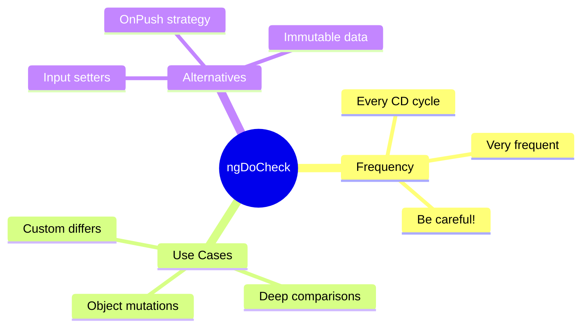

# 🔎 Use Case 5: ngDoCheck

> **💡 Lightbulb Moment**: `ngDoCheck` runs during EVERY change detection cycle - use it for custom change detection logic!

---

## 1. 🔍 What is ngDoCheck?

Called during every change detection run, after ngOnChanges and ngOnInit.

```typescript
export class ObjectDiffComponent implements DoCheck {
    @Input() data: any;
    private previousData: string = '';
    
    ngDoCheck() {
        const currentData = JSON.stringify(this.data);
        if (currentData !== this.previousData) {
            console.log('Deep change detected!');
            this.previousData = currentData;
            this.onDataChanged();
        }
    }
}
```

---

## 2. 🚀 Use Cases

### Detect Object Mutations
```typescript
@Input() user: User;
private previousName = '';

ngDoCheck() {
    if (this.user?.name !== this.previousName) {
        this.previousName = this.user?.name;
        this.handleNameChange();
    }
}
```

### Custom Differ
```typescript
private iterableDiffer: IterableDiffer<Item>;

constructor(private differs: IterableDiffers) {
    this.iterableDiffer = differs.find([]).create();
}

ngDoCheck() {
    const changes = this.iterableDiffer.diff(this.items);
    if (changes) {
        changes.forEachAddedItem(r => console.log('Added:', r.item));
        changes.forEachRemovedItem(r => console.log('Removed:', r.item));
    }
}
```

---

## 3. ❓ Interview Questions

### Basic Questions

#### Q1: When does ngDoCheck run?
**Answer:** On EVERY change detection cycle - can be hundreds of times! Use sparingly.

#### Q2: Why is ngDoCheck "expensive"?
**Answer:** It runs frequently. Any heavy computation here will slow your app significantly.

---

### Scenario-Based Questions

#### Scenario: Array Mutation Detection
**Question:** Detect when items are added/removed from an array (mutations, not reference change).

**Answer:**
```typescript
private arrayDiffer: IterableDiffer<Item>;

constructor(differs: IterableDiffers) {
    this.arrayDiffer = differs.find([]).create();
}

ngDoCheck() {
    const changes = this.arrayDiffer.diff(this.items);
    if (changes) {
        this.handleArrayChanges(changes);
    }
}
```

---

## ⚠️ Warning

**ngDoCheck runs VERY frequently!** Keep it lightweight.

---

## 🧠 Mind Map


